<a href="https://aifactory.ibizlab.cn">

</a>


# AI Factory - 零代码构建智能体，让每个团队都有自己的智能调度中心

## 💡 平台介绍

- AI Factory 是新一代企业级 AI 应用开发与编排平台。其设计宗旨在于通过**零代码/低代码**的方式，大幅降低大模型应用的构建门槛。平台提供完整的智能体设计、技能级联、云边协同部署和企业级应用对接能力，覆盖从智能体孵化到生产环境落地的全生命周期；
- AI Factory 充分汲取前沿多智能体Multi-Agent 以及 Skills 等技术精髓，实现了对多种主流大模型的统一接入、算力级联与精细化受控编排，助力企业以极低成本快速实现智能化转型；
- AI Factory 采用创新的分层底座架构 + 云边协同工作机制，实现了“决策、能力、物理触手”的完美解耦。

### 🌐 在线体验

- **官方网站**: [https://aifactory.ibizlab.cn](https://aifactory.ibizlab.cn)
- **Demo 地址**: [https://aifactory.ibizlab.cn/demo/](https://aifactory.ibizlab.cn/demo/)
- **用户名 / 密码**: `demo_admin / 123456`
- **技术资料**: [https://aifactory.ibizlab.cn/doc/](https://aifactory.ibizlab.cn/doc/)
- **ModelingIDE**: [https://aifactory.ibizlab.cn/modeling/](https://aifactory.ibizlab.cn/modeling/)
- **后台技术框架支持**: [https://github.com/ibizlab-cloud/ibiz-service-hub](https://github.com/ibizlab-cloud/ibiz-service-hub)
- **前端技术框架支持**: [https://open.ibizlab.cn/apphub/](https://open.ibizlab.cn/apphub/)

> **提示：** 本产品是由 [iBizLab 开源实验室](https://www.ibizlab.cn/) 基于  [iBizModeling](https://modeling.ibizlab.cn/) 打造，面向企业级 AI 垂直应用场景，提供可本地部署、可二次开发的完整解决方案，共建企业级开源 AI 生态。


## 🎨 核心架构

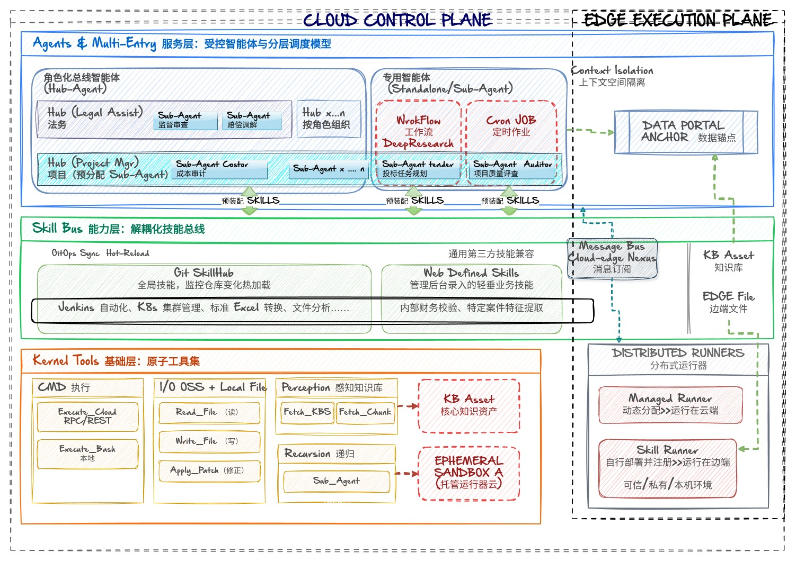

### 🧩 服务层：受控智能体与分层调度模型 (Agents & Multi-Entry)

Agent 是执行意图的独立实体，支持 **总线编排** 与 **自主作业** 两种存在形态。

#### 1️⃣  角色化总线 (Hub-Agent)

作为“多专家调度官”，负责组织、团队或特定大场景的全局控制。

* **多专家隔离**：系统支持根据组织架构或业务领域建立多个 Hub 实例。
* **定向支配**：每个 Hub 挂载特定的角色 Prompt 及**支配清单**，决定其可调度的 Sub-Agent 以及 SKILL 范围。
* **意图分发**：作为交互入口，负责将复杂需求拆解并分发给底层的专家单元。

#### 2️⃣  原子智能体 (Standalone/Sub-Agent)

作为“专项执行官”，专注于某一特定垂直领域。

* **双重生命周期**：
  
- **从属模式 (Sub-Agent Mode)**：由 Hub 激活，运行于临时沙盒，任务结束即销毁。
- **独立模式 (Standalone Mode)**：拥有独立 URL/Token。支持 **定时作业 (Cron Job)** 或 **批量流水线 (Pipeline)** 直接驱动，无需交互式入口。


* **支配与配给制 (Resource Allocation)**：
- 在定义阶段为 Agent 进行 **能力配给**。每个 Agent 仅能支配其清单内的基础 Skill 与扩展 Skill，实现最小权限控制 (PoLP)。
- 每个 Agent 都可以独立指定接入模型，实现算力的**“高低快慢”级联搭配**。如由长文本/强推理作为 Hub 负责高维决策；由低参数 Flash 模型绑定 Sub Agent 负责高频的局部执行与数据清洗。


### 🔧 能力层：解耦化技能总线 (Skill Bus)

技能（Skill）是对工具序列的逻辑封装。AI Factory 通过“多源寻址”机制实现能力要素的动态注入。

#### 1️⃣  **多态供应体系**
* **Standard Skills 供应 (Global SkillHub)**：系统监听外部 Git 仓库。通过 **热加载 (Hot-Reload)** 机制实现技能清单与 Git 提交同步，确保能力生产与消耗的解耦。
* **Web-Defined Skills 供应 (Local Extension)**：通过管理后台 UI 快速录入的业务规约。用于处理垂直度高、时效性强的业务逻辑（如：特定的工单分类算法、特定案件的特征提取规则、公司内部财务报销校验逻辑）。


#### 2️⃣  **技能定义规范 (Standard Specification)**
* 所有技能均遵循标准的 **Input/Output Schema**，支持技能间的级联 (Chaining) 与自动化探测。
* 特性：兼容市面主流 Skill 规范。支持 Git 自动刷新，仓库更新即系统能力更新。
* 范例：Jenkins 自动化、K8s 集群管理、标准 Excel 转换器。


### ⚙️ 基础层：原子工具集 (Kernel Tools)

底层内核由一套经过高度优化、不可随意更改的原子指令集。作为系统的“物理底座”。执行任务时，通过标准的 ToolCall 协议直接驱动这些工具。它们是 Agent/Skill 感知和改变物理世界的唯一触手。

* **命令**：`execute_bash` (系统级指令注入)、`execute_cloud` (微服务 RPC/REST 调用)。
* **IO屏障**：针对 OSS 或本地文件系统的封装，包括 `read_file`、`write_file`、`apply_patch`，确保文件操作的幂等性。
* **感知**：`fetch_kbs` (知识库路由)，`fetch_kb_chunks` (向量空间检索)，支持基于 Metadata 的前置过滤。
* **递归**：`sub_agent`。这是架构的精髓，允许 Agent 派生出一个逻辑隔离的任务副本（Sandbox），实现递归编排。


## ⚙️ **技术特性**

| 维度 | 实现方式 | 目的 |
|------|----------|------|
| 🤝 协同性 | Cloud-Edge Skill Runner | 云边协同，打破内网数据隔离 |
| 📚 知识性 | Deep KB Binding | 高精度召回与知识回填 |
| 🔗 可追溯性 | Anchor & Portal | 从AI结论到原始证据的一键回溯 |
| 🎛️ 灵活性 | Multi-Hub / Standalone | 覆盖人机问答与无人值守全场景 |
| 🧱 隔离性 | Context Sandbox | 子任务沙盒运行，用完即焚 |


### ☁️ 云边协同执行架构 (Cloud-Edge Runner)

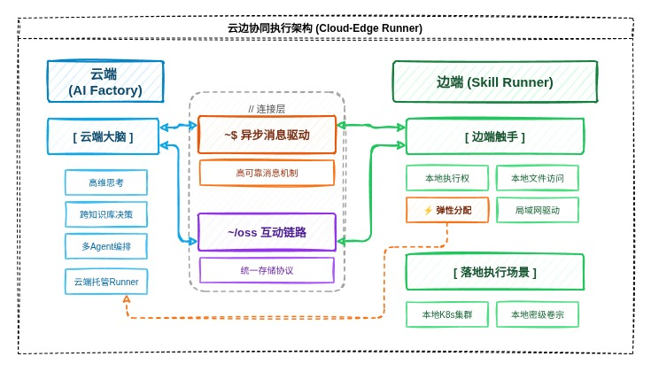

这是 AI Factory 实现“物理落地”的重磅特性，通过 **Skill Runner** 实现云端大脑与本地触手的协同。

#### 1️⃣  异步消息驱动

云端（AI Factory）与边端（Skill Runner）通过高可靠的消息机制连接，实现跨网络环境的指令下达与状态回传。

#### 2️⃣  边端触手 (Skill Runner)

用户可在本地部署配套的 `skill_runner` 客户端，将 AI 的执行力延伸至私有环境：

* **本地执行权**：支持在本地运行敏感的 Skill 代码、访问本地文件系统、驱动局域网内的程序。
* **OSS 互动链路**：云端知识库通过统一的存储协议（OSS）与边端 Runner 实时交换大文件，解决数据传输瓶颈。
* **弹性分配**：对于无需本地执行权的用户，系统自动分配云端托管 Runner 运行任务。

#### 3️⃣  云边协同场景

* **云端大脑**：负责高维思考、多 Agent 编排、跨知识库决策。
* **边端触手**：负责落地执行（如：操作本地 K8s 集群、处理本地密级卷宗、驱动本地自动化工具）。


### 📚 深度绑定的语义仓库 (Knowledge Base Binding)

与通用工具不同，AI Factory 的知识库是**原生资产**，而非边缘插件。

* **语义拓扑绑定**：Agent 与知识库并非简单的检索关系，而是“空间绑定”。Agent 在定义时即声明其知识边界，确保召回的上下文具有极高的业务相关性。
* **跨库动态路由**：支持根据问题意图在多个垂直知识库（如：ERP项目、智慧水务、环境监管）之间自动切换或联合检索。
* **双向同步机制**：知识库不仅供 AI 读取，执行过程中的分析结果（如：Agent 生成的审计笔记）可反向写回知识库，实现知识的动态生长。
* **非损还原**：在输出结论的同时，利用 Skill 层捕获的文件锚点（Anchor），反向生成 Portal 链接，实现从 AI 抽象结论到原始物理证据的一键回溯。


### 🧹 上下文空间隔离 (Context Isolation)

这是解决大规模工程任务中“上下文坍塌”的核心方案：

* **逻辑快照**：子任务分配独立的 **上下文堆栈 (Context Stack)**。其执行过程中的冗余推理、工具日志被锁定在沙盒内。
* **用完即焚 (Ephemeral Instance)**：结论返回后，沙盒实例及其上下文立即销毁。Hub 仅记录结构化结论，确保主模型拥有极高的**信噪比**。


## 🔁 演示业务流执行过程 (Execution Trace)

| 阶段 | 实体 | 动作说明                                      |
| --- | --- |-------------------------------------------|
| **1. 触发** | **Hub/Standalone Agent** | 用户在角色化 Hub 下达指令。或定时任务直接驱动                 |
| **2. 编排** | **Hub-Agent** | 识别跨库需求，根据配给清单派生 Sub-Agent。                |
| **3. 执行** | **Sandbox** | Sub-Agent 结合多知识库驱动 SKILL 在各自沙盒中执行。        |
| **4. 路由** | **Kernel Tools** | tool_call 执行 `fetch_kb` `read_file`等原子工具。 |
| **5. 汇总** | **Hub-Agent** | 接收 Sub-Agent 摘要，生成比对表格，销毁沙盒，生成 Portal。    |


### 📌 01 · 企业级知识库与权限隔离

* 基于“组织-团队-个人”网格架构的原生知识库核心模块。支持压缩包与文件夹的目录递归入卷、全自动分目录建卷与自适应切片索引编译。知识资产在后续服务于大模型推理时具备严苛的物理与逻辑权限边界，防止非授权实体的跨库越权检索。 [演示视频](https://www.bilibili.com/video/BV1tSLA6hEY4/?share_source=copy_web&vd_source=af6d57bb1565805dc179813dd7e29a1c)

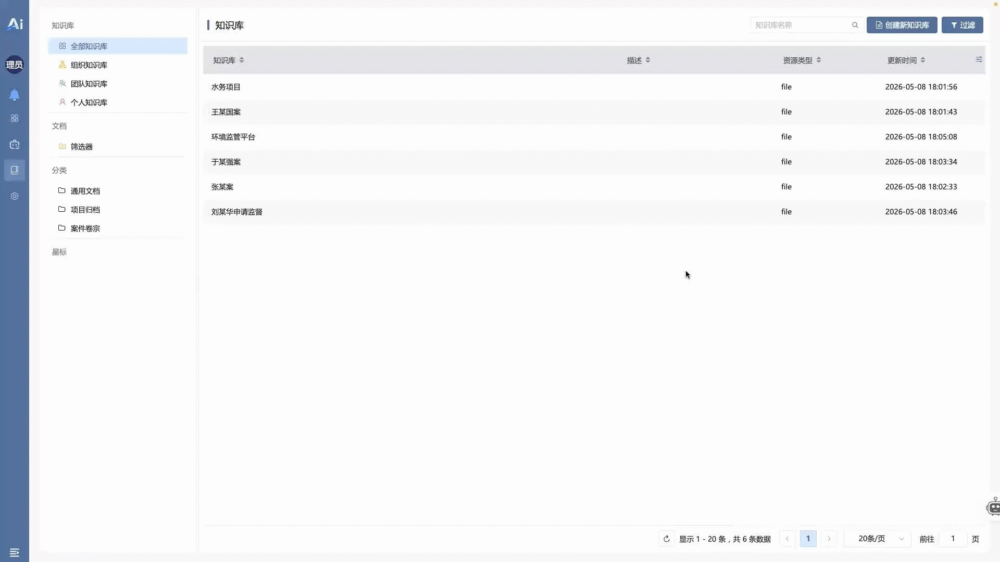

### 🔀 02 · 跨知识库智能检索辅助对话

* 多知识库环境下的上下文动态路由机制。系统根据输入流的语义意图，在 ERP、智慧水务、环境监管等独立知识库之间执行自动命中的单库切换或双库并发检索。在输出最终结论的同时，内核反向生成的**数据穿梭门**，支持一键回溯至原始物理文件的具体文件位置。[演示视频](https://www.bilibili.com/video/BV1mULA6cES2/?share_source=copy_web&vd_source=af6d57bb1565805dc179813dd7e29a1c)

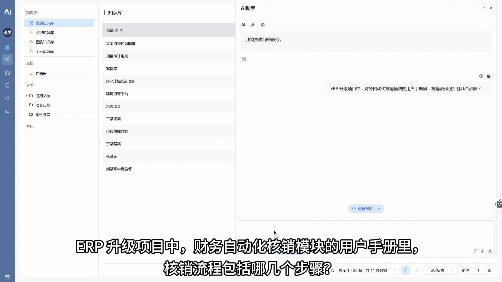

### 🎛️ 03 · 多角色中控总线(Hub) 动态调配 Sub-Agent

* 基于角色（Role-based）的智能体管理总线调度架构。通过切换不同的总线智能体（如项目管理总线、辅助办案总线），动态挂载并隔离对应的垂直业务技能清单与 Sub-Agent 专家组。在激活具体任务时，驱动 `sub_agent` 递归算子定向派生子任务流，实现最小权限原则（PoLP）下的受控运行。[演示视频](https://www.bilibili.com/video/BV1UULA6cEJ2/?share_source=copy_web&vd_source=af6d57bb1565805dc179813dd7e29a1c)

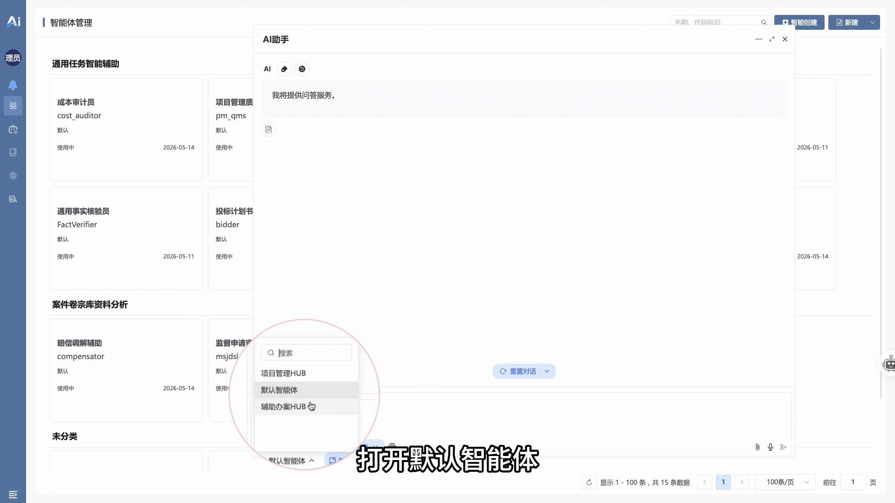

### ⚡ 04 · 零门槛即时新建专属智能体

* 针对专项无预设工具场景的能力敏捷扩展。用户只需通过 UI 提交自然语言描述期望的功能，系统在线秒级编译并绑定运行一个新的专属智能体。智能体最终审查结论可通过 API 异步反向写入对应原始文件的评论区，形成文件历史审计笔记的动态沉淀，打造智能辅助的闭环体系。[演示视频](https://www.bilibili.com/video/BV1uULA6wEG3/?share_source=copy_web&vd_source=af6d57bb1565805dc179813dd7e29a1c)

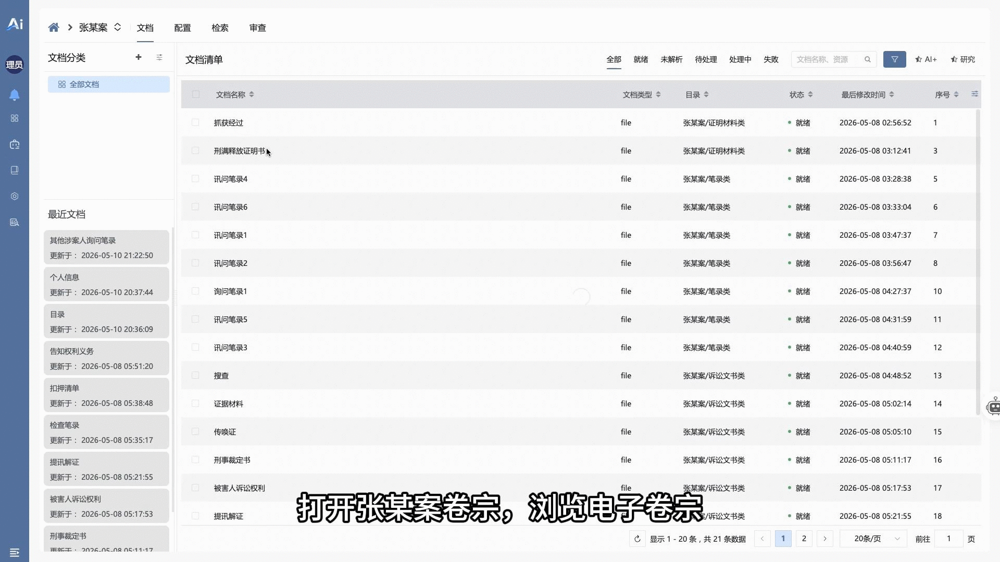

### 🔌 05 · 按用户发布专属OpenAI接口，第三方客户端等价使用

* 系统能力的对外标准集成。网关层完全兼容 OpenAI 标准接口协议，支持用户自主分发 Token 令牌以无缝接入 CherryStudio、ChatBox等第三方客户端。该令牌在进入系统网关时强绑定用户的身份、存储权限与专属记忆仓，使其外部检索行为同样受内核的原生审计。[演示视频](https://www.bilibili.com/video/BV1S2LA6aE5K/?share_source=copy_web&vd_source=af6d57bb1565805dc179813dd7e29a1c)

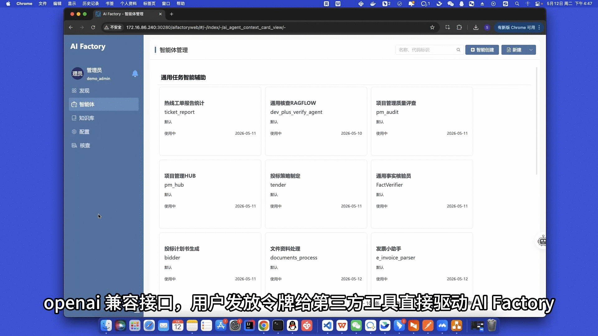

### 📊 06 · 对话式报表：AI自动写代码分析数据

* 解决大批量结构化（Excel/CSV）数据流场景下大模型“上下文坍塌”问题的工程实现。突破长度限制与幻觉问题。智能体不直接读取全量数据，而是激活文件分析技能，对目标数据进行采样并理解，随后在底层隔离的代码沙箱（Sandbox）内实时动态编写并编译运行 Python 脚本。输出标准结构化报告与可视化资产，对实时交互指令（如按日期追加趋势分析），动态执行二次计算并实时渲染生成对应的饼图与折线图看板。[演示视频](https://www.bilibili.com/video/BV1FNLP6nEDU/?share_source=copy_web&vd_source=af6d57bb1565805dc179813dd7e29a1c)

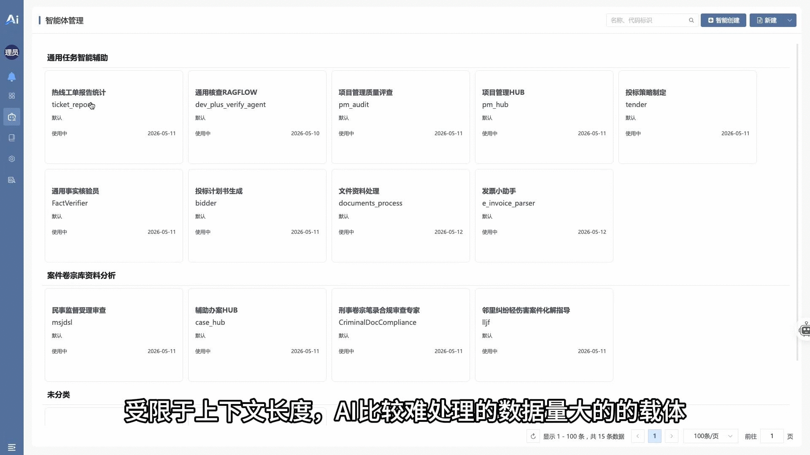

### 🔗 07 · 记忆串联 特征提取/类案推送/规则推理 多任务

* 复杂长链路业务流下的技能级联（Chaining）技术落地。系统通过有向任务流，依次触发定制的特征提取、类案搜索、规则推理三大标准能力。执行过程中，上游提取的结构化特征被实时写入 `Session Memory`（会话级持久化记忆库），作为下游规则引擎计算的强类型入参。[演示视频](https://www.bilibili.com/video/BV16NLP6JEKS/?share_source=copy_web&vd_source=af6d57bb1565805dc179813dd7e29a1c)

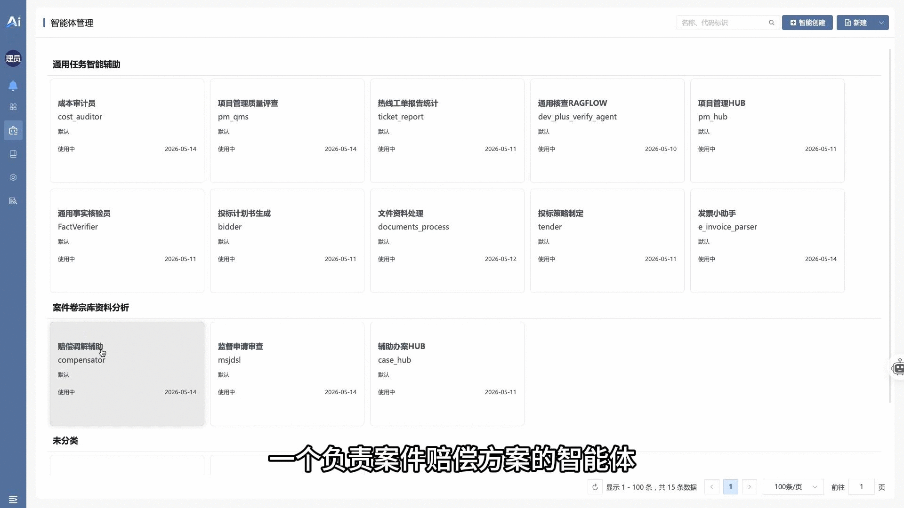

### 🔬 08 · 深度研究 规划-执行-总结 多智能体联动

* 复杂长链路全局规划任务下的多 Agent 异步协同拓扑。系统引入深度研究（Deep Research）框架，将复杂意图拆解为：规划（投标策略规划智能体生成策略）→ 执行（定向检索信息并进行事实核验）→ 综合（投标任务书智能体收官）。多个智能体按照严格的依赖逻辑联合流式执行，最终输出高确定性的结构化任务书。[演示视频](https://www.bilibili.com/video/BV16NLP6JECi/?share_source=copy_web&vd_source=af6d57bb1565805dc179813dd7e29a1c)

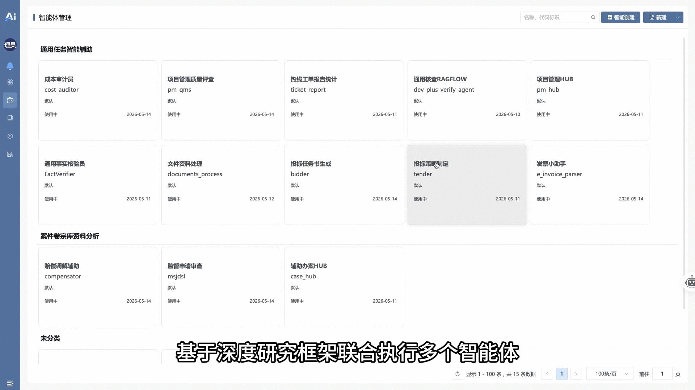

### 🧾 09 · 云边协同：云端决策本地执行，安全处理海量文件

* 长程大批量数据处理的工程耐受力与云边解耦架构。主智能体设置20 张发票一组分批解析，中间过程由 `Sub-Agent` 在逻辑沙盒中并发处理，用完即焚，实现模型高低快慢的完美搭配。长程任务也可设定后台静默执行，由部署在本地内网的 **Skill Runner** 分布式挂载并执行本地文件操控与合并，实现“云端大脑决策，边端触手干活”。[演示视频](https://www.bilibili.com/video/BV1rALP6DEnc/?share_source=copy_web&vd_source=af6d57bb1565805dc179813dd7e29a1c)

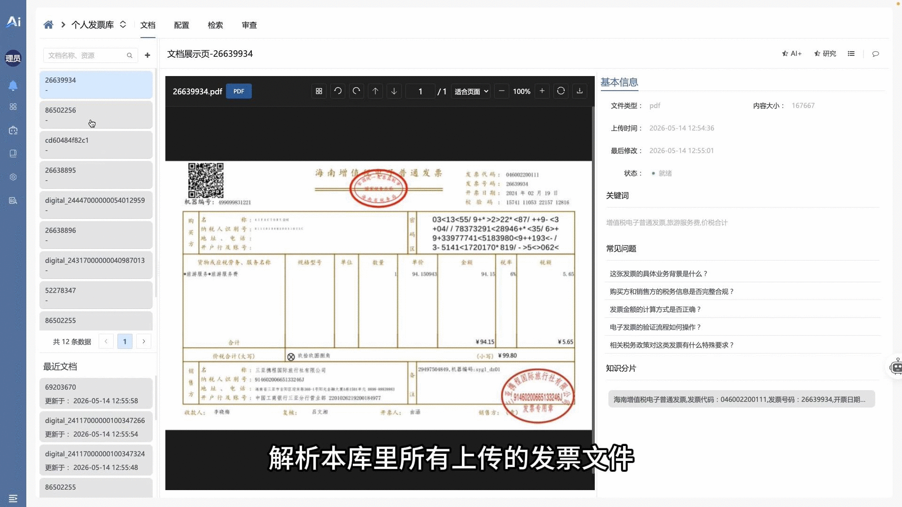

### 🧩 10 · 标准化工作流作业以及可插拔的场景式智能核查套件

* 高确定性、长程质量评查作业的流程控制与应用市场套件微应用分发。系统通过确定性工作流（Workflow）强约束智能体的执行步骤，克服自由状态机的不确定性。同时支持将特定场景的“智能体 + 工作流 + 规则库”解耦打包为“场景核查套件”进行动态热插拔，并配置 Cron Job 实现无人值守的定时巡检与日志审计。[演示视频](https://www.bilibili.com/video/BV1nALP6QES2/?share_source=copy_web&vd_source=af6d57bb1565805dc179813dd7e29a1c)

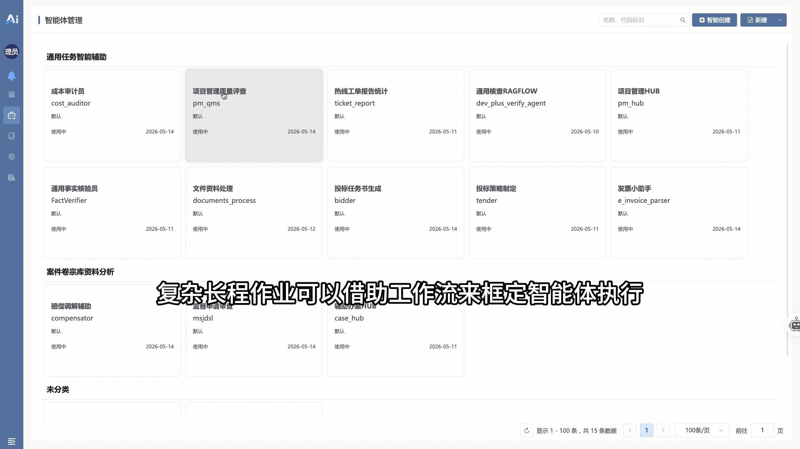


## ⚡ 快速上手

### 环境要求
- CPU ≥ 4 核， RAM ≥ 16 GB， Disk ≥ 50 GB，Docker ≥ 24.0.0， Docker-Compose ≥ v2.26.1

### 安装步骤
```bash
# 克隆项目
git clone https://github.com/ibizlab/aifactory.git

# 启动服务
cd aifactory/deploy/compose
docker-compose up -d
```
[!CAUTION] 更详细安装说明参考 [install](deploy/compose/README.md)


### 🛠️ AI功能启用前准备工作

### 📦 **1. 模型初始化（示例占位）**

系统安装完成后，会**自动生成示例模型配置**作为占位模板，展示各领域所需的模型类型：


| 领域 | 示例模型名称 |
|------|----------|
| 🧠 **主模型（Default）** | `Qwen/Qwen3.6-27B` |
| ⚡ **快速模型（Flash）** | `Qwen/Qwen3.5-9B` |
| 🎯 **意图分析模型** | `Qwen/Qwen3.5-9B` |
| 🖼️ **多模态模型（VL）** | `Qwen/Qwen3.6-35B-A3B` |
| 📊 **Embedding 模型** | `BAAI/bge-m3` |
| 🔁 **Rerank 模型** | `BAAI/bge-reranker-v2-m3` |

> ⚠️ *以上均为示例占位硅基流动平台里的模型，令牌未设置，不可直接使用，需修改令牌或替换为其他服务商的真实模型*


### 🔧 **2. 接入真实模型（必须操作）**

#### 步骤一：设置模型提供商

进入菜单：**配置 → 模型服务**

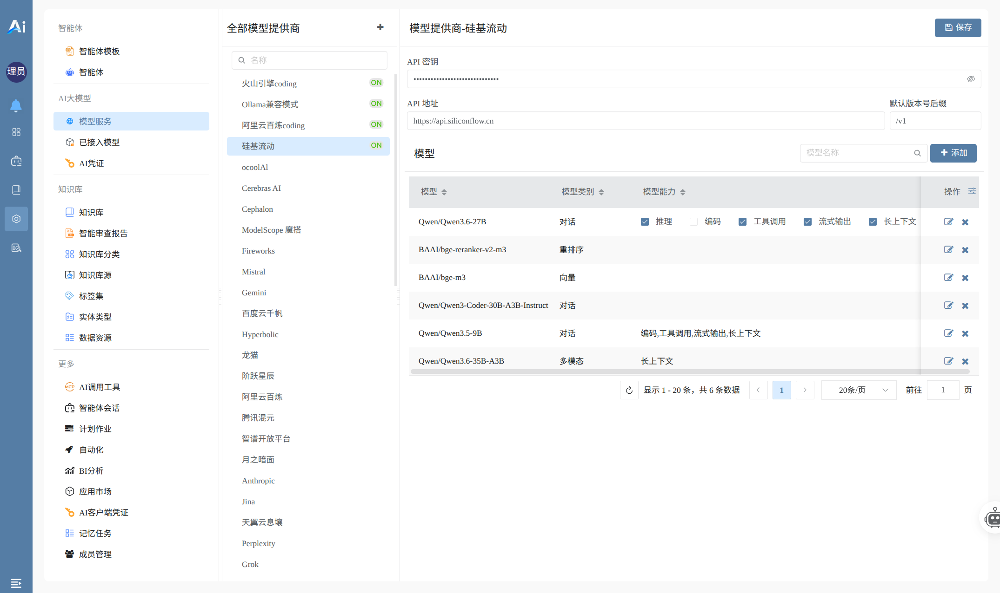
- 点击提供商名称（如硅基流动、火山引擎、阿里云百炼等）
- 填写：API密钥

> 📌 *平台支持硅基流动、Ollama兼容模式、阿里云百炼、火山引擎等多种提供商。如果有其他平台可以点击「+按钮」添加模型提供商*

#### 步骤二：注册模型

在同一页面，点击「模型」标签下的「+添加」：

- 选中**模型名称**（如 `qwen3.6-plus` `GLM-5.1`）点击添加
- 添加好后在下方表格中设置**模型类别**（对话/向量/重排序/多模态）
- 设置**模型能力**（推理/工具调用/流式输出/长上下文等）

#### 步骤三：设置默认模型并发布

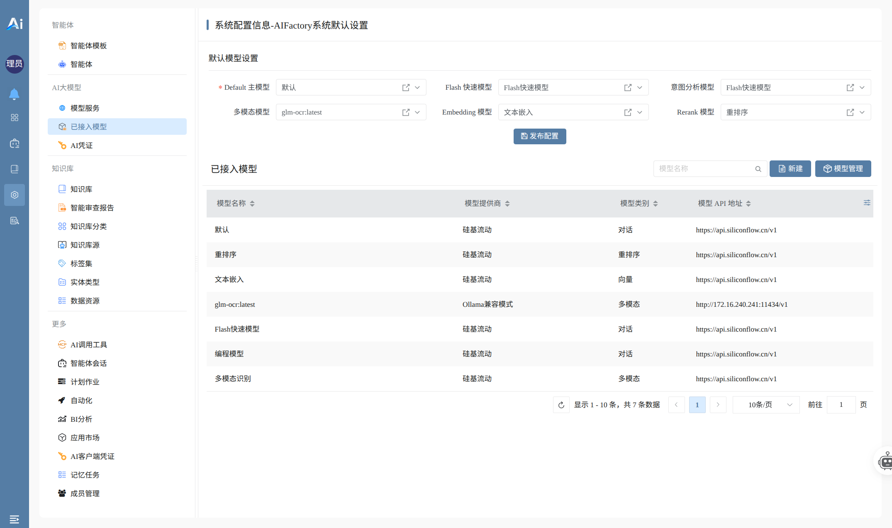

进入菜单：**配置 → 已接入模型**

- 为每个领域分别选择已注册的真实模型：
    - 主模型 / 快速模型 / 意图分析模型
    - 多模态模型 / Embedding 模型 / Rerank 模型
- 点击「发布配置」，使设置生效


> 📌 以上步骤全部完成后，您即可开始创建专属智能体，使用 AI Factory 的 AI 功能。


### 🛠 定制开发

如果您需要在 AI Factory 的基础上进行 二次开发或行业定制，推荐使用 [iBizModeling](https://modeling.ibizlab.cn/) 在线实验室：

🔹 在线创建和编辑模型，无需本地安装

🔹 ModelingIDE中可视化建模配置，一键发布新模型

🔹 本地 AI Factory 系统自动加载模型变更，实时解释执行，支持快速验证

👉 [点击这里申请在线实验室](https://open.ibizlab.cn/plmweb/#/-/index/-/workspace_tab_exp_view/srfnav=oss/recent_oss_tree_exp_view/-/route-modal/dev_lab_apply_apply_edit_view/-)  免费使用


## 📞 联系我们

- 官方网站：[https://aifactory.ibizlab.cn](https://aifactory.ibizlab.cn)
- 博客：[CSDN](https://blog.csdn.net/weixin_49504018?spm=1018.2118.3001.5148)
- 关于我们：[https://modeling.ibizlab.cn/development.html](https://modeling.ibizlab.cn/development.html)
- 开源实验室官网：https://www.ibizlab.cn
- 开源社区：https://open.ibizlab.cn
- 微信公众号：iBiz开放平台
- QQ交流群：1067434627

 
