# iBiz 在线实验室开发联动-iBizPLM

### 📦 步骤一：新建私有 Git 版本库

#### 1.1 创建 Gitee 私有仓库

- 登录 Gitee 平台
- 进入"新建仓库"页面
- 填写仓库信息：
  - **仓库名称**：自定义（示例：`hiplm`）
  - **可见性**：私有（仅仓库成员可见）
  - **初始化仓库**：勾选"设置模板"，选择 Readme 文件
- 点击"创建"按钮完成仓库创建

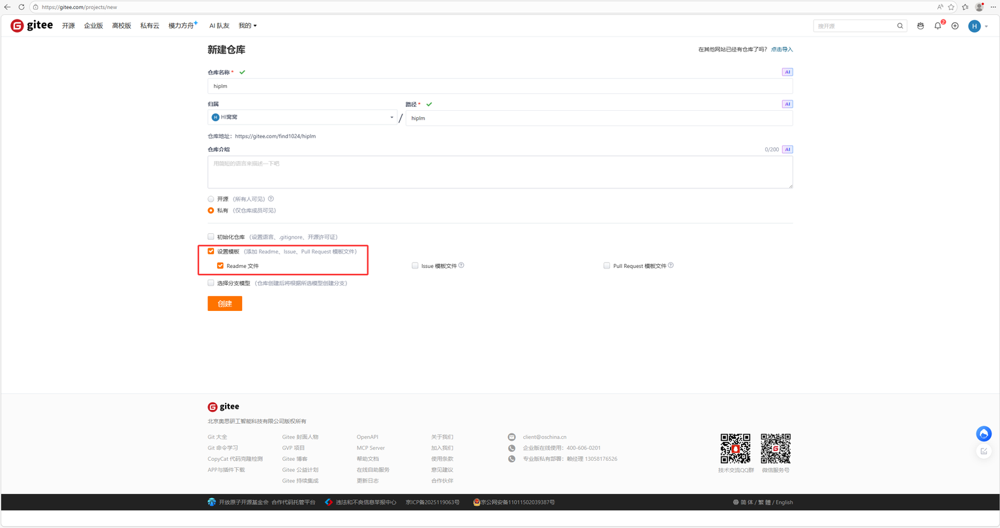

#### 1.2 生成私人令牌（Token）

- 进入 Gitee 个人设置 → 安全设置 → 私人令牌
- 点击"生成新令牌"
- 勾选所需权限（projects, pull_requests, issues, notes, keys, hook, groups, gist, enterprises, emails 等）
- 保存生成的令牌（仅显示一次，请妥善保管）

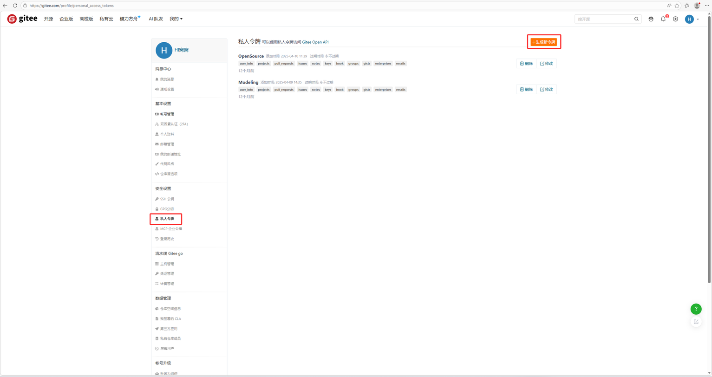

#### 1.3 拼接仓库访问地址

仓库地址格式：

```
https://oauth2:第一步生成的私人令牌@第一步创建的仓库地址.git
```

> [!TIP]
>
> - 将 `第一步生成的私人令牌` 替换为步骤 1.2 中生成的私人令牌
> - 将 `第一步创建的仓库地址` 替换为步骤 1.1 中创建的仓库地址（去掉 https:// 前缀）
> - **分支**：默认为 `master`（或你在创建仓库时选择的分支）

### 🧪 步骤二：创建 PLM 在线实验室

#### 2.1 登录 iBiz 开放平台

- 访问 iBiz 开放平台
- 进入"开源社区" → "我的实验室"

#### 2.2 新建实验室

- 点击"创建实验室"按钮
- 填写实验室信息：
  - **模板**：产品生命周期管理系统
  - **系统代码**：自定义（示例：`plmbizdev`）
  - **系统中文名**：产品生命周期管理系统
- 点击"提交"按钮

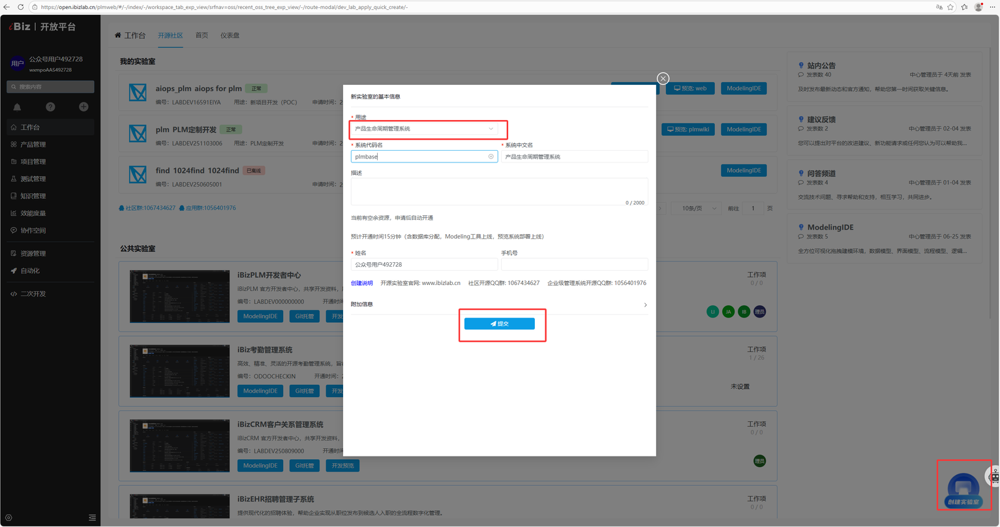

#### 2.3 等待实验室就绪

> [!NOTE]
> 实验室状态变为"正常"（绿色标识）约需 **15 分钟**，请耐心等待。

- 状态正常后，点击右侧 **"ModelingIDE"** 按钮进入配置界面

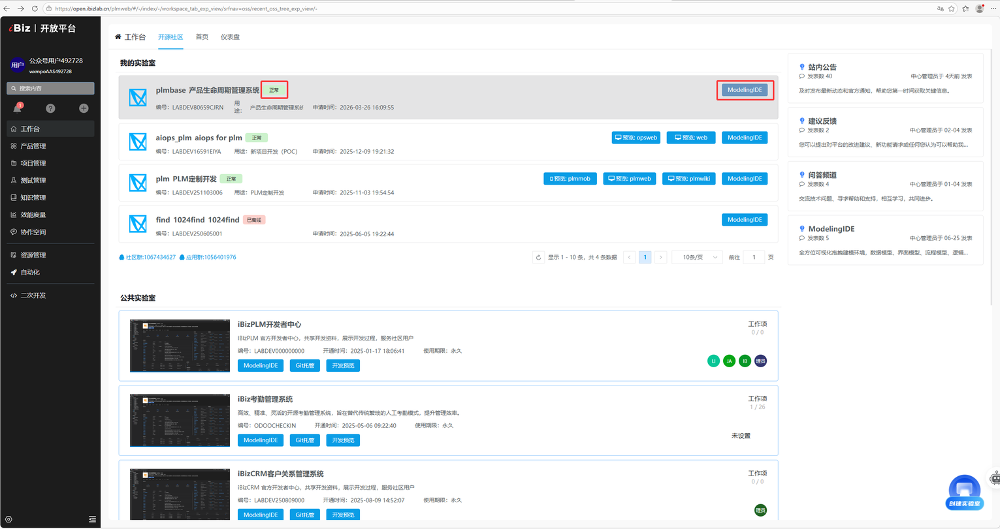

### ⚙️ 步骤三：配置私有 Git 仓库

#### 3.1 进入环境设置

- 在 ModelingIDE 界面，点击右上角菜单
- 选择 **"高级设置"**

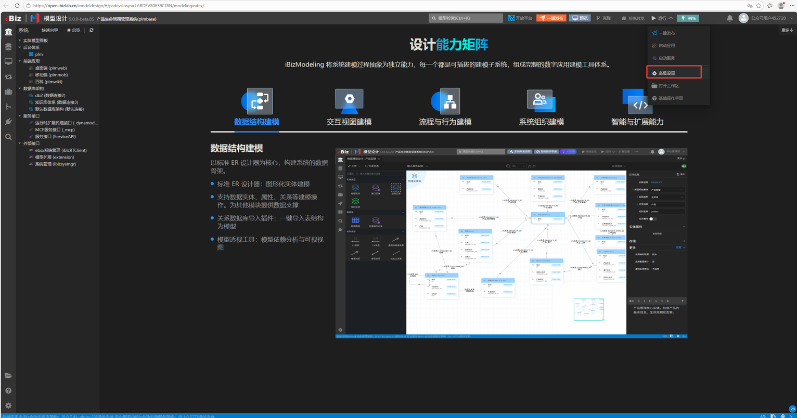

#### 3.2 修改代码版本仓库

- 找到"代码版本仓库"配置项
- 填写以下信息：
  - **仓库地址**：`https://oauth2:[TOKEN]@第一步创建的仓库地址.git`
  - **分支**：`master`（或你创建的仓库的默认分支）
- 点击 **"保存并同步代码仓库"** 按钮

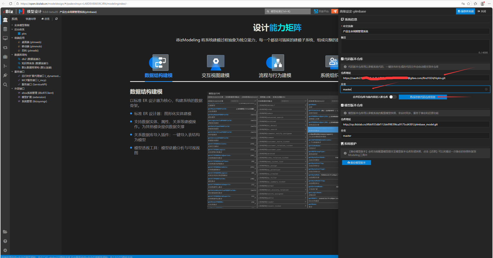

> [!CAUTION]
> 仓库地址不可使用系统内置版本仓库，一键发布时生成的代码将自动提交到本仓库

### 🚀 步骤四：一键发布

#### 4.1 执行发布

- 点击右上角 **"一键发布"** 按钮
- 点击"开始"按钮

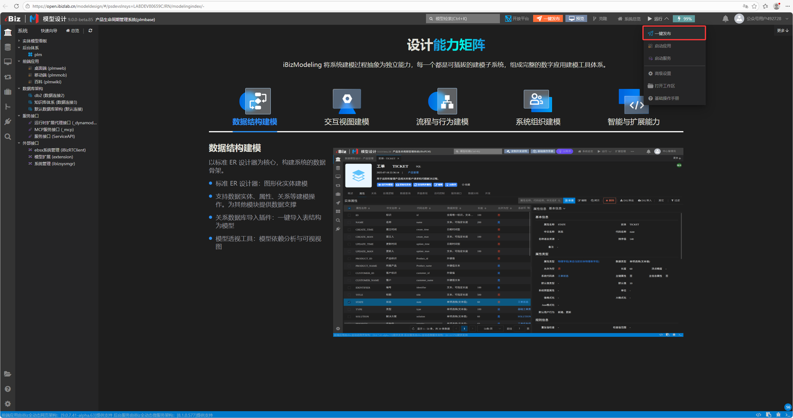

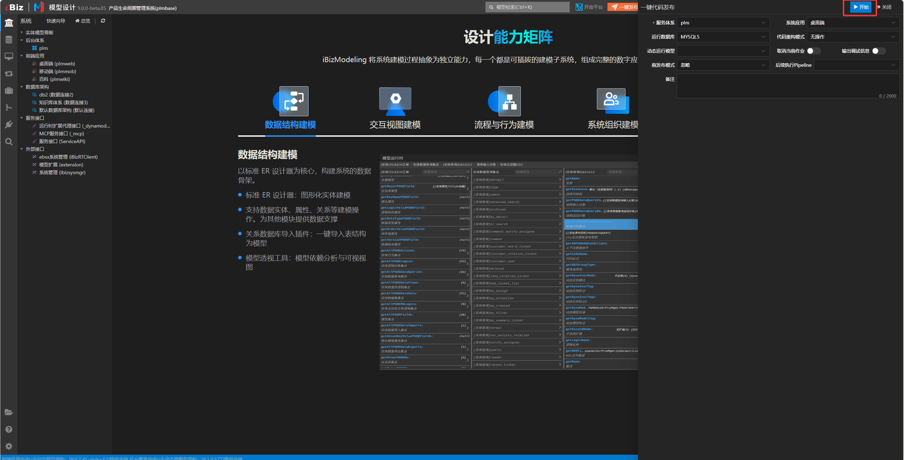

#### 4.2 查看发布日志

- 发布过程中可点击底部 **"打开/关闭"** 按钮查看实时日志
- 日志内容包括：
  - 模型代码生成
  - 前端代码生成
  - 后端代码生成
  - Git 提交

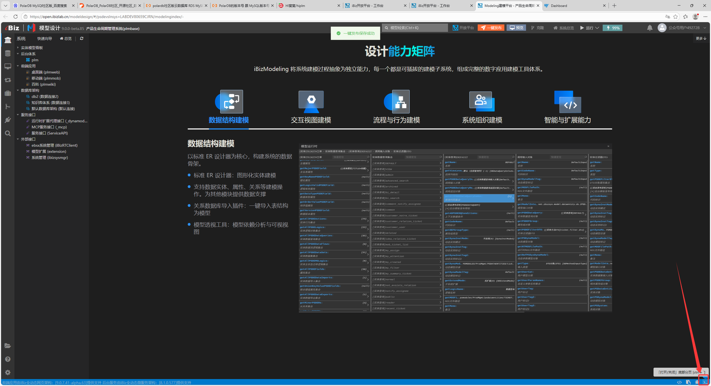

### ✅ 步骤五：验证发布结果

#### 5.1 检查发布日志

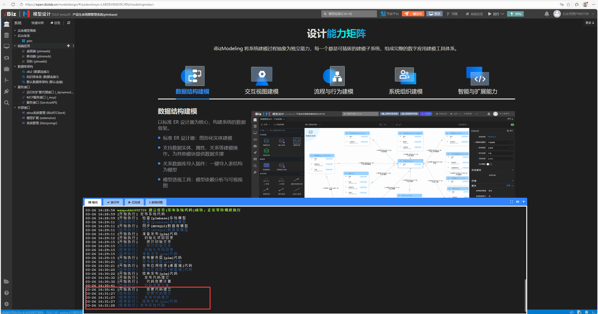

#### 5.2 验证 Gitee 仓库

- 访问你在步骤 1.1 中创建的 Gitee 仓库页面
- 确认有以下内容：
  - 新增 `model` 文件夹、`ibizmodel.yaml`文件
  - 提交记录显示：`发布系统代码 [应用名称，成品]`
  - 提交者为 `ibizdev`

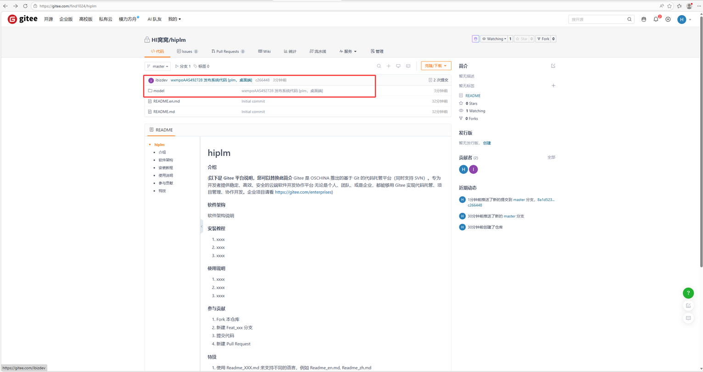

### 💻 步骤六：本地部署

#### 克隆仓库

```bash
git clone https://gitee.com/ibizlab/plm.git
cd plm/deploy/compose
```

#### 配置仓库信息

编辑 `.lab` 文件，修改以下配置：

```bash
SYSTEM_REPO=第一步生成的私有 Git 仓库地址
SYSTEM_BRANCH=master（或你创建的仓库的默认分支）
```

> [!TIP]
> - `SYSTEM_REPO`：填写步骤 1.3 中拼接的完整仓库地址（包含 oauth2 和私人令牌）
> - `SYSTEM_BRANCH`：填写你的仓库分支名（默认为 `master`）

#### 启动服务

```bash
docker compose -f docker-compose-lab.yml --env-file .lab up -d
```

#### 查看日志

```bash
docker logs -f plmservice
```

#### 验证启动成功

看到以下日志表示服务启动成功：

```
[DEBUG] n.i.central.cloud.core.ServiceHubBase : 系统 [ibizplm] 已经注册
[DEBUG] n.i.central.cloud.core.ServiceHubBase : Heap Memory Usage:
[DEBUG] n.i.central.cloud.core.ServiceHubBase : Init: 786432000
[DEBUG] n.i.central.cloud.core.ServiceHubBase : Used: 1489565680
[DEBUG] n.i.central.cloud.core.ServiceHubBase : Committed: 4904714240
[DEBUG] n.i.central.cloud.core.ServiceHubBase : Max: 11169955840
[DEBUG] n.i.central.cloud.core.ServiceHubBase : Non-Heap Memory Usage:
[DEBUG] n.i.central.cloud.core.ServiceHubBase : Init: 2555904
[DEBUG] n.i.central.cloud.core.ServiceHubBase : Used: 222739928
[DEBUG] n.i.central.cloud.core.ServiceHubBase : Committed: 231342080
[DEBUG] n.i.central.cloud.core.ServiceHubBase : Max: -1
```

#### 后续操作

- 访问以下系统页面（假定本机使用 localhost 访问，如果跨机器访问请将 localhost 更换为服务器 ip 地址或域名）：
  - **iBizPLM 桌面端**：http://localhost:30250/ibizplm-plmweb/
  - **iBizPLM 移动端**：http://localhost:30260/ibizplm-plmmob/
  - **UAA 系统管理**：http://localhost:32666
- 根据需求使用在线实验室进行二次开发
- 建模配置参考：[B 站教学视频](https://space.bilibili.com/3546701094717585)

### ✅ 验证完成

- ✅ 发布日志显示代码提交成功
- ✅ Gitee 仓库有新的提交记录
- ✅ 本地部署服务启动成功

### ❓ 常见问题

#### Q1: 实验室状态长时间不为"正常"怎么办？

- 等待 15-20 分钟，实验室初始化需要时间
- 如超过 30 分钟仍不正常，联系平台管理员

#### Q2: Token 泄露了怎么办？

- 立即在 Gitee 私人令牌页面删除该令牌
- 重新生成新令牌并更新仓库地址配置

#### Q3: 发布失败如何排查？

- 查看发布日志中的错误信息
- 确认仓库地址和 Token 配置正确
- 确认 Gitee 仓库有写入权限

### 🔗 相关链接

- 🌐 iBiz 开放平台：[www.ibizlab.cn](https://www.ibizlab.cn)
- 🌐 Gitee 代码托管：[gitee.com](https://gitee.com)
- 💬 QQ 交流群：`1067434627`
