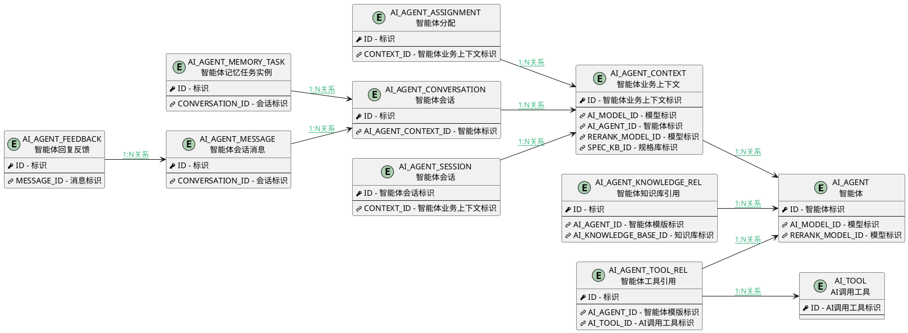

# 智能体 <!-- {docsify-ignore-all} -->

```plantuml
@startuml
skinparam svgLinkTarget _blank
<style>
root {
  HyperlinkColor #42b983
}
</style>
left to right direction

entity "AI_AGENT\n智能体" as AI_AGENT [[$../module/ai/ai_agent {智能体}]] {
        <&key> ID - 智能体标识
        --
        <&link-intact> AI_MODEL_ID - 模型标识
        <&link-intact> RERANK_MODEL_ID - 模型标识
}
entity "AI_AGENT_ASSIGNMENT\n智能体分配" as AI_AGENT_ASSIGNMENT [[$../module/ai/ai_agent_assignment {智能体分配}]] {
        <&key> ID - 标识
        --
        <&link-intact> CONTEXT_ID - 智能体业务上下文标识
}
entity "AI_AGENT_CONTEXT\n智能体业务上下文" as AI_AGENT_CONTEXT [[$../module/ai/ai_agent_context {智能体业务上下文}]] {
        <&key> ID - 智能体业务上下文标识
        --
        <&link-intact> AI_MODEL_ID - 模型标识
        <&link-intact> AI_AGENT_ID - 智能体标识
        <&link-intact> RERANK_MODEL_ID - 模型标识
        <&link-intact> SPEC_KB_ID - 规格库标识
}
entity "AI_AGENT_CONVERSATION\n智能体会话" as AI_AGENT_CONVERSATION [[$../module/ai/ai_agent_conversation {智能体会话}]] {
        <&key> ID - 标识
        --
        <&link-intact> AI_AGENT_CONTEXT_ID - 智能体标识
}
entity "AI_AGENT_FEEDBACK\n智能体回复反馈" as AI_AGENT_FEEDBACK [[$../module/ai/ai_agent_feedback {智能体回复反馈}]] {
        <&key> ID - 标识
        --
        <&link-intact> MESSAGE_ID - 消息标识
}
entity "AI_AGENT_KNOWLEDGE_REL\n智能体知识库引用" as AI_AGENT_KNOWLEDGE_REL [[$../module/ai/ai_agent_knowledge_rel {智能体知识库引用}]] {
        <&key> ID - 标识
        --
        <&link-intact> AI_AGENT_ID - 智能体模版标识
        <&link-intact> AI_KNOWLEDGE_BASE_ID - 知识库标识
}
entity "AI_AGENT_MEMORY_TASK\n智能体记忆任务实例" as AI_AGENT_MEMORY_TASK [[$../module/ai/ai_agent_memory_task {智能体记忆任务实例}]] {
        <&key> ID - 标识
        --
        <&link-intact> CONVERSATION_ID - 会话标识
}
entity "AI_AGENT_MESSAGE\n智能体会话消息" as AI_AGENT_MESSAGE [[$../module/ai/ai_agent_message {智能体会话消息}]] {
        <&key> ID - 标识
        --
        <&link-intact> CONVERSATION_ID - 会话标识
}
entity "AI_AGENT_SESSION\n智能体会话" as AI_AGENT_SESSION [[$../module/ai/ai_agent_session {智能体会话}]] {
        <&key> ID - 智能体会话标识
        --
        <&link-intact> CONTEXT_ID - 智能体业务上下文标识
}
entity "AI_AGENT_TOOL_REL\n智能体工具引用" as AI_AGENT_TOOL_REL [[$../module/ai/ai_agent_tool_rel {智能体工具引用}]] {
        <&key> ID - 标识
        --
        <&link-intact> AI_AGENT_ID - 智能体模版标识
        <&link-intact> AI_TOOL_ID - AI调用工具标识
}
entity "AI_TOOL\nAI调用工具" as AI_TOOL [[$../module/ai/ai_tool {AI调用工具}]] {
        <&key> ID - AI调用工具标识
        --
}

AI_AGENT_CONTEXT--> AI_AGENT : [[$../der/DER1N_AI_AGENT_CONTEXT_AI_AGENT_AI_AGENT_ID{DER1N_AI_AGENT_CONTEXT_AI_AGENT_AI_AGENT_ID} 1:N关系]]
AI_AGENT_KNOWLEDGE_REL--> AI_AGENT : [[$../der/DER1N_AI_AGENT_KNOWLEDGE_REL_AI_AGENT_AI_AGENT_ID{DER1N_AI_AGENT_KNOWLEDGE_REL_AI_AGENT_AI_AGENT_ID} 1:N关系]]
AI_AGENT_TOOL_REL--> AI_AGENT : [[$../der/DER1N_AI_AGENT_TOOL_REL_AI_AGENT_AI_AGENT_ID{DER1N_AI_AGENT_TOOL_REL_AI_AGENT_AI_AGENT_ID} 1:N关系]]
AI_AGENT_ASSIGNMENT--> AI_AGENT_CONTEXT : [[$../der/DER1N_AI_AGENT_ASSIGNMENT_AI_AGENT_CONTEXT_CONTEXT_ID{DER1N_AI_AGENT_ASSIGNMENT_AI_AGENT_CONTEXT_CONTEXT_ID} 1:N关系]]
AI_AGENT_CONVERSATION--> AI_AGENT_CONTEXT : [[$../der/DER1N_AI_AGENT_CONVERSATION_AI_AGENT_CONTEXT_AI_AGENT_CONTEXT_ID{DER1N_AI_AGENT_CONVERSATION_AI_AGENT_CONTEXT_AI_AGENT_CONTEXT_ID} 1:N关系]]
AI_AGENT_SESSION--> AI_AGENT_CONTEXT : [[$../der/DER1N_AI_AGENT_SESSION_AI_AGENT_CONTEXT_CONTEXT_ID{DER1N_AI_AGENT_SESSION_AI_AGENT_CONTEXT_CONTEXT_ID} 1:N关系]]
AI_AGENT_MEMORY_TASK--> AI_AGENT_CONVERSATION : [[$../der/DER1N_AI_AGENT_MEMORY_TASK_AI_AGENT_CONVERSATION_CONVERSATION_ID{DER1N_AI_AGENT_MEMORY_TASK_AI_AGENT_CONVERSATION_CONVERSATION_ID} 1:N关系]]
AI_AGENT_MESSAGE--> AI_AGENT_CONVERSATION : [[$../der/DER1N_AI_AGENT_MESSAGE_AI_AGENT_CONVERSATION_CONVERSATION_ID{DER1N_AI_AGENT_MESSAGE_AI_AGENT_CONVERSATION_CONVERSATION_ID} 1:N关系]]
AI_AGENT_FEEDBACK--> AI_AGENT_MESSAGE : [[$../der/DER1N_AI_AGENT_FEEDBACK_AI_AGENT_MESSAGE_MESSAGE_ID{DER1N_AI_AGENT_FEEDBACK_AI_AGENT_MESSAGE_MESSAGE_ID} 1:N关系]]
AI_AGENT_TOOL_REL--> AI_TOOL : [[$../der/DER1N_AI_AGENT_TOOL_REL_AI_TOOL_AI_TOOL_ID{DER1N_AI_AGENT_TOOL_REL_AI_TOOL_AI_TOOL_ID} 1:N关系]]


hide methods
@enduml
```
