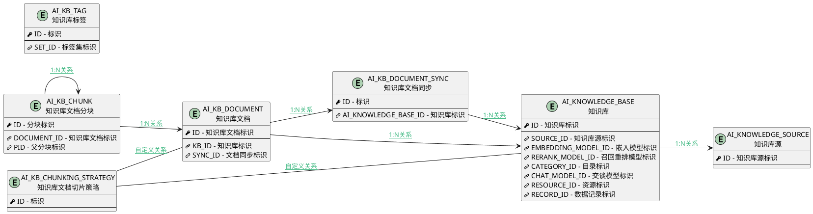

# 知识库 <!-- {docsify-ignore-all} -->

```plantuml
@startuml
skinparam svgLinkTarget _blank
<style>
root {
  HyperlinkColor #42b983
}
</style>
left to right direction

entity "AI_KB_CHUNK\n知识库文档分块" as AI_KB_CHUNK [[$../module/ai/ai_kb_chunk {知识库文档分块}]] {
        <&key> ID - 分块标识
        --
        <&link-intact> DOCUMENT_ID - 知识库文档标识
        <&link-intact> PID - 父分块标识
}
entity "AI_KB_CHUNKING_STRATEGY\n知识库文档切片策略" as AI_KB_CHUNKING_STRATEGY [[$../module/ai/ai_kb_chunking_strategy {知识库文档切片策略}]] {
        <&key> ID - 标识
        --
}
entity "AI_KB_DOCUMENT\n知识库文档" as AI_KB_DOCUMENT [[$../module/ai/ai_kb_document {知识库文档}]] {
        <&key> ID - 知识库文档标识
        --
        <&link-intact> KB_ID - 知识库标识
        <&link-intact> SYNC_ID - 文档同步标识
}
entity "AI_KB_DOCUMENT_SYNC\n知识库文档同步" as AI_KB_DOCUMENT_SYNC [[$../module/ai/ai_kb_document_sync {知识库文档同步}]] {
        <&key> ID - 标识
        --
        <&link-intact> AI_KNOWLEDGE_BASE_ID - 知识库标识
}
entity "AI_KB_TAG\n知识库标签" as AI_KB_TAG [[$../module/ai/ai_kb_tag {知识库标签}]] {
        <&key> ID - 标识
        --
        <&link-intact> SET_ID - 标签集标识
}
entity "AI_KNOWLEDGE_BASE\n知识库" as AI_KNOWLEDGE_BASE [[$../module/ai/ai_knowledge_base {知识库}]] {
        <&key> ID - 知识库标识
        --
        <&link-intact> SOURCE_ID - 知识库源标识
        <&link-intact> EMBEDDING_MODEL_ID - 嵌入模型标识
        <&link-intact> RERANK_MODEL_ID - 召回重排模型标识
        <&link-intact> CATEGORY_ID - 目录标识
        <&link-intact> CHAT_MODEL_ID - 交谈模型标识
        <&link-intact> RESOURCE_ID - 资源标识
        <&link-intact> RECORD_ID - 数据记录标识
}
entity "AI_KNOWLEDGE_SOURCE\n知识库源" as AI_KNOWLEDGE_SOURCE [[$../module/ai/ai_knowledge_source {知识库源}]] {
        <&key> ID - 知识库源标识
        --
}

AI_KB_CHUNK--> AI_KB_CHUNK : [[$../der/DER1N_AI_KB_CHUNK_AI_KB_CHUNK_PID{DER1N_AI_KB_CHUNK_AI_KB_CHUNK_PID} 1:N关系]]
AI_KB_CHUNK--> AI_KB_DOCUMENT : [[$../der/DER1N_AI_KB_CHUNK_AI_KB_DOCUMENT_DOCUMENT_ID{DER1N_AI_KB_CHUNK_AI_KB_DOCUMENT_DOCUMENT_ID} 1:N关系]]
AI_KB_CHUNKING_STRATEGY-- AI_KB_DOCUMENT : [[$../der/DERCUSTOM_AI_KB_CHUNKING_STRATEGY_AI_KB_DOCUMENT{DERCUSTOM_AI_KB_CHUNKING_STRATEGY_AI_KB_DOCUMENT} 自定义关系]]
AI_KB_DOCUMENT--> AI_KB_DOCUMENT_SYNC : [[$../der/DER1N_AI_KB_DOCUMENT_AI_KB_DOCUMENT_SYNC_SYNC_ID{DER1N_AI_KB_DOCUMENT_AI_KB_DOCUMENT_SYNC_SYNC_ID} 1:N关系]]
AI_KB_DOCUMENT--> AI_KNOWLEDGE_BASE : [[$../der/DER1N_AI_KB_DOCUMENT_AI_KNOWLEDGE_BASE_KB_ID{DER1N_AI_KB_DOCUMENT_AI_KNOWLEDGE_BASE_KB_ID} 1:N关系]]
AI_KB_DOCUMENT_SYNC--> AI_KNOWLEDGE_BASE : [[$../der/DER1N_AI_KB_DOCUMENT_SYNC_AI_KNOWLEDGE_BASE_AI_KNOWLEDGE_BASE_ID{DER1N_AI_KB_DOCUMENT_SYNC_AI_KNOWLEDGE_BASE_AI_KNOWLEDGE_BASE_ID} 1:N关系]]
AI_KB_CHUNKING_STRATEGY-- AI_KNOWLEDGE_BASE : [[$../der/DERCUSTOM_AI_KB_CHUNKING_STRATEGY_AI_KNOWLEDGE_BASE{DERCUSTOM_AI_KB_CHUNKING_STRATEGY_AI_KNOWLEDGE_BASE} 自定义关系]]
AI_KNOWLEDGE_BASE--> AI_KNOWLEDGE_SOURCE : [[$../der/DER1N_AI_KNOWLEDGE_BASE_AI_KNOWLEDGE_SOURCE_SOURCE_ID{DER1N_AI_KNOWLEDGE_BASE_AI_KNOWLEDGE_SOURCE_SOURCE_ID} 1:N关系]]


hide methods
@enduml
```
