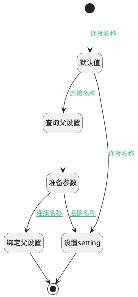

## 默认设定 <!-- {docsify-ignore-all} -->

   

### 处理过程

### 处理步骤说明

#### 开始 :id=Begin [开始]

*- N/A*
#### 默认值 :id=PREPAREPARAM_01 [准备参数]

1. 将`Default(传入变量).PID(父标识)` 设置给  `parent.ID(标识)`

#### 查询父设置 :id=DEACTION_01 [实体行为]

调用实体 [类别(CATEGORY)](module/Base/category.md) 行为 [Get](module/Base/category#行为) ，行为参数为`parent`

将执行结果返回给参数`parent`

#### 设置setting :id=PREPAREPARAM_02 [准备参数]

1. 将`{"visibility":"private","similarity_threshold":"0.10","vector_similarity_weight":"0.3","top_k":20,"rerank":2,"use_kg":0,"parser_config":{"auto_keywords":"3","auto_questions":"5","chunk_token_num":"512","delimiter":"\\n","task_page_size":"12","raptor":{"use_raptor":1,"threshold":0.1,"max_clusters":64,"random_seed":42,"prompt":"请总结以下段落。 小心数字，不要编造。 段落如下：      \n {cluster_content} \n以上就是你需要总结的内容。","max_tokens":256},"graphrag":{"use_graphrag":0,"entity_types":"organization,person,event","method":"general"},"chunk_overlap_num":30,"keep_separator":1,"layout_recognize":"OCR","max_chunk_count_per_doc":1000,"method":"NAIVE","data_masking_rules":[],"pageindex":{"use_pageindex":0,"pages_per_index":5}}}` 设置给  `Default(传入变量).json`
2. 将`Default(传入变量).json` 绑定给  `setting`
3. 将`无值（NONE）` 设置给  `Default(传入变量).json`
4. 将`setting` 设置给  `Default(传入变量).SETTING(设置)`

#### 准备参数 :id=PREPAREPARAM_04 [准备参数]

1. 将`parent.SETTING(设置)` 绑定给  `setting`

#### 绑定父设置 :id=PREPAREPARAM_03 [准备参数]

1. 将`无值（NONE）` 设置给  `setting.ID(标识)`
2. 将`无值（NONE）` 设置给  `setting.NAME(名称)`
3. 将`setting` 设置给  `Default(传入变量).SETTING(设置)`

#### 结束 :id=END_01 [结束]

返回 `Default(传入变量)`

### 连接条件说明
#### 连接名称 :id=Begin-PREPAREPARAM_01

`Default(传入变量).OWNER_TYPE(所属数据对象)` EQ `space` AND `Default(传入变量).SETTING(设置)` ISNULL
#### 连接名称 :id=PREPAREPARAM_01-PREPAREPARAM_02

`parent(parent).ID(标识)` ISNULL
#### 连接名称 :id=PREPAREPARAM_01-DEACTION_01

`parent(parent).ID(标识)` ISNOTNULL
#### 连接名称 :id=PREPAREPARAM_04-PREPAREPARAM_03

`setting(setting)` ISNOTNULL
#### 连接名称 :id=PREPAREPARAM_04-PREPAREPARAM_02

`setting(setting)` ISNULL

### 实体逻辑参数

|    中文名   |    代码名    |  数据类型    |  实体   |备注 |
| --------| --------| -------- | -------- | --------   |
|传入变量(<i class="fa fa-check"/></i>)|Default|数据对象|[类别(CATEGORY)](module/Base/category.md)||
|parent|parent|数据对象|[类别(CATEGORY)](module/Base/category.md)||
|setting|setting|数据对象|[类别设置(CATEGORY_SETTINGS)](module/Base/category_settings.md)||
