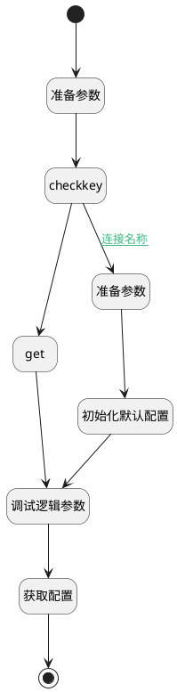

## get_aifactory_sys_env <!-- {docsify-ignore-all} -->

   

### 处理过程




### 处理步骤说明

#### 开始 :id=Begin<sup class="footnote-symbol"> <font color=gray size=1>[开始]</font></sup>


*- N/A*
#### 准备参数 :id=PREPAREPARAM_01<sup class="footnote-symbol"> <font color=gray size=1>[准备参数]</font></sup>


1. 将`aifactory_sys_env` 设置给  `Default(传入变量).ID(标识)`

#### checkkey :id=DEACTION_01<sup class="footnote-symbol"> <font color=gray size=1>[实体行为]</font></sup>


调用实体 [类别设置(CATEGORY_SETTINGS)](module/Base/category_settings.md) 行为 [CheckKey](module/Base/category_settings#行为) ，行为参数为`Default(传入变量)`

将执行结果返回给参数`check`

#### 准备参数 :id=PREPAREPARAM_02<sup class="footnote-symbol"> <font color=gray size=1>[准备参数]</font></sup>


1. 将`AIFactory系统默认设置` 设置给  `Default(传入变量).NAME(名称)`

#### get :id=DEACTION_03<sup class="footnote-symbol"> <font color=gray size=1>[实体行为]</font></sup>


调用实体 [类别设置(CATEGORY_SETTINGS)](module/Base/category_settings.md) 行为 [Get](module/Base/category_settings#行为) ，行为参数为`Default(传入变量)`

将执行结果返回给参数`Default(传入变量)`

#### 初始化默认配置 :id=DEACTION_02<sup class="footnote-symbol"> <font color=gray size=1>[实体行为]</font></sup>


调用实体 [类别设置(CATEGORY_SETTINGS)](module/Base/category_settings.md) 行为 [Create](module/Base/category_settings#行为) ，行为参数为`Default(传入变量)`

将执行结果返回给参数`Default(传入变量)`

#### 调试逻辑参数 :id=DEBUGPARAM_01<sup class="footnote-symbol"> <font color=gray size=1>[调试逻辑参数]</font></sup>


> [!NOTE|label:调试信息|icon:fa fa-bug]
> 调试输出参数`Default(传入变量)`的详细信息


#### 获取配置 :id=RAWSFCODE_01<sup class="footnote-symbol"> <font color=gray size=1>[直接后台代码]</font></sup>


<p class="panel-title"><b>执行代码[Groovy]</b></p>

```groovy
def _default = logic.param('Default').getReal()
        // 字符串类字段保持原有处理
        def id = _default.get("id")?.toString() ?: ""
        def sysid = sys.getDeploySystemId().toLowerCase()
        def agentpre = "${sysid}-ai--".toString()

        def serviceHub = net.ibizsys.central.cloud.core.spring.rt.ServiceHub.getInstance()
        org.yaml.snakeyaml.Yaml yaml = new org.yaml.snakeyaml.Yaml();
        def agent_runtime = sys.dataentity('ai_model')
        def getmodel = { String model_id ->
            def filter=agent_runtime.createSearchContext()
            filter.eq("id",model_id)
            return agent_runtime.selectOne(filter,true)
        }
        
        
        try {

            

            if(id == "aifactory_sys_env") {
                String strConfig = serviceHub.getConfig("deploysystem-${sysid}".toString());
                _default.set("configs",strConfig)

                String strOss = serviceHub.getConfig("cloud-oss");
                Map cloudoss = (!strOss) ? new HashMap() : yaml.loadAs(strOss, Map.class)
                Map aiimage = cloudoss.getOrDefault("aiimage", new HashMap())
                def vlagent = aiimage.get("agent")
                if(vlagent && vlagent.startsWith(agentpre)) {
                    vlagent = vlagent.replace(agentpre,"")
                    def agent = getmodel(vlagent)
                    if(agent) {
                        _default.set("vl_model_id",agent.get("id"))
                        _default.set("vl_model",agent.get("name"))
                    }
                }

                String strai = serviceHub.getConfig("cloud-ai");
                Map cloudai = (!strai) ? new HashMap() : yaml.loadAs(strai, Map.class)
                def defaultagent = cloudai.get("defaultagent")
                if(defaultagent && defaultagent.startsWith(agentpre)) {
                    defaultagent = defaultagent.replace(agentpre,"")
                    def agent = getmodel(defaultagent)
                    if(agent) {
                        _default.set("chat_model_id",agent.get("id"))
                        _default.set("chat_model",agent.get("name"))
                    }
                }

                String strkb = serviceHub.getConfig("cloud-kb");
                if(!strkb) {
                    strkb="fetchkbs:\n  url: lb://servicehub-ibizaifactory/ibizaifactory/serviceapi/ai_knowledge_bases/fetch_full_text\n  method: POST\n  agentformat: ibizaifactory-kb--{key}"
                    serviceHub.publishConfig("cloud-kb", strkb);
                }

            }


        } catch (Exception e) {
            e.printStackTrace()
        }
```

#### 结束 :id=END_01<sup class="footnote-symbol"> <font color=gray size=1>[结束]</font></sup>


返回 `Default(传入变量)`


### 连接条件说明
#### 连接名称 :id=DEACTION_01-PREPAREPARAM_02

`check(check)` EQ `0`


### 实体逻辑参数

|    中文名   |    代码名    |  数据类型    |  实体   |备注 |
| --------| --------| -------- | -------- | --------   |
|传入变量(<i class="fa fa-check"/></i>)|Default|数据对象|[类别设置(CATEGORY_SETTINGS)](module/Base/category_settings.md)||
|check|check|简单数据|||
