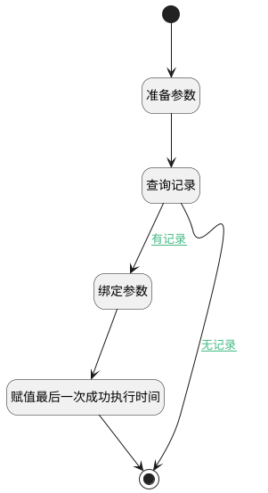

## 获取最后一次成功执行时间戳 <!-- {docsify-ignore-all} -->

   

### 处理过程

### 处理步骤说明

#### 开始 :id=Begin [开始]

*- N/A*
#### 准备参数 :id=PREPAREPARAM_01 [准备参数]

1. 将`Default(传入变量).owner_id(所属数据标识)` 设置给  `log_filter.n_owner_id_eq`
2. 将`SUCCESS` 设置给  `log_filter.n_state_eq`
3. 将`PSDELOGIC` 设置给  `log_filter.n_owner_subtype_eq`
4. 将`end_at,desc` 设置给  `log_filter.sort`
5. 将`1` 设置给  `log_filter.size`

#### 查询记录 :id=DEDATAQUERY_01 [实体数据查询]

调用实体 [扩展日志(EXTEND_LOG)](module/Base/extend_log.md) 数据查询 [数据查询(DEFAULT)](module/Base/extend_log#数据查询) ，查询参数为`log_filter`

将执行结果返回给参数`log_page`

#### 绑定参数 :id=BINDPARAM_01 [绑定参数]

绑定参数`log_page` 到 `last_extend_log`
#### 赋值最后一次成功执行时间 :id=PREPAREPARAM_02 [准备参数]

1. 将`last_extend_log.END_AT(结束时间)` 设置给  `Default(传入变量).last_exec_time`

#### 结束 :id=END_01 [结束]

返回 `Default(传入变量)`

### 连接条件说明
#### 无记录 :id=DEDATAQUERY_01-END_01

`log_page(log_page).size` EQ `0`
#### 有记录 :id=DEDATAQUERY_01-BINDPARAM_01

`log_page(log_page).size` GT `0`

### 实体逻辑参数

|    中文名   |    代码名    |  数据类型    |  实体   |备注 |
| --------| --------| -------- | -------- | --------   |
|传入变量(<i class="fa fa-check"/></i>)|Default|数据对象|[扩展日志(EXTEND_LOG)](module/Base/extend_log.md)||
|last_extend_log|last_extend_log|数据对象|[扩展日志(EXTEND_LOG)](module/Base/extend_log.md)||
|log_filter|log_filter|过滤器|||
|log_page|log_page|分页查询|||
