## 最近访问跳转其他视图 <!-- {docsify-ignore-all} -->

   首页最近访问点击后跳转其他视图

### 处理过程

```plantuml
@startuml
hide footbox
<style>
root {
  HyperlinkColor #42b983
}
</style>

hide empty description
state "开始" as Begin <<start>> [[$./recent_jump_other_view#begin {开始}]]
state "结束" as END1 <<end>> [[$./recent_jump_other_view#end1 {结束}]]
state "知识类" as PREPAREJSPARAM11  [[$./recent_jump_other_view#preparejsparam11 {知识类}]]
state "获取选中卡片" as PREPAREJSPARAM1  [[$./recent_jump_other_view#preparejsparam1 {获取选中卡片}]]
state "获取选中表格行" as PREPAREJSPARAM2  [[$./recent_jump_other_view#preparejsparam2 {获取选中表格行}]]
state "重定向跳转" as DEUIACTION1  [[$./recent_jump_other_view#deuiaction1 {重定向跳转}]]
state "获取选中数据详情" as RAWJSCODE1  [[$./recent_jump_other_view#rawjscode1 {获取选中数据详情}]]
state "页面" as PREPAREJSPARAM12  [[$./recent_jump_other_view#preparejsparam12 {页面}]]




@enduml
```




### 处理步骤说明

#### 获取选中卡片 :id=PREPAREJSPARAM1<sup class="footnote-symbol"> <font color=gray size=1>[准备参数]</font></sup>


1. 将`DATAVIEW(卡片参数).state` 设置给  `STATE(state)`
2. 将`STATE(state).selectedData` 设置给  `selectedData(选中数据（数组）)`

#### 获取选中数据详情 :id=RAWJSCODE1<sup class="footnote-symbol"> <font color=gray size=1>[直接前台代码]</font></sup>

用脚本处理，获取第一条数据（因为只有会一条数据）

<p class="panel-title"><b>执行代码</b></p>

```javascript
let selecteddata=uiLogic.selecteddata;
if (selecteddata.length > 0) {
    uiLogic.selectobj = selecteddata[0];
}
```

#### 开始 :id=Begin<sup class="footnote-symbol"> <font color=gray size=1>[开始]</font></sup>


#### 结束 :id=END1<sup class="footnote-symbol"> <font color=gray size=1>[结束]</font></sup>


#### 重定向跳转 :id=DEUIACTION1<sup class="footnote-symbol"> <font color=gray size=1>[实体界面行为调用]</font></sup>


调用实体 [最近访问(RECENT)](module/Base/recent.md) 界面行为 [通过重定向视图跳转](module/Base/recent#界面行为) ，行为参数为`selectedData(选中数据（数组）)`

#### 获取选中表格行 :id=PREPAREJSPARAM2<sup class="footnote-symbol"> <font color=gray size=1>[准备参数]</font></sup>


1. 将`grid(表格部件参数).state` 设置给  `STATE(state)`
2. 将`STATE(state).selectedData` 设置给  `selectedData(选中数据（数组）)`

#### 知识类 :id=PREPAREJSPARAM11<sup class="footnote-symbol"> <font color=gray size=1>[准备参数]</font></sup>


1. 将`selectobj(选中数据).recent_parent` 设置给  `ctx(上下文参数).space`
2. 将`selectobj(选中数据).owner_subtype` 设置给  `ctx(上下文参数).owner_subtype`

#### 页面 :id=PREPAREJSPARAM12<sup class="footnote-symbol"> <font color=gray size=1>[准备参数]</font></sup>


1. 将`selectobj(选中数据).owner_id` 设置给  `ctx(上下文参数).article_page`


### 实体逻辑参数

|    中文名   |    代码名    |  数据类型      |备注 |
| --------| --------| --------  | --------   |
|卡片参数|DATAVIEW|部件对象||
|选中数据（数组）|selectedData|简单数据列表||
|当前视图|cur_view|当前视图对象||
|选中数据|selectobj|数据对象||
|当前部件对象|this_obj|当前部件对象||
|表格部件参数|grid|部件对象||
|传入变量(<i class="fa fa-check"/></i>)|Default|数据对象||
|上下文参数|ctx|导航视图参数绑定参数||
|state|STATE|数据对象||
