## 创建对应的知识库 <!-- {docsify-ignore-all} -->

   

### 处理过程

```plantuml
@startuml
hide empty description
<style>
root {
  HyperlinkColor #42b983
}
</style>

hide empty description
state "开始" as Begin <<start>> [[$./CreateCorrespondingKB#begin {"开始"}]]
state "设置知识库数据" as PREPAREPARAM_01  [[$./CreateCorrespondingKB#prepareparam_01 {"设置知识库数据"}]]
state "创建知识库" as DEACTION_01  [[$./CreateCorrespondingKB#deaction_01 {"创建知识库"}]]
state "准备参数" as PREPAREPARAM_02  [[$./CreateCorrespondingKB#prepareparam_02 {"准备参数"}]]


Begin --> PREPAREPARAM_01
PREPAREPARAM_01 --> DEACTION_01
DEACTION_01 --> PREPAREPARAM_02


@enduml
```

### 处理步骤说明

#### 开始 :id=Begin [开始]

*- N/A*
#### 设置知识库数据 :id=PREPAREPARAM_01 [准备参数]

1. 将`Default(传入变量).ID(标识)` 设置给  `ai_knowledge_base(知识库).ID(知识库标识)`
2. 将`Default(传入变量).NAME(空间名称)` 设置给  `ai_knowledge_base(知识库).NAME(知识库名称)`
3. 将`Default(传入变量).VISIBILITY(可见范围)` 设置给  `ai_knowledge_base(知识库).VISIBILITY(可见范围)`
4. 将`{"auto_keywords":4,"auto_questions":5,"chunk_token_num":512,"delimiter":"\n","layout_recognize":"DeepDOC","task_page_size":12,"raptor":{"use_raptor":1,"max_token":"256","threshold":"0.1","max_cluster":"64","random_seed":"42","prompt":"请总结以下段落。 小心数字，不要编造。 段落如下：       {cluster_content} 以上就是你需要总结的内容。"},"graphrag":{"use_graphrag":1,"resolution":"1","entity_types":"organization,time,event,person,geo,product","method":"general"},"chunk_overlap":123,"chunk_overlap_num":30,"chunk_size":52,"keep_separator":1,"max_chunk_count_per_doc":111,"separator":"-","data_masking_rules":[{}],"method":"FIXED"}` 设置给  `ai_knowledge_base(知识库).PARSER_CONFIG(解析配置)`
5. 将`FIXED` 设置给  `ai_knowledge_base(知识库).CHUNK_METHOD(切片方法)`

#### 创建知识库 :id=DEACTION_01 [实体行为]

调用实体 [知识库(AI_KNOWLEDGE_BASE)](module/ai/ai_knowledge_base.md) 行为 [Create](module/ai/ai_knowledge_base#行为) ，行为参数为`ai_knowledge_base(知识库)`

#### 准备参数 :id=PREPAREPARAM_02 [准备参数]

    无

### 实体逻辑参数

|    中文名   |    代码名    |  数据类型    |  实体   |备注 |
| --------| --------| -------- | -------- | --------   |
|传入变量(<i class="fa fa-check"/></i>)|Default|数据对象|[空间(SPACE)](module/Wiki/space.md)||
|知识库|ai_knowledge_base|数据对象|[知识库(AI_KNOWLEDGE_BASE)](module/ai/ai_knowledge_base.md)||
