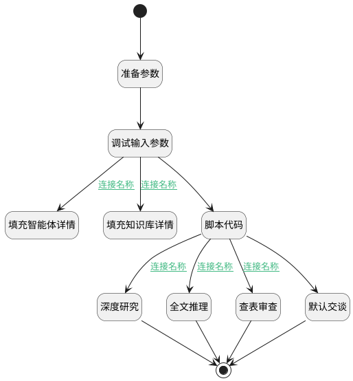

## agent_flow_templ <!-- {docsify-ignore-all} -->

   智能体处理流(模板)

### 处理过程




### 处理步骤说明

#### 准备参数 :id=PREPAREPARAM_01<sup class="footnote-symbol"> <font color=gray size=1>[准备参数]</font></sup>


1. 将`Default(传入变量).srfaiagenttag` 设置给  `agent.CODE_NAME(代码标识)`
2. 将`Default(传入变量).srfaiagenttag` 设置给  `flow_request.srfaiagenttag`
3. 将`Default(传入变量).knowledgebases` 设置给  `kb.ID(知识库标识)`
4. 将`Default(传入变量).knowledgebases` 设置给  `flow_request.knowledgebases`
5. 将`Default(传入变量).srfextparams` 设置给  `flow_request.srfextparams`

#### 开始 :id=BEGIN_01<sup class="footnote-symbol"> <font color=gray size=1>[开始]</font></sup>


*- N/A*
#### 调试输入参数 :id=DEBUGPARAM_01<sup class="footnote-symbol"> <font color=gray size=1>[调试逻辑参数]</font></sup>


> [!NOTE|label:调试信息|icon:fa fa-bug]
> 调试输出参数`Default(传入变量)`的详细信息


#### 填充智能体详情 :id=DEACTION_01<sup class="footnote-symbol"> <font color=gray size=1>[实体行为]</font></sup>


调用实体 [智能体业务上下文(AI_AGENT_CONTEXT)](module/ai/ai_agent_context.md) 行为 [find_by_code](module/ai/ai_agent_context#行为) ，行为参数为`agent`

将执行结果返回给参数`agent`

#### 填充知识库详情 :id=DEACTION_02<sup class="footnote-symbol"> <font color=gray size=1>[实体行为]</font></sup>


调用实体 [知识库(AI_KNOWLEDGE_BASE)](module/ai/ai_knowledge_base.md) 行为 [find_by_code](module/ai/ai_knowledge_base#行为) ，行为参数为`kb`

将执行结果返回给参数`kb`

#### 脚本代码 :id=RAWSFCODE_01<sup class="footnote-symbol"> <font color=gray size=1>[直接后台代码]</font></sup>


<p class="panel-title"><b>执行代码[Groovy]</b></p>

```groovy
def _default = logic.param("default").getReal();
def _request = logic.param("flow_request").getReal();
def _agent = logic.param("agent").getReal();
def _kb = logic.param("kb").getReal();
```

#### 深度研究 :id=DELOGIC_02<sup class="footnote-symbol"> <font color=gray size=1>[实体逻辑]</font></sup>


调用实体 [智能体业务上下文(AI_AGENT_CONTEXT)](module/ai/ai_agent_context.md) 处理逻辑 [深度研究]((module/ai/ai_agent_context/logic/deep_research.md)) ，行为参数为`flow_request(flow_request)`
将执行结果返回给参数`response(response)`

#### 全文推理 :id=DELOGIC_03<sup class="footnote-symbol"> <font color=gray size=1>[实体逻辑]</font></sup>


调用实体 [智能体业务上下文(AI_AGENT_CONTEXT)](module/ai/ai_agent_context.md) 处理逻辑 [交谈全文内容推理]((module/ai/ai_agent_context/logic/chat_fulltext_reason.md)) ，行为参数为`flow_request(flow_request)`
将执行结果返回给参数`response(response)`

#### 查表审查 :id=DELOGIC_04<sup class="footnote-symbol"> <font color=gray size=1>[实体逻辑]</font></sup>


调用实体 [智能体业务上下文(AI_AGENT_CONTEXT)](module/ai/ai_agent_context.md) 处理逻辑 [查表审查]((module/ai/ai_agent_context/logic/lookup.md)) ，行为参数为`flow_request(flow_request)`
将执行结果返回给参数`response(response)`

#### 默认交谈 :id=SYSAICHATAGENT_CHATOUTPUT_01<sup class="footnote-symbol"> <font color=gray size=1>[SYSAICHATAGENT_CHATOUTPUT]</font></sup>


#### 结束 :id=END_01<sup class="footnote-symbol"> <font color=gray size=1>[结束]</font></sup>


返回 `response`


### 连接条件说明
#### 连接名称 :id=DEBUGPARAM_01-DEACTION_01

`agent(agent).CODE_NAME(代码标识)` ISNOTNULL
#### 连接名称 :id=DEBUGPARAM_01-DEACTION_02

`kb(kb).ID(知识库标识)` ISNOTNULL
#### 连接名称 :id=RAWSFCODE_01-DELOGIC_02

`agent(agent).DEEP_RESEARCH(deep_research)` EQ `1`
#### 连接名称 :id=RAWSFCODE_01-DELOGIC_03

`agent(agent).USE_FULLTEXT(使用全文推理)` EQ `1`
#### 连接名称 :id=RAWSFCODE_01-DELOGIC_04

`agent(agent).SPEC_KB_ID(规格库标识)` ISNOTNULL


### 实体逻辑参数

|    中文名   |    代码名    |  数据类型    |  实体   |备注 |
| --------| --------| -------- | -------- | --------   |
|传入变量(<i class="fa fa-check"/></i>)|Default||||
|agent|agent|数据对象|[智能体业务上下文(AI_AGENT_CONTEXT)](module/ai/ai_agent_context.md)||
|flow_request|flow_request||||
|kb|kb|数据对象|[知识库(AI_KNOWLEDGE_BASE)](module/ai/ai_knowledge_base.md)||
|last_return|last_return|上一次调用返回|||
|response|response||||
