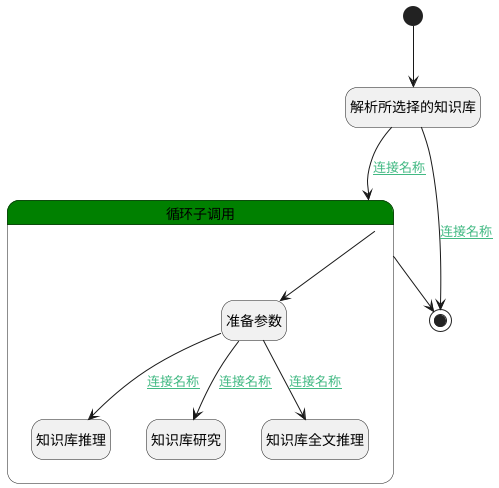

## 批量执行 <!-- {docsify-ignore-all} -->

   

### 处理过程




### 处理步骤说明

#### 开始 :id=Begin<sup class="footnote-symbol"> <font color=gray size=1>[开始]</font></sup>


*- N/A*
#### 知识库推理 :id=DEACTION_01<sup class="footnote-symbol"> <font color=gray size=1>[实体行为]</font></sup>


调用实体 [知识库(AI_KNOWLEDGE_BASE)](module/ai/ai_knowledge_base.md) 行为 [推理(reason)](module/ai/ai_knowledge_base#行为) ，行为参数为`kb_temp(循环临时对象)`

#### 解析所选择的知识库 :id=RAWSFCODE_01<sup class="footnote-symbol"> <font color=gray size=1>[直接后台代码]</font></sup>


<p class="panel-title"><b>执行代码[Groovy]</b></p>

```groovy
def _defualt = logic.param('Default').getReal()
def kb_list = logic.param('kb_list').getReal()
def kb_ids = _defualt.get('kb_ids')
if(kb_ids) {
    def kb_runtime = sys.dataentity('AI_KNOWLEDGE_BASE')
    groovy.json.JsonSlurper jsonParser = new groovy.json.JsonSlurper()
    def kbs = jsonParser.parseText(kb_ids)
    if (kbs.size() > 0) {
        kbs.each { it ->
            def kb = kb_runtime.entity()
            kb.set('id', it.get('id'))
            kb.set('agenttag', _defualt.get('code_name'))
            kb_list.add(kb)
        }
    }    
}

```

#### 准备参数 :id=PREPAREPARAM_01<sup class="footnote-symbol"> <font color=gray size=1>[准备参数]</font></sup>


    无

#### 知识库研究 :id=DELOGIC_01<sup class="footnote-symbol"> <font color=gray size=1>[实体逻辑]</font></sup>


调用实体 [知识库(AI_KNOWLEDGE_BASE)](module/ai/ai_knowledge_base.md) 处理逻辑 [深度研究]((module/ai/ai_knowledge_base/logic/deep_research.md)) ，行为参数为`kb_temp(循环临时对象)`

#### 循环子调用 :id=LOOPSUBCALL_01<sup class="footnote-symbol"> <font color=gray size=1>[循环子调用]</font></sup>


循环参数`kb_list(选择知识库列表)`，子循环参数使用`kb_temp(循环临时对象)`
#### 知识库全文推理 :id=DELOGIC_02<sup class="footnote-symbol"> <font color=gray size=1>[实体逻辑]</font></sup>


调用实体 [知识库(AI_KNOWLEDGE_BASE)](module/ai/ai_knowledge_base.md) 处理逻辑 [全文内容推理]((module/ai/ai_knowledge_base/logic/fulltext_reason.md)) ，行为参数为`kb_temp(循环临时对象)`

#### 结束 :id=END_01<sup class="footnote-symbol"> <font color=gray size=1>[结束]</font></sup>


返回 `Default(传入变量)`


### 连接条件说明
#### 连接名称 :id=RAWSFCODE_01-LOOPSUBCALL_01

`kb_list(选择知识库列表).size` GT `0`
#### 连接名称 :id=PREPAREPARAM_01-DEACTION_01

`Default(传入变量).DEEP_RESEARCH(deep_research)` EQ `0`
#### 连接名称 :id=PREPAREPARAM_01-DELOGIC_01

`Default(传入变量).DEEP_RESEARCH(deep_research)` EQ `1`
#### 连接名称 :id=PREPAREPARAM_01-DELOGIC_02

`Default(传入变量).DEEP_RESEARCH(deep_research)` EQ `2`
#### 连接名称 :id=RAWSFCODE_01-END_01

`kb_list(选择知识库列表).size` EQ `0`


### 实体逻辑参数

|    中文名   |    代码名    |  数据类型    |  实体   |备注 |
| --------| --------| -------- | -------- | --------   |
|传入变量(<i class="fa fa-check"/></i>)|Default|数据对象|[智能体业务上下文(AI_AGENT_CONTEXT)](module/ai/ai_agent_context.md)||
|选择知识库列表|kb_list|数据对象列表|[知识库(AI_KNOWLEDGE_BASE)](module/ai/ai_knowledge_base.md)||
|循环临时对象|kb_temp|数据对象|[知识库(AI_KNOWLEDGE_BASE)](module/ai/ai_knowledge_base.md)||
