## 创建之前 <!-- {docsify-ignore-all} -->

   

### 处理过程

```plantuml
@startuml
hide empty description
<style>
root {
  HyperlinkColor #42b983
}
</style>

hide empty description
state "开始" as Begin <<start>> [[$./beforefile#begin {"开始"}]]
state "调试逻辑参数" as DEBUGPARAM_01  [[$./beforefile#debugparam_01 {"调试逻辑参数"}]]
state "直接SQL调用" as RAWSQLCALL_01  [[$./beforefile#rawsqlcall_01 {"直接SQL调用"}]]


Begin --> DEBUGPARAM_01 : [[$./beforefile#begin-debugparam_01{连接名称} 连接名称]]
DEBUGPARAM_01 --> RAWSQLCALL_01


@enduml
```




### 处理步骤说明

#### 开始 :id=Begin<sup class="footnote-symbol"> <font color=gray size=1>[开始]</font></sup>


*- N/A*
#### 调试逻辑参数 :id=DEBUGPARAM_01<sup class="footnote-symbol"> <font color=gray size=1>[调试逻辑参数]</font></sup>


> [!NOTE|label:调试信息|icon:fa fa-bug]
> 调试输出参数`Default(传入变量)`的详细信息


#### 直接SQL调用 :id=RAWSQLCALL_01<sup class="footnote-symbol"> <font color=gray size=1>[直接SQL调用]</font></sup>


<p class="panel-title"><b>执行sql语句</b></p>

```sql
select id as ai_agent_id from ai_agent where id = ?
```

<p class="panel-title"><b>执行sql参数</b></p>

1. `Default(传入变量).template_id`

重置参数`Default(传入变量)`，并将执行sql结果赋值给参数`Default(传入变量)`


### 连接条件说明
#### 连接名称 :id=Begin-DEBUGPARAM_01

`Default(传入变量).AI_AGENT_ID(智能体标识)` ISNULL AND `Default(传入变量).template_id` ISNOTNULL AND `Default(传入变量).FLOW_MODE(智能体模式)` NOTEQ `DE`


### 实体逻辑参数

|    中文名   |    代码名    |  数据类型    |  实体   |备注 |
| --------| --------| -------- | -------- | --------   |
|传入变量(<i class="fa fa-check"/></i>)|Default|数据对象|[智能体业务上下文(AI_AGENT_CONTEXT)](module/ai/ai_agent_context.md)||
