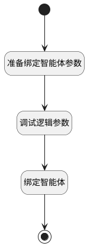

## 绑定智能体 <!-- {docsify-ignore-all} -->

   

### 处理过程

### 处理步骤说明

#### 开始 :id=Begin [开始]

*- N/A*
#### 准备绑定智能体参数 :id=PREPAREPARAM_01 [准备参数]

1. 将`Default(传入变量).ID(智能体业务上下文标识)` 设置给  `ai_agent_assignment.CONTEXT_ID(智能体业务上下文标识)`
2. 将`Default(传入变量).use_tag` 设置给  `ai_agent_assignment.USE_TAG(引用标记)`

#### 调试逻辑参数 :id=DEBUGPARAM_01 [调试逻辑参数]

> [!NOTE|label:调试信息|icon:fa fa-bug]
> 调试输出参数`ai_agent_assignment`的详细信息

#### 绑定智能体 :id=DEACTION_01 [实体行为]

调用实体 [智能体分配(AI_AGENT_ASSIGNMENT)](module/ai/ai_agent_assignment.md) 行为 [Create](module/ai/ai_agent_assignment#行为) ，行为参数为`ai_agent_assignment`

#### 结束 :id=END_01 [结束]

*- N/A*

### 实体逻辑参数

|    中文名   |    代码名    |  数据类型    |  实体   |备注 |
| --------| --------| -------- | -------- | --------   |
|传入变量(<i class="fa fa-check"/></i>)|Default|数据对象|[智能体业务上下文(AI_AGENT_CONTEXT)](module/ai/ai_agent_context.md)||
|ai_agent_assignment|ai_agent_assignment|数据对象|[智能体分配(AI_AGENT_ASSIGNMENT)](module/ai/ai_agent_assignment.md)||
