## 交谈分析文档 <!-- {docsify-ignore-all} -->

   

### 处理过程

```plantuml
@startuml
hide empty description
<style>
root {
  HyperlinkColor #42b983
}
</style>

hide empty description
state "开始" as Begin <<start>> [[$./chat_analyze_documents#begin {"开始"}]]
state "准备参数" as PREPAREPARAM_01  [[$./chat_analyze_documents#prepareparam_01 {"准备参数"}]]
state "交谈执行代码输出文档" as SYSAICHATAGENT_CHATEXECUTECODE_DOCUMENTS_01  [[$./chat_analyze_documents#sysaichatagent_chatexecutecode_documents_01 {"交谈执行代码输出文档"}]]
state "意图整理" as SYSAICHATAGENT_CHATINTENTS_01  [[$./chat_analyze_documents#sysaichatagent_chatintents_01 {"意图整理"}]]


Begin --> SYSAICHATAGENT_CHATINTENTS_01
SYSAICHATAGENT_CHATINTENTS_01 --> PREPAREPARAM_01
PREPAREPARAM_01 --> SYSAICHATAGENT_CHATEXECUTECODE_DOCUMENTS_01


@enduml
```

### 处理步骤说明

#### 开始 :id=Begin [开始]

*- N/A*
#### 意图整理 :id=SYSAICHATAGENT_CHATINTENTS_01 [SYSAICHATAGENT_CHATINTENTS]

#### 准备参数 :id=PREPAREPARAM_01 [准备参数]

1. 将`efe2de90-ef60-4b13-6529-f8ddef4c9efe` 设置给  `Default(传入变量).knowledgebases`
2. 将`intentList(意图列表)` 设置给  `Default(传入变量).chunkqueries`

#### 交谈执行代码输出文档 :id=SYSAICHATAGENT_CHATEXECUTECODE_DOCUMENTS_01 [SYSAICHATAGENT_CHATEXECUTECODE_DOCUMENTS]

### 实体逻辑参数

|    中文名   |    代码名    |  数据类型    |  实体   |备注 |
| --------| --------| -------- | -------- | --------   |
|传入变量(<i class="fa fa-check"/></i>)|Default||||
|意图列表|intentList|简单数据列表|||
