## 交谈执行行为 <!-- {docsify-ignore-all} -->

   

### 处理过程

```plantuml
@startuml
hide empty description
<style>
root {
  HyperlinkColor #42b983
}
</style>

hide empty description
state "开始" as Begin <<start>> [[$./chat_execute_action#begin {"开始"}]]
state "等待输入" as SYSAICHATAGENT_CHATINPUT_01  [[$./chat_execute_action#sysaichatagent_chatinput_01 {"等待输入"}]]
state "交谈执行行为" as SYSAICHATAGENT_CHATEXECUTEACTION_01  [[$./chat_execute_action#sysaichatagent_chatexecuteaction_01 {"交谈执行行为"}]]


Begin --> SYSAICHATAGENT_CHATINPUT_01
SYSAICHATAGENT_CHATINPUT_01 --> SYSAICHATAGENT_CHATEXECUTEACTION_01


@enduml
```

### 处理步骤说明

#### 开始 :id=Begin [开始]

*- N/A*
#### 等待输入 :id=SYSAICHATAGENT_CHATINPUT_01 [SYSAICHATAGENT_CHATINPUT]

#### 交谈执行行为 :id=SYSAICHATAGENT_CHATEXECUTEACTION_01 [SYSAICHATAGENT_CHATEXECUTEACTION]

### 实体逻辑参数

|    中文名   |    代码名    |  数据类型    |  实体   |备注 |
| --------| --------| -------- | -------- | --------   |
|传入变量(<i class="fa fa-check"/></i>)|Default||||
