## 交谈执行技能 <!-- {docsify-ignore-all} -->

   

### 处理过程

```plantuml
@startuml
hide empty description
<style>
root {
  HyperlinkColor #42b983
}
</style>

hide empty description
state "开始" as Begin <<start>> [[$./chat_execute_skill#begin {"开始"}]]
state "意图整理" as SYSAICHATAGENT_CHATINTENTS_01  [[$./chat_execute_skill#sysaichatagent_chatintents_01 {"意图整理"}]]
state "交谈执行技能" as SYSAICHATAGENT_CHATEXECUTESKILL_01  [[$./chat_execute_skill#sysaichatagent_chatexecuteskill_01 {"交谈执行技能"}]]


Begin --> SYSAICHATAGENT_CHATINTENTS_01
SYSAICHATAGENT_CHATINTENTS_01 --> SYSAICHATAGENT_CHATEXECUTESKILL_01


@enduml
```

### 处理步骤说明

#### 开始 :id=Begin [开始]

*- N/A*
#### 意图整理 :id=SYSAICHATAGENT_CHATINTENTS_01 [SYSAICHATAGENT_CHATINTENTS]

#### 交谈执行技能 :id=SYSAICHATAGENT_CHATEXECUTESKILL_01 [SYSAICHATAGENT_CHATEXECUTESKILL]

### 实体逻辑参数

|    中文名   |    代码名    |  数据类型    |  实体   |备注 |
| --------| --------| -------- | -------- | --------   |
|传入变量(<i class="fa fa-check"/></i>)|Default||||
|意图列表|intentList|简单数据列表|||
