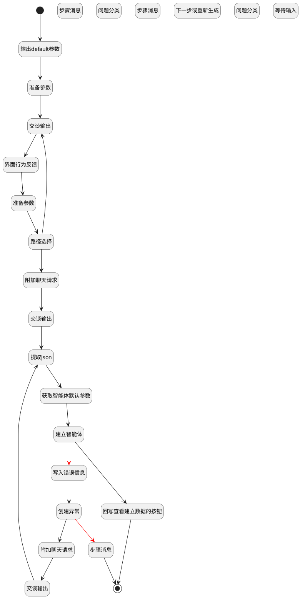

## 创建智能体 <!-- {docsify-ignore-all} -->

   

### 处理过程

### 处理步骤说明

#### 开始 :id=Begin [开始]

*- N/A*
#### 输出default参数 :id=DEBUGPARAM_01 [调试逻辑参数]

> [!NOTE|label:调试信息|icon:fa fa-bug]
> 调试输出参数`Default(传入变量)`的详细信息

#### 附加聊天请求 :id=SYSAICHATAGENT_APPENDCHATREQUEST_01 [SYSAICHATAGENT_APPENDCHATREQUEST]

#### 交谈输出 :id=SYSAICHATAGENT_CHATOUTPUT_01 [SYSAICHATAGENT_CHATOUTPUT]

#### 步骤消息 :id=SYSAICHATAGENT_CHATSTEP_01 [SYSAICHATAGENT_CHATSTEP]

#### 准备参数 :id=PREPAREPARAM_04 [准备参数]

1. 将`Default(传入变量).srfextparams` 绑定给  `srfextparams`

#### 交谈输出 :id=SYSAICHATAGENT_CHATOUTPUT_03 [SYSAICHATAGENT_CHATOUTPUT]

#### 交谈输出 :id=SYSAICHATAGENT_CHATOUTPUT_02 [SYSAICHATAGENT_CHATOUTPUT]

#### 问题分类 :id=SYSAICHATAGENT_CHATCATEGORY_03 [SYSAICHATAGENT_CHATCATEGORY]

#### 提取json :id=PREPAREPARAM_01 [准备参数]

1. 将`chat_response(AI反馈).json` 绑定给  `ai_agent_context(智能体)`
2. 将`srfextparams.AI_AGENT_ID(智能体标识)` 设置给  `ai_agent_context(智能体).AI_AGENT_ID(智能体标识)`

#### 界面行为反馈 :id=SYSAICHATAGENT_CHATUIACTION_02 [SYSAICHATAGENT_CHATUIACTION]

[{
"type": "raw",
  "data": {
    "content": "确认生成"
  },
  "metadata": {
   "content_name": "确认生成",
   "language": "zh-CN"
  }
}]

#### 路径选择 :id=SYSAICHATAGENT_CHATDECISION_01 [SYSAICHATAGENT_CHATDECISION]

#### 附加聊天请求 :id=SYSAICHATAGENT_APPENDCHATREQUEST_02 [SYSAICHATAGENT_APPENDCHATREQUEST]

#### 准备参数 :id=PREPAREPARAM_03 [准备参数]

    无

#### 获取智能体默认参数 :id=DEACTION_01 [实体行为]

调用实体 [智能体业务上下文(AI_AGENT_CONTEXT)](module/ai/ai_agent_context.md) 行为 [GetDraft](module/ai/ai_agent_context#行为) ，行为参数为`ai_agent_context(智能体)`

将执行结果返回给参数`ai_agent_context(智能体)`

#### 步骤消息 :id=SYSAICHATAGENT_CHATSTEP_02 [SYSAICHATAGENT_CHATSTEP]

#### 创建异常 :id=SYSAICHATAGENT_CHATSTEP_03 [SYSAICHATAGENT_CHATSTEP]

#### 建立智能体 :id=DEACTION_03 [实体行为]

调用实体 [智能体业务上下文(AI_AGENT_CONTEXT)](module/ai/ai_agent_context.md) 行为 [Create](module/ai/ai_agent_context#行为) ，行为参数为`ai_agent_context(智能体)`

将执行结果返回给参数`ai_agent_context(智能体)`

#### 下一步或重新生成 :id=SYSAICHATAGENT_CHATINPUT_02 [SYSAICHATAGENT_CHATINPUT]

#### 回写查看建立数据的按钮 :id=SYSAICHATAGENT_CHATUIACTION_01 [SYSAICHATAGENT_CHATUIACTION]

[{
  "id": "open_edit_view",
  "type": "uiaction",
  "data": {
    "id": "open_edit_view",
    "uiaction_id": "open_edit_view@ai_agent_context",
    "de_name": "ai_agent_context"
  },
  "metadata": {
   "name": "打开建立的智能体",
   "actionContext": "ai_agent_context:${params.ai_agent_context.id}",
   "uiaction_id": "open_edit_view@ai_agent_context"
  }
}]

#### 写入错误信息 :id=PREPAREPARAM_02 [准备参数]

1. 将`last_return` 设置给  `temp.error`

#### 问题分类 :id=SYSAICHATAGENT_CHATCATEGORY_05 [SYSAICHATAGENT_CHATCATEGORY]

#### 等待输入 :id=SYSAICHATAGENT_CHATINPUT_04 [SYSAICHATAGENT_CHATINPUT]

#### 步骤消息 :id=SYSAICHATAGENT_CHATSTEP_04 [SYSAICHATAGENT_CHATSTEP]

#### 结束 :id=END_01 [结束]

返回 `chat_response(AI反馈)`

### 实体逻辑参数

|    中文名   |    代码名    |  数据类型    |  实体   |备注 |
| --------| --------| -------- | -------- | --------   |
|传入变量(<i class="fa fa-check"/></i>)|Default||||
|智能体|ai_agent_context|数据对象|[智能体业务上下文(AI_AGENT_CONTEXT)](module/ai/ai_agent_context.md)||
|AI反馈|chat_response||||
|last_return|last_return|上一次调用返回|||
|srfextparams|srfextparams|数据对象|[智能体业务上下文(AI_AGENT_CONTEXT)](module/ai/ai_agent_context.md)||
|temp|temp|数据对象|||
