## 深度研究 <!-- {docsify-ignore-all} -->

   

### 处理过程

```plantuml
@startuml
hide empty description
<style>
root {
  HyperlinkColor #42b983
}
</style>

hide empty description
state "开始" as Begin <<start>> [[$./deep_research#begin {"开始"}]]
state "准备知识库id" as PREPAREPARAM_01  [[$./deep_research#prepareparam_01 {"准备知识库id"}]]
state "调试逻辑参数RESEARCH" as DEBUGPARAM_02  [[$./deep_research#debugparam_02 {"调试逻辑参数RESEARCH"}]]
state "获取知识库信息" as DELOGIC_02  [[$./deep_research#delogic_02 {"获取知识库信息"}]]
state "结束" as END_02 <<end>> [[$./deep_research#end_02 {"结束"}]]
state "获取知识库信息" as DEACTION_01  [[$./deep_research#deaction_01 {"获取知识库信息"}]]
state "切换深度研究智能体" as PREPAREPARAM_02  [[$./deep_research#prepareparam_02 {"切换深度研究智能体"}]]
state "1.提示生成研究策略" as SYSAICHATAGENT_CHATSTEP_02  [[$./deep_research#sysaichatagent_chatstep_02 {"1.提示生成研究策略"}]]
state "附加聊天请求" as SYSAICHATAGENT_APPENDCHATREQUEST_01  [[$./deep_research#sysaichatagent_appendchatrequest_01 {"附加聊天请求"}]]
state "交谈输出" as SYSAICHATAGENT_CHATOUTPUT_01  [[$./deep_research#sysaichatagent_chatoutput_01 {"交谈输出"}]]
state "提取j深度研究son对象" as PREPAREPARAM_03  [[$./deep_research#prepareparam_03 {"提取j深度研究son对象"}]]
state "提示提取json对象异常" as SYSAICHATAGENT_CHATSTEP_04  [[$./deep_research#sysaichatagent_chatstep_04 {"提示提取json对象异常"}]]
state "结束" as END_03 <<end>> [[$./deep_research#end_03 {"结束"}]]
state "设置search_plans，verification_checklist" as PREPAREPARAM_04  [[$./deep_research#prepareparam_04 {"设置search_plans，verification_checklist"}]]
state "提示研究策略内容" as SYSAICHATAGENT_CHATSTEP_03  [[$./deep_research#sysaichatagent_chatstep_03 {"提示研究策略内容"}]]
state "切换通用事实核验员智能体、请求清除知识库标识" as PREPAREPARAM_05  [[$./deep_research#prepareparam_05 {"切换通用事实核验员智能体、请求清除知识库标识"}]]
state "附加聊天请求" as RAWSFCODE_02  [[$./deep_research#rawsfcode_02 {"附加聊天请求"}]]
state "2.提示根据检索信息进行事实核验" as SYSAICHATAGENT_CHATSTEP_07  [[$./deep_research#sysaichatagent_chatstep_07 {"2.提示根据检索信息进行事实核验"}]]
state "通用事实核验交谈输出" as SYSAICHATAGENT_CHATOUTPUT_02  [[$./deep_research#sysaichatagent_chatoutput_02 {"通用事实核验交谈输出"}]]
state "提取通用事实核验员内容" as PREPAREPARAM_06  [[$./deep_research#prepareparam_06 {"提取通用事实核验员内容"}]]
state "提示事实核验内容" as SYSAICHATAGENT_CHATSTEP_06  [[$./deep_research#sysaichatagent_chatstep_06 {"提示事实核验内容"}]]
state "准备参数" as PREPAREPARAM_08  [[$./deep_research#prepareparam_08 {"准备参数"}]]
state "调试逻辑参数" as DEBUGPARAM_01  [[$./deep_research#debugparam_01 {"调试逻辑参数"}]]
state "判定交谈输出" as SYSAICHATAGENT_CHATOUTPUT_03  [[$./deep_research#sysaichatagent_chatoutput_03 {"判定交谈输出"}]]
state "判定请求" as SYSAICHATAGENT_APPENDCHATREQUEST_03  [[$./deep_research#sysaichatagent_appendchatrequest_03 {"判定请求"}]]
state "3.提示判定" as SYSAICHATAGENT_CHATSTEP_09  [[$./deep_research#sysaichatagent_chatstep_09 {"3.提示判定"}]]
state "切换判定专家智能体" as PREPAREPARAM_09  [[$./deep_research#prepareparam_09 {"切换判定专家智能体"}]]
state "实体处理逻辑" as DELOGIC_01  [[$./deep_research#delogic_01 {"实体处理逻辑"}]]
state "提取判定内容" as PREPAREPARAM_010  [[$./deep_research#prepareparam_010 {"提取判定内容"}]]
state "调试逻辑参数RESEARCH3" as DEBUGPARAM_03  [[$./deep_research#debugparam_03 {"调试逻辑参数RESEARCH3"}]]
state "提示判定" as SYSAICHATAGENT_CHATSTEP_010  [[$./deep_research#sysaichatagent_chatstep_010 {"提示判定"}]]
state "最终显示结果" as SYSAICHATAGENT_APPENDCHATRESULT_01  [[$./deep_research#sysaichatagent_appendchatresult_01 {"最终显示结果"}]]
state "结束" as END_01 <<end>> [[$./deep_research#end_01 {"结束"}]]
state "循环子调用" as LOOPSUBCALL_01  [[$./deep_research#loopsubcall_01 {"循环子调用"}]] #green {
state "准备知识检索参数" as PREPAREPARAM_07  [[$./deep_research#prepareparam_07 {"准备知识检索参数"}]]
state "提示知识库检索" as SYSAICHATAGENT_CHATSTEP_08  [[$./deep_research#sysaichatagent_chatstep_08 {"提示知识库检索"}]]
state "知识检索" as SYSAICHATAGENT_FETCHCHUNKS_01  [[$./deep_research#sysaichatagent_fetchchunks_01 {"知识检索"}]]
state "添加到retrieved_chunks" as RAWSFCODE_01  [[$./deep_research#rawsfcode_01 {"添加到retrieved_chunks"}]]
}


Begin --> PREPAREPARAM_01 : [[$./deep_research#begin-prepareparam_01{有知识库} 有知识库]]
PREPAREPARAM_01 --> DEBUGPARAM_02
DEBUGPARAM_02 --> DELOGIC_02
DELOGIC_02 --> PREPAREPARAM_02
PREPAREPARAM_02 --> SYSAICHATAGENT_CHATSTEP_02
SYSAICHATAGENT_CHATSTEP_02 --> SYSAICHATAGENT_APPENDCHATREQUEST_01
SYSAICHATAGENT_APPENDCHATREQUEST_01 --> SYSAICHATAGENT_CHATOUTPUT_01
SYSAICHATAGENT_CHATOUTPUT_01 --> PREPAREPARAM_03
PREPAREPARAM_03 --> PREPAREPARAM_04
PREPAREPARAM_04 --> SYSAICHATAGENT_CHATSTEP_03
SYSAICHATAGENT_CHATSTEP_03 --> LOOPSUBCALL_01
LOOPSUBCALL_01 --> PREPAREPARAM_05
PREPAREPARAM_05 --> DEBUGPARAM_01
DEBUGPARAM_01 --> RAWSFCODE_02
RAWSFCODE_02 --> SYSAICHATAGENT_CHATSTEP_07
SYSAICHATAGENT_CHATSTEP_07 --> SYSAICHATAGENT_CHATOUTPUT_02
SYSAICHATAGENT_CHATOUTPUT_02 --> PREPAREPARAM_06
PREPAREPARAM_06 --> SYSAICHATAGENT_CHATSTEP_06
SYSAICHATAGENT_CHATSTEP_06 --> PREPAREPARAM_08
PREPAREPARAM_08 --> DELOGIC_01
DELOGIC_01 --> PREPAREPARAM_09
PREPAREPARAM_09 --> DEBUGPARAM_03
DEBUGPARAM_03 --> SYSAICHATAGENT_CHATSTEP_09
SYSAICHATAGENT_CHATSTEP_09 --> SYSAICHATAGENT_APPENDCHATREQUEST_03
SYSAICHATAGENT_APPENDCHATREQUEST_03 --> SYSAICHATAGENT_CHATOUTPUT_03
SYSAICHATAGENT_CHATOUTPUT_03 --> PREPAREPARAM_010
PREPAREPARAM_010 --> SYSAICHATAGENT_CHATSTEP_010
SYSAICHATAGENT_CHATSTEP_010 --> SYSAICHATAGENT_APPENDCHATRESULT_01
SYSAICHATAGENT_APPENDCHATRESULT_01 --> END_01
LOOPSUBCALL_01 --> PREPAREPARAM_07
PREPAREPARAM_07 --> SYSAICHATAGENT_CHATSTEP_08 : [[$./deep_research#prepareparam_07-sysaichatagent_chatstep_08{queries > 0} queries > 0]]
SYSAICHATAGENT_CHATSTEP_08 --> SYSAICHATAGENT_FETCHCHUNKS_01
SYSAICHATAGENT_FETCHCHUNKS_01 --> RAWSFCODE_01
PREPAREPARAM_03 -[#red]-> SYSAICHATAGENT_CHATSTEP_04
SYSAICHATAGENT_CHATSTEP_04 --> END_03
DELOGIC_02 -[#red]-> END_02


@enduml
```




### 处理步骤说明

#### 开始 :id=Begin<sup class="footnote-symbol"> <font color=gray size=1>[开始]</font></sup>


*- N/A*
#### 准备知识库id :id=PREPAREPARAM_01<sup class="footnote-symbol"> <font color=gray size=1>[准备参数]</font></sup>


1. 将`Default(传入变量).knowledgebases` 设置给  `kb.ID(知识库标识)`
2. 将`Default(传入变量).srfaiagenttag` 绑定给  `agenttag`

#### 调试逻辑参数RESEARCH :id=DEBUGPARAM_02<sup class="footnote-symbol"> <font color=gray size=1>[调试逻辑参数]</font></sup>


> [!NOTE|label:调试信息|icon:fa fa-bug]
> 调试输出参数`Default(传入变量)`的详细信息


#### 获取知识库信息 :id=DELOGIC_02<sup class="footnote-symbol"> <font color=gray size=1>[实体逻辑]</font></sup>


调用实体 [知识库(AI_KNOWLEDGE_BASE)](module/ai/ai_knowledge_base.md) 处理逻辑 [get_by_code]((module/ai/ai_knowledge_base/logic/get_by_code.md)) ，行为参数为`kb(kb)`
将执行结果返回给参数`kb(kb)`

#### 结束 :id=END_02<sup class="footnote-symbol"> <font color=gray size=1>[结束]</font></sup>


返回 `chat_response`

#### 获取知识库信息 :id=DEACTION_01<sup class="footnote-symbol"> <font color=gray size=1>[实体行为]</font></sup>


调用实体 [知识库(AI_KNOWLEDGE_BASE)](module/ai/ai_knowledge_base.md) 行为 [Get](module/ai/ai_knowledge_base#行为) ，行为参数为`kb`

将执行结果返回给参数`kb`

#### 切换深度研究智能体 :id=PREPAREPARAM_02<sup class="footnote-symbol"> <font color=gray size=1>[准备参数]</font></sup>


1. 将`agenttag` 设置给  `Default(传入变量).srfaiagenttag`

#### 1.提示生成研究策略 :id=SYSAICHATAGENT_CHATSTEP_02<sup class="footnote-symbol"> <font color=gray size=1>[SYSAICHATAGENT_CHATSTEP]</font></sup>


#### 附加聊天请求 :id=SYSAICHATAGENT_APPENDCHATREQUEST_01<sup class="footnote-symbol"> <font color=gray size=1>[SYSAICHATAGENT_APPENDCHATREQUEST]</font></sup>


#### 交谈输出 :id=SYSAICHATAGENT_CHATOUTPUT_01<sup class="footnote-symbol"> <font color=gray size=1>[SYSAICHATAGENT_CHATOUTPUT]</font></sup>


#### 提取j深度研究son对象 :id=PREPAREPARAM_03<sup class="footnote-symbol"> <font color=gray size=1>[准备参数]</font></sup>


1. 将`chat_response.json` 绑定给  `chat_response_entity`

#### 提示提取json对象异常 :id=SYSAICHATAGENT_CHATSTEP_04<sup class="footnote-symbol"> <font color=gray size=1>[SYSAICHATAGENT_CHATSTEP]</font></sup>


#### 结束 :id=END_03<sup class="footnote-symbol"> <font color=gray size=1>[结束]</font></sup>


返回 `chat_response`

#### 设置search_plans，verification_checklist :id=PREPAREPARAM_04<sup class="footnote-symbol"> <font color=gray size=1>[准备参数]</font></sup>


1. 将`chat_response_entity.search_plans` 绑定给  `search_plans`
2. 将`chat_response_entity.verification_checklist` 绑定给  `verification_checklist`

#### 提示研究策略内容 :id=SYSAICHATAGENT_CHATSTEP_03<sup class="footnote-symbol"> <font color=gray size=1>[SYSAICHATAGENT_CHATSTEP]</font></sup>


#### 循环子调用 :id=LOOPSUBCALL_01<sup class="footnote-symbol"> <font color=gray size=1>[循环子调用]</font></sup>


循环参数`search_plans`，子循环参数使用`search_plan`
#### 切换通用事实核验员智能体、请求清除知识库标识 :id=PREPAREPARAM_05<sup class="footnote-symbol"> <font color=gray size=1>[准备参数]</font></sup>


1. 将`FactVerifier` 设置给  `Default(传入变量).srfaiagenttag`
2. 将`无值（NONE）` 设置给  `Default(传入变量).knowledgebases`

#### 附加聊天请求 :id=RAWSFCODE_02<sup class="footnote-symbol"> <font color=gray size=1>[直接后台代码]</font></sup>


<p class="panel-title"><b>执行代码[Groovy]</b></p>

```groovy
def _default = logic.param("default").getReal();
def retrieved_chunks = logic.param("retrieved_chunks").getReal();
def verification_checklist = logic.param("verification_checklist").getReal();

def retrieved_chunk_contents = retrieved_chunks
    .collect { it.getContent() } 
    .findAll { it && it.trim() }

String strMessage = ""

// strMessage += "下面将输出根据会话从资料库中检索的内容，供你在后续的交谈中使用。如你的回答涉及引用资料，则必须精准、客观 。杜绝信息幻觉：严禁编造、夸大或组合片段信息来生成片段中不存在的答案。对于片段信息不足的问题，必须如实告知。\n"
// strMessage += "**注意**：输出内容如引用资料片段，需要显式声明及提供资料片段的访问链接`url`，如::[资料片段01](chunkview://chunkid)"
// strMessage += "\r\n\r\n"

strMessage += "retrieved_chunks : \n"

int nIndex = 1;
for (int i = 0; i < retrieved_chunks.size(); i++) {
    def chunk = retrieved_chunks.get(i);
    if (!chunk.getContent()) {
        continue;
    }
    // if (chunk.getDocName()) {
    //     strMessage += String.format("# 资料片段`%1\$s`，url`chunkview://%2\$s`，来自文档`%3\$s`\r\n", nIndex, chunk.getId(), chunk.getDocName());
    // } else {
    //     strMessage += String.format("# 资料片段`%1\$s`，url`chunkview://%2\$s`\r\n", nIndex, chunk.getId());
    // }
    // strMessage += "---\r\n";
    strMessage += chunk.getContent();
    strMessage += "\r\n";
    nIndex++;
}

strMessage += "\nverification_checklist :" + sys.serialize(verification_checklist)


_default.getMessagesIf().addAll(net.ibizsys.central.cloud.core.util.ChatMessagesBuilder.create().user(strMessage).build());


def _content = logic.param("content")
_content.bind(strMessage)
```

#### 2.提示根据检索信息进行事实核验 :id=SYSAICHATAGENT_CHATSTEP_07<sup class="footnote-symbol"> <font color=gray size=1>[SYSAICHATAGENT_CHATSTEP]</font></sup>


#### 通用事实核验交谈输出 :id=SYSAICHATAGENT_CHATOUTPUT_02<sup class="footnote-symbol"> <font color=gray size=1>[SYSAICHATAGENT_CHATOUTPUT]</font></sup>


#### 提取通用事实核验员内容 :id=PREPAREPARAM_06<sup class="footnote-symbol"> <font color=gray size=1>[准备参数]</font></sup>


1. 将`chat_response.content` 绑定给  `sshy_content`

#### 提示事实核验内容 :id=SYSAICHATAGENT_CHATSTEP_06<sup class="footnote-symbol"> <font color=gray size=1>[SYSAICHATAGENT_CHATSTEP]</font></sup>


#### 准备参数 :id=PREPAREPARAM_08<sup class="footnote-symbol"> <font color=gray size=1>[准备参数]</font></sup>


1. 将`agenttag` 设置给  `agententity.CODE_NAME(代码标识)`

#### 准备知识检索参数 :id=PREPAREPARAM_07<sup class="footnote-symbol"> <font color=gray size=1>[准备参数]</font></sup>


1. 将`kb.id(知识库标识)` 设置给  `query_chunk.n_kbid_eq`
2. 将`search_plan.queries` 设置给  `query_chunk.queries`
3. 将`0.7` 设置给  `query_chunk.n_vector_similarity_gtandeq`
4. 将`1` 设置给  `query_chunk.n_rerank_eq`
5. 将`10` 设置给  `query_chunk.size`
6. 将`0.2` 设置给  `query_chunk.n_similarity_gtandeq`
7. 将`片段A` 设置给  `query_chunk.chunksnprefix`
8. 将`chunkview://{id}` 设置给  `query_chunk.chunkviewurl`
9. 将`search_plan.expected_data` 设置给  `query_chunk.instruct`
10. 将`search_plan.queries` 绑定给  `queries`

#### 调试逻辑参数 :id=DEBUGPARAM_01<sup class="footnote-symbol"> <font color=gray size=1>[调试逻辑参数]</font></sup>


> [!NOTE|label:调试信息|icon:fa fa-bug]
> 调试输出参数`retrieved_chunks`的详细信息


#### 判定交谈输出 :id=SYSAICHATAGENT_CHATOUTPUT_03<sup class="footnote-symbol"> <font color=gray size=1>[SYSAICHATAGENT_CHATOUTPUT]</font></sup>


#### 判定请求 :id=SYSAICHATAGENT_APPENDCHATREQUEST_03<sup class="footnote-symbol"> <font color=gray size=1>[SYSAICHATAGENT_APPENDCHATREQUEST]</font></sup>


#### 3.提示判定 :id=SYSAICHATAGENT_CHATSTEP_09<sup class="footnote-symbol"> <font color=gray size=1>[SYSAICHATAGENT_CHATSTEP]</font></sup>


#### 切换判定专家智能体 :id=PREPAREPARAM_09<sup class="footnote-symbol"> <font color=gray size=1>[准备参数]</font></sup>


1. 将`agententity.SYNTHESIZER(总结智能体)` 绑定给  `agenttag2`
2. 将`agenttag2` 设置给  `Default(传入变量).srfaiagenttag`

#### 实体处理逻辑 :id=DELOGIC_01<sup class="footnote-symbol"> <font color=gray size=1>[实体逻辑]</font></sup>


调用实体 [智能体业务上下文(AI_AGENT_CONTEXT)](module/ai/ai_agent_context.md) 处理逻辑 [get_by_code]((module/ai/ai_agent_context/logic/get_by_code.md)) ，行为参数为`agententity(agententity)`
将执行结果返回给参数`agententity(agententity)`

#### 提示知识库检索 :id=SYSAICHATAGENT_CHATSTEP_08<sup class="footnote-symbol"> <font color=gray size=1>[SYSAICHATAGENT_CHATSTEP]</font></sup>


#### 提取判定内容 :id=PREPAREPARAM_010<sup class="footnote-symbol"> <font color=gray size=1>[准备参数]</font></sup>


1. 将`chat_response.content` 绑定给  `content`

#### 调试逻辑参数RESEARCH3 :id=DEBUGPARAM_03<sup class="footnote-symbol"> <font color=gray size=1>[调试逻辑参数]</font></sup>


> [!NOTE|label:调试信息|icon:fa fa-bug]
> 调试输出参数`Default(传入变量)`的详细信息


#### 知识检索 :id=SYSAICHATAGENT_FETCHCHUNKS_01<sup class="footnote-symbol"> <font color=gray size=1>[SYSAICHATAGENT_FETCHCHUNKS]</font></sup>


#### 提示判定 :id=SYSAICHATAGENT_CHATSTEP_010<sup class="footnote-symbol"> <font color=gray size=1>[SYSAICHATAGENT_CHATSTEP]</font></sup>


#### 添加到retrieved_chunks :id=RAWSFCODE_01<sup class="footnote-symbol"> <font color=gray size=1>[直接后台代码]</font></sup>


<p class="panel-title"><b>执行代码[Groovy]</b></p>

```groovy
def query_chunk_result = logic.param("query_chunk_result").getReal();
def retrieved_chunks = logic.param("retrieved_chunks").getReal();

if (!query_chunk_result || !query_chunk_result.getContent()) {
    return
}

//只取前五条
def query_chunks = query_chunk_result.getContent().take(5)

// 计算当前 retrieved_chunks 中所有 content 的总长度
def currentTotalLength = 0
if(retrieved_chunks){
    currentTotalLength = retrieved_chunks.sum { it.getContent() ? it.getContent().length() : 0 }
}

if(currentTotalLength > 30000) {
    return
}


// 构建已存在 ID 的集合（用于快速去重）
Set existingIds = retrieved_chunks.collect { it.getId() } as Set

for (def chunk in query_chunks) {
    if(currentTotalLength > 30000) {
        break
    }
    if (existingIds.contains(chunk.getId())) {
        continue
    }

    retrieved_chunks.add(chunk)
    existingIds.add(chunk.getId())
    currentTotalLength += chunk.getContent() ? chunk.getContent().length() : 0

    println "------------------------retrieved_chunks lenght：" + currentTotalLength
}


```

#### 最终显示结果 :id=SYSAICHATAGENT_APPENDCHATRESULT_01<sup class="footnote-symbol"> <font color=gray size=1>[SYSAICHATAGENT_APPENDCHATRESULT]</font></sup>


#### 结束 :id=END_01<sup class="footnote-symbol"> <font color=gray size=1>[结束]</font></sup>


返回 `chat_response`


### 连接条件说明
#### 有知识库 :id=Begin-PREPAREPARAM_01

`Default(传入变量).knowledgebases` ISNOTNULL
#### queries > 0 :id=PREPAREPARAM_07-SYSAICHATAGENT_CHATSTEP_08

`queries(queries)` ISNOTNULL AND `queries(queries).size` GT `0`


### 实体逻辑参数

|    中文名   |    代码名    |  数据类型    |  实体   |备注 |
| --------| --------| -------- | -------- | --------   |
|传入变量(<i class="fa fa-check"/></i>)|Default||||
|agententity|agententity|数据对象|[智能体业务上下文(AI_AGENT_CONTEXT)](module/ai/ai_agent_context.md)||
|agenttag|agenttag|简单数据|||
|agenttag2|agenttag2|简单数据|||
|chat_response|chat_response||||
|chat_response_entity|chat_response_entity|数据对象|||
|content|content|简单数据|||
|kb|kb|数据对象|[知识库(AI_KNOWLEDGE_BASE)](module/ai/ai_knowledge_base.md)||
|queries|queries|简单数据列表|||
|query_chunk|query_chunk|过滤器|||
|query_chunk_result|query_chunk_result|分页查询|||
|retrieved_chunks|retrieved_chunks|数据对象列表|||
|search_plan|search_plan|数据对象|||
|search_plans|search_plans|数据对象列表|||
|sshy_content|sshy_content|简单数据|||
|verification_checklist|verification_checklist|简单数据列表|||
