## dynamic_agent_dataset <!-- {docsify-ignore-all} -->

   

### 处理过程

```plantuml
@startuml
hide empty description
<style>
root {
  HyperlinkColor #42b983
}
</style>

hide empty description
state "开始" as Begin <<start>> [[$./dynamic_agent_dataset#begin {"开始"}]]
state "准备参数" as PREPAREPARAM_01  [[$./dynamic_agent_dataset#prepareparam_01 {"准备参数"}]]
state "实体数据集" as DEDATASET_01  [[$./dynamic_agent_dataset#dedataset_01 {"实体数据集"}]]
state "结束" as END_01 <<end>> [[$./dynamic_agent_dataset#end_01 {"结束"}]]
state "循环子调用" as LOOPSUBCALL_01  [[$./dynamic_agent_dataset#loopsubcall_01 {"循环子调用"}]] #green {
state "准备参数" as PREPAREPARAM_02  [[$./dynamic_agent_dataset#prepareparam_02 {"准备参数"}]]
}


Begin --> PREPAREPARAM_01
PREPAREPARAM_01 --> DEDATASET_01
DEDATASET_01 --> LOOPSUBCALL_01
LOOPSUBCALL_01 --> PREPAREPARAM_02 : [[$./dynamic_agent_dataset#loopsubcall_01-prepareparam_02{连接名称} 连接名称]]
LOOPSUBCALL_01 --> END_01


@enduml
```

### 处理步骤说明

#### 开始 :id=Begin [开始]

*- N/A*
#### 准备参数 :id=PREPAREPARAM_01 [准备参数]

1. 将`1000` 设置给  `Default(传入变量).size`

#### 实体数据集 :id=DEDATASET_01 [实体数据集]

调用实体 [智能体业务上下文(AI_AGENT_CONTEXT)](module/ai/ai_agent_context.md) 数据集合 [全部数据(full_info)](module/ai/ai_agent_context#数据集合) ，查询参数为`Default(传入变量)`

将执行结果返回给参数`page`

#### 循环子调用 :id=LOOPSUBCALL_01 [循环子调用]

循环参数`page`，子循环参数使用`item`
#### 准备参数 :id=PREPAREPARAM_02 [准备参数]

1. 将`无值（NONE）` 设置给  `item.SKILL_PROMPT(技能提示词)`
2. 将`无值（NONE）` 设置给  `item.SKILL_README(技能说明)`

#### 结束 :id=END_01 [结束]

返回 `page`

### 连接条件说明
#### 连接名称 :id=LOOPSUBCALL_01-PREPAREPARAM_02

(`item(item).USE_FULLTEXT(使用全文推理)` EQ `1` OR `item(item).DEEP_RESEARCH(deep_research)` EQ `1` OR `item(item).SPEC_KB_ID(规格库标识)` ISNOTNULL)

### 实体逻辑参数

|    中文名   |    代码名    |  数据类型    |  实体   |备注 |
| --------| --------| -------- | -------- | --------   |
|传入变量(<i class="fa fa-check"/></i>)|Default|过滤器|||
|item|item|数据对象|[智能体业务上下文(AI_AGENT_CONTEXT)](module/ai/ai_agent_context.md)||
|page|page|分页查询|||
