## get_by_code <!-- {docsify-ignore-all} -->

   

### 处理过程

```plantuml
@startuml
hide empty description
<style>
root {
  HyperlinkColor #42b983
}
</style>

hide empty description
state "开始" as Begin <<start>> [[$./get_by_code#begin {"开始"}]]
state "直接SQL调用" as RAWSQLCALL_01  [[$./get_by_code#rawsqlcall_01 {"直接SQL调用"}]]
state "实体行为" as DEACTION_01  [[$./get_by_code#deaction_01 {"实体行为"}]]
state "执行脚本代码" as RAWSFCODE_01  [[$./get_by_code#rawsfcode_01 {"执行脚本代码"}]]
state "结束" as END_01 <<end>> [[$./get_by_code#end_01 {"结束"}]]


Begin --> RAWSQLCALL_01
RAWSQLCALL_01 --> DEACTION_01 : [[$./get_by_code#rawsqlcall_01-deaction_01{连接名称} 连接名称]]
DEACTION_01 --> RAWSFCODE_01
RAWSFCODE_01 --> END_01


@enduml
```




### 处理步骤说明

#### 开始 :id=Begin<sup class="footnote-symbol"> <font color=gray size=1>[开始]</font></sup>


*- N/A*
#### 直接SQL调用 :id=RAWSQLCALL_01<sup class="footnote-symbol"> <font color=gray size=1>[直接SQL调用]</font></sup>


<p class="panel-title"><b>执行sql语句</b></p>

```sql
select max(id) as id from ai_agent_context where code_name=? or code_name like concat(?,'@%')
```

<p class="panel-title"><b>执行sql参数</b></p>

1. `Default(传入变量).CODE_NAME(代码标识)`
2. `Default(传入变量).CODE_NAME(代码标识)`

将执行sql结果赋值给参数`Default(传入变量)`

#### 实体行为 :id=DEACTION_01<sup class="footnote-symbol"> <font color=gray size=1>[实体行为]</font></sup>


调用实体 [智能体业务上下文(AI_AGENT_CONTEXT)](module/ai/ai_agent_context.md) 行为 [Get](module/ai/ai_agent_context#行为) ，行为参数为`Default(传入变量)`

将执行结果返回给参数`Default(传入变量)`

#### 执行脚本代码 :id=RAWSFCODE_01<sup class="footnote-symbol"> <font color=gray size=1>[直接后台代码]</font></sup>


<p class="panel-title"><b>执行代码[Groovy]</b></p>

```groovy
def defaultEntity = logic.param("default").getReal()
if(!defaultEntity.get("page_index")) {
    defaultEntity.set("page_index",0)
}
def context_content = "\n---\n\n* **执行智能体**: "+defaultEntity.get("name") +"\n"
if(defaultEntity.get("description")){
    context_content = context_content+"* **智能体描述**: " + defaultEntity.get("description") +"\n"
}
context_content = context_content +"\n---\n"
defaultEntity.set("context_content",context_content)
```

#### 结束 :id=END_01<sup class="footnote-symbol"> <font color=gray size=1>[结束]</font></sup>


返回 `Default(传入变量)`


### 连接条件说明
#### 连接名称 :id=RAWSQLCALL_01-DEACTION_01

`Default(传入变量).ID(智能体业务上下文标识)` ISNOTNULL


### 实体逻辑参数

|    中文名   |    代码名    |  数据类型    |  实体   |备注 |
| --------| --------| -------- | -------- | --------   |
|传入变量(<i class="fa fa-check"/></i>)|Default|数据对象|[智能体业务上下文(AI_AGENT_CONTEXT)](module/ai/ai_agent_context.md)||
