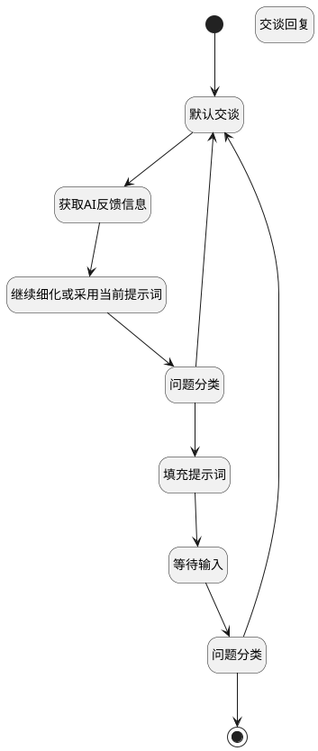

## 辅助生成引导提示词（停用） <!-- {docsify-ignore-all} -->

   

### 处理过程




### 处理步骤说明

#### 开始 :id=Begin<sup class="footnote-symbol"> <font color=gray size=1>[开始]</font></sup>


*- N/A*
#### 默认交谈 :id=SYSAICHATAGENT_CHATOUTPUT_02<sup class="footnote-symbol"> <font color=gray size=1>[SYSAICHATAGENT_CHATOUTPUT]</font></sup>


#### 问题分类 :id=SYSAICHATAGENT_CHATCATEGORY_02<sup class="footnote-symbol"> <font color=gray size=1>[SYSAICHATAGENT_CHATCATEGORY]</font></sup>


#### 交谈回复 :id=DEBUGPARAM_01<sup class="footnote-symbol"> <font color=gray size=1>[调试逻辑参数]</font></sup>


> [!NOTE|label:调试信息|icon:fa fa-bug]
> 调试输出参数`chat_response(AI交谈反馈)`的详细信息


#### 问题分类 :id=SYSAICHATAGENT_CHATCATEGORY_01<sup class="footnote-symbol"> <font color=gray size=1>[SYSAICHATAGENT_CHATCATEGORY]</font></sup>


#### 等待输入 :id=SYSAICHATAGENT_CHATINPUT_02<sup class="footnote-symbol"> <font color=gray size=1>[SYSAICHATAGENT_CHATINPUT]</font></sup>


#### 结束 :id=END_01<sup class="footnote-symbol"> <font color=gray size=1>[结束]</font></sup>


返回 `chat_response(AI交谈反馈)`

#### 获取AI反馈信息 :id=RAWSFCODE_01<sup class="footnote-symbol"> <font color=gray size=1>[直接后台代码]</font></sup>


<p class="panel-title"><b>执行代码[Groovy]</b></p>

```groovy
def chat_response = logic.param('chat_response').getReal()
def lastcontent = logic.param('lastcontent').getReal()

if (chat_response?.choices) {
    lastcontent = chat_response.choices.last().content
}
```

#### 填充提示词 :id=SYSAICHATAGENT_CHATUIACTION_01<sup class="footnote-symbol"> <font color=gray size=1>[SYSAICHATAGENT_CHATUIACTION]</font></sup>


#### 继续细化或采用当前提示词 :id=SYSAICHATAGENT_CHATINPUT_01<sup class="footnote-symbol"> <font color=gray size=1>[SYSAICHATAGENT_CHATINPUT]</font></sup>


### 实体逻辑参数

|    中文名   |    代码名    |  数据类型    |  实体   |备注 |
| --------| --------| -------- | -------- | --------   |
|传入变量(<i class="fa fa-check"/></i>)|Default||||
|AI交谈反馈|chat_response||||
|lastcontent|lastcontent|简单数据|||
