## 查表审查 <!-- {docsify-ignore-all} -->

   

### 处理过程

```plantuml
@startuml
hide empty description
<style>
root {
  HyperlinkColor #42b983
}
</style>

hide empty description
state "开始" as Begin <<start>> [[$./lookup#begin {"开始"}]]
state "1.获取参考资料" as SYSAICHATAGENT_CHATSTEP_01  [[$./lookup#sysaichatagent_chatstep_01 {"1.获取参考资料"}]]
state "调试逻辑参数data" as DEBUGPARAM_01  [[$./lookup#debugparam_01 {"调试逻辑参数data"}]]
state "获取kb" as DEACTION_01  [[$./lookup#deaction_01 {"获取kb"}]]
state "获取智能体信息" as DELOGIC_01  [[$./lookup#delogic_01 {"获取智能体信息"}]]
state "获取知识库信息" as DELOGIC_02  [[$./lookup#delogic_02 {"获取知识库信息"}]]
state "准备获取kb" as PREPAREPARAM_01  [[$./lookup#prepareparam_01 {"准备获取kb"}]]
state "准备引用参数" as PREPAREPARAM_02  [[$./lookup#prepareparam_02 {"准备引用参数"}]]
state "设置chunkqueries" as RAWSFCODE_01  [[$./lookup#rawsfcode_01 {"设置chunkqueries"}]]
state "附加聊天请求" as SYSAICHATAGENT_APPENDCHATREQUEST_01  [[$./lookup#sysaichatagent_appendchatrequest_01 {"附加聊天请求"}]]
state "交谈输出" as SYSAICHATAGENT_CHATOUTPUT_01  [[$./lookup#sysaichatagent_chatoutput_01 {"交谈输出"}]]
state "提取参考材料" as PREPAREPARAM_03  [[$./lookup#prepareparam_03 {"提取参考材料"}]]
state "提示参考资料" as SYSAICHATAGENT_CHATSTEP_02  [[$./lookup#sysaichatagent_chatstep_02 {"提示参考资料"}]]
state "执行智能体" as SYSAICHATAGENT_CHATSTEP_03  [[$./lookup#sysaichatagent_chatstep_03 {"执行智能体"}]]
state "附加聊天请求" as SYSAICHATAGENT_APPENDCHATREQUEST_02  [[$./lookup#sysaichatagent_appendchatrequest_02 {"附加聊天请求"}]]
state "交谈输出" as SYSAICHATAGENT_CHATOUTPUT_02  [[$./lookup#sysaichatagent_chatoutput_02 {"交谈输出"}]]
state "审查完成" as SYSAICHATAGENT_CHATSTEP_04  [[$./lookup#sysaichatagent_chatstep_04 {"审查完成"}]]
state "结束" as END_01 <<end>> [[$./lookup#end_01 {"结束"}]]


Begin --> SYSAICHATAGENT_CHATSTEP_01
SYSAICHATAGENT_CHATSTEP_01 --> DEBUGPARAM_01
DEBUGPARAM_01 --> PREPAREPARAM_01
PREPAREPARAM_01 --> DELOGIC_01
DELOGIC_01 --> DELOGIC_02
DELOGIC_02 --> PREPAREPARAM_02
PREPAREPARAM_02 --> RAWSFCODE_01
RAWSFCODE_01 --> SYSAICHATAGENT_APPENDCHATREQUEST_01
SYSAICHATAGENT_APPENDCHATREQUEST_01 --> SYSAICHATAGENT_CHATOUTPUT_01
SYSAICHATAGENT_CHATOUTPUT_01 --> PREPAREPARAM_03
PREPAREPARAM_03 --> SYSAICHATAGENT_CHATSTEP_02
SYSAICHATAGENT_CHATSTEP_02 --> SYSAICHATAGENT_CHATSTEP_03
SYSAICHATAGENT_CHATSTEP_03 --> SYSAICHATAGENT_APPENDCHATREQUEST_02
SYSAICHATAGENT_APPENDCHATREQUEST_02 --> SYSAICHATAGENT_CHATOUTPUT_02
SYSAICHATAGENT_CHATOUTPUT_02 --> SYSAICHATAGENT_CHATSTEP_04
SYSAICHATAGENT_CHATSTEP_04 --> END_01


@enduml
```




### 处理步骤说明

#### 开始 :id=Begin<sup class="footnote-symbol"> <font color=gray size=1>[开始]</font></sup>


*- N/A*
#### 1.获取参考资料 :id=SYSAICHATAGENT_CHATSTEP_01<sup class="footnote-symbol"> <font color=gray size=1>[SYSAICHATAGENT_CHATSTEP]</font></sup>


#### 调试逻辑参数data :id=DEBUGPARAM_01<sup class="footnote-symbol"> <font color=gray size=1>[调试逻辑参数]</font></sup>


> [!NOTE|label:调试信息|icon:fa fa-bug]
> 调试输出参数`Default(传入变量)`的详细信息


#### 获取kb :id=DEACTION_01<sup class="footnote-symbol"> <font color=gray size=1>[实体行为]</font></sup>


调用实体 [知识库(AI_KNOWLEDGE_BASE)](module/ai/ai_knowledge_base.md) 行为 [Get](module/ai/ai_knowledge_base#行为) ，行为参数为`kb`

将执行结果返回给参数`kb`

#### 获取知识库信息 :id=DELOGIC_02<sup class="footnote-symbol"> <font color=gray size=1>[实体逻辑]</font></sup>


调用实体 [知识库(AI_KNOWLEDGE_BASE)](module/ai/ai_knowledge_base.md) 处理逻辑 [get_by_code]((module/ai/ai_knowledge_base/logic/get_by_code.md)) ，行为参数为`kb(kb)`
将执行结果返回给参数`kb(kb)`

#### 获取智能体信息 :id=DELOGIC_01<sup class="footnote-symbol"> <font color=gray size=1>[实体逻辑]</font></sup>


调用实体 [智能体业务上下文(AI_AGENT_CONTEXT)](module/ai/ai_agent_context.md) 处理逻辑 [get_by_code]((module/ai/ai_agent_context/logic/get_by_code.md)) ，行为参数为`agententity(agententity)`
将执行结果返回给参数`agententity(agententity)`

#### 准备获取kb :id=PREPAREPARAM_01<sup class="footnote-symbol"> <font color=gray size=1>[准备参数]</font></sup>


1. 将`Default(传入变量).knowledgebases` 设置给  `kb.id(知识库标识)`
2. 将`Default(传入变量).srfaiagenttag` 设置给  `agententity.CODE_NAME(代码标识)`

#### 准备引用参数 :id=PREPAREPARAM_02<sup class="footnote-symbol"> <font color=gray size=1>[准备参数]</font></sup>


1. 将`agententity.SPEC_KB_ID(规格库标识)` 设置给  `refrence_chat_request.knowledgebases`
2. 将`1` 设置给  `refrence_chat_request.chunkpageindex`

#### 设置chunkqueries :id=RAWSFCODE_01<sup class="footnote-symbol"> <font color=gray size=1>[直接后台代码]</font></sup>


<p class="panel-title"><b>执行代码[Groovy]</b></p>

```groovy
/*Groovy*/
def _refrence_chat_request = logic.param('refrence_chat_request').getReal()
def _kb = logic.param('kb').getReal()
def _agententity = logic.param('agententity').getReal()

String chunkqueries = "我需要执行如下任务，请帮我查询相关信息，精简输出为引用参考资料。"
if(_agententity.get('context_content')){
  chunkqueries += "\n" + _agententity.get('context_content')
}

chunkqueries += "\n任务目标数据情况如下："

if(_kb.get('guidance_prompt')){
  chunkqueries += _kb.get('guidance_prompt')
}else if(_kb.get('description')){
  chunkqueries += _kb.get('description')
}

_refrence_chat_request.set('chunkqueries',chunkqueries)
```

#### 附加聊天请求 :id=SYSAICHATAGENT_APPENDCHATREQUEST_01<sup class="footnote-symbol"> <font color=gray size=1>[SYSAICHATAGENT_APPENDCHATREQUEST]</font></sup>


#### 交谈输出 :id=SYSAICHATAGENT_CHATOUTPUT_01<sup class="footnote-symbol"> <font color=gray size=1>[SYSAICHATAGENT_CHATOUTPUT]</font></sup>


#### 提取参考材料 :id=PREPAREPARAM_03<sup class="footnote-symbol"> <font color=gray size=1>[准备参数]</font></sup>


1. 将`refrence_chat_response.content` 绑定给  `refrence`

#### 提示参考资料 :id=SYSAICHATAGENT_CHATSTEP_02<sup class="footnote-symbol"> <font color=gray size=1>[SYSAICHATAGENT_CHATSTEP]</font></sup>


#### 执行智能体 :id=SYSAICHATAGENT_CHATSTEP_03<sup class="footnote-symbol"> <font color=gray size=1>[SYSAICHATAGENT_CHATSTEP]</font></sup>


#### 附加聊天请求 :id=SYSAICHATAGENT_APPENDCHATREQUEST_02<sup class="footnote-symbol"> <font color=gray size=1>[SYSAICHATAGENT_APPENDCHATREQUEST]</font></sup>


#### 交谈输出 :id=SYSAICHATAGENT_CHATOUTPUT_02<sup class="footnote-symbol"> <font color=gray size=1>[SYSAICHATAGENT_CHATOUTPUT]</font></sup>


#### 审查完成 :id=SYSAICHATAGENT_CHATSTEP_04<sup class="footnote-symbol"> <font color=gray size=1>[SYSAICHATAGENT_CHATSTEP]</font></sup>


#### 结束 :id=END_01<sup class="footnote-symbol"> <font color=gray size=1>[结束]</font></sup>


返回 `chat_response`


### 实体逻辑参数

|    中文名   |    代码名    |  数据类型    |  实体   |备注 |
| --------| --------| -------- | -------- | --------   |
|传入变量(<i class="fa fa-check"/></i>)|Default||||
|agententity|agententity|数据对象|[智能体业务上下文(AI_AGENT_CONTEXT)](module/ai/ai_agent_context.md)||
|chat_response|chat_response||||
|data|data|数据对象列表|||
|kb|kb|数据对象|[知识库(AI_KNOWLEDGE_BASE)](module/ai/ai_knowledge_base.md)||
|refrence|refrence|简单数据|||
|refrence_chat_request|refrence_chat_request||||
|refrence_chat_response|refrence_chat_response||||
