## 提示并打开审查报告 <!-- {docsify-ignore-all} -->

   打开提示弹窗并按照用户选择打开审查报告页面

### 处理过程

```plantuml
@startuml
hide footbox
<style>
root {
  HyperlinkColor #42b983
}
</style>

hide empty description
state "开始" as Begin <<start>> [[$./open_report#begin {开始}]]
state "消息提示" as MSGBOX_01  [[$./open_report#msgbox_01 {消息提示}]]
state "打开审查报告页面" as DEUIACTION_01  [[$./open_report#deuiaction_01 {打开审查报告页面}]]


Begin --> MSGBOX_01
MSGBOX_01 --> DEUIACTION_01 : [[$./open_report#msgbox_01-deuiaction_01{连接名称} 连接名称]]


@enduml
```




### 处理步骤说明

#### 开始 :id=Begin<sup class="footnote-symbol"> <font color=gray size=1>[开始]</font></sup>


#### 消息提示 :id=MSGBOX_01<sup class="footnote-symbol"> <font color=gray size=1>[消息弹窗]</font></sup>


#### 打开审查报告页面 :id=DEUIACTION_01<sup class="footnote-symbol"> <font color=gray size=1>[实体界面行为调用]</font></sup>


调用实体 [智能体业务上下文(AI_AGENT_CONTEXT)](module/ai/ai_agent_context.md) 界面行为 [打开审查报告页面](module/ai/ai_agent_context#界面行为) 

### 连接条件说明
#### 连接名称 :id=MSGBOX_01-DEUIACTION_01

```result(result)``` EQ ```yes```


### 实体逻辑参数

|    中文名   |    代码名    |  数据类型      |备注 |
| --------| --------| --------  | --------   |
|传入变量(<i class="fa fa-check"/></i>)|Default|数据对象||
|result|result|上一次调用返回||
