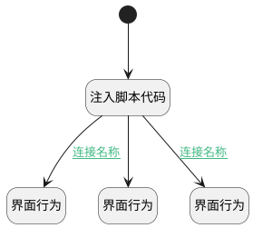

## run智能体逻辑 <!-- {docsify-ignore-all} -->

   

### 处理过程




### 处理步骤说明

#### 开始 :id=Begin<sup class="footnote-symbol"> <font color=gray size=1>[开始]</font></sup>


#### 注入脚本代码 :id=RAWJSCODE_01<sup class="footnote-symbol"> <font color=gray size=1>[直接前台代码]</font></sup>


<p class="panel-title"><b>执行代码</b></p>

```javascript
console.log("执行智能体");
 Object.assign(uiLogic.aicontext, uiLogic.default);
uiLogic.aicontext._name=uiLogic.aicontext.name;
uiLogic.aicontext.agent_name=uiLogic.aicontext.name;
uiLogic.aicontext.agent_description=uiLogic.aicontext.description;
uiLogic.aicontext.context_code_name = uiLogic.aicontext.code_name;
uiLogic.aicontext.context_namee = uiLogic.aicontext.name;
uiLogic.aicontext.context_id = uiLogic.aicontext.id;
uiLogic.aicontext.srfmajortext = uiLogic.aicontext.agent_name;
uiLogic.aicontext.name = null;
uiLogic.aicontext.description = null;

var context_content = "\n---\n\n* **执行智能体**: "+uiLogic.aicontext.agent_name +"\n";
if(uiLogic.aicontext.agent_description) {
    context_content = context_content+"* **智能体描述**: " + uiLogic.aicontext.agent_description+"\n";
}
context_content = context_content +"\n---\n";
uiLogic.aicontext.context_content=context_content;
// if(!uiLogic.aicontext.page_index) {
//     uiLogic.aicontext.page_index=0;
// }
const screenshot = uiLogic.aicontext.agent_description && uiLogic.aicontext.agent_description.indexOf("截图")>=0
uiLogic.context.ai_agent_context=uiLogic.aicontext.context_id;
uiLogic.context.ai_knowledge_base=uiLogic.aicontext.kb_id;
if(view && view.parentView) {
    
    var appDataEntityId=view.parentView.model.appDataEntityId;
    if(uiLogic.aicontext.kb_id && appDataEntityId === "ai.ai_agent_context") {
        appDataEntityId="ai.ai_knowledge_base";
    }
    else {
        var contextObj = view.parentView.state.srfactiveviewdata;
            if((!contextObj) && view.parentData && view.parentData.length > 0) {
                if (view.parentData.length == 1) {
                    contextObj = view.parentData[0];
                }
                else {
                    contextObj = view.parentData;
                }
            }
            else if((!contextObj) && view.parentView.getController("form")) {
                contextObj = view.parentView.getController("form").data;
            }
            if(contextObj) {
                // 使用Object.assign进行浅合并
                if (!Array.isArray(contextObj)) {
                    Object.assign(uiLogic.aicontext, contextObj);
                }
                else {
                    uiLogic.aicontext.list = contextObj;
                }
            }
    }


    if(appDataEntityId && appDataEntityId.indexOf(".")>0) {
        uiLogic.aicontext._entity_tag=appDataEntityId.split(".")[1];
        uiLogic.context._entity_tag=uiLogic.aicontext._entity_tag;
    }
     
    if(screenshot) {
        try{

            const viewDom = document.getElementById(view.parentView.id);
            if (viewDom) {
                const fileName = view.parentView.model.caption || view.parentView.model.codeName;
                const screenshotElement = document.querySelector('.priority-screenshot') || 
                          document.querySelector('.ibiz-bi-report-panel-content>.el-collapse') || 
                          document.querySelector('.ibiz-custom-dashboard-container') || 
                          viewDom;
                
                const canvas = await ibiz.util.html2canvas.getCanvas(screenshotElement, { fileName });

                const blob = await new Promise((resolve) => {
                    canvas.toBlob((b) => {
                        if (b) {
                             const file = new File([b], fileName + '.png', {
                                type: 'image/png',
                                lastModified: new Date().getTime()
                            });
                            resolve(file);
                        } else {
                            resolve(null);
                        }
                    }, 'image/png', 0.7);
                });

                const fileUrlObj = ibiz.util.file.calcFileUpDownUrl(view.parentView.context,view.parentView.params);
                const fileobj = await ibiz.util.file.fileUpload(fileUrlObj.uploadUrl,blob,ibiz.util.file.getUploadHeaders());

                uiLogic.aicontext.screenshot="+")";
                
                
            }

         } catch (error) {
        }
        
    }
}
```

#### 界面行为 :id=DEUIACTION_01<sup class="footnote-symbol"> <font color=gray size=1>[实体界面行为调用]</font></sup>


调用实体 [智能体会话(AI_AGENT_SESSION)](module/ai/ai_agent_session.md) 界面行为 [执行逻辑](module/ai/ai_agent_session#界面行为) ，行为参数为`aicontext`

#### 界面行为 :id=DEUIACTION_02<sup class="footnote-symbol"> <font color=gray size=1>[实体界面行为调用]</font></sup>


调用实体 [智能体会话(AI_AGENT_SESSION)](module/ai/ai_agent_session.md) 界面行为 [研究](module/ai/ai_agent_session#界面行为) ，行为参数为`aicontext`

#### 界面行为 :id=DEUIACTION_03<sup class="footnote-symbol"> <font color=gray size=1>[实体界面行为调用]</font></sup>


调用实体 [智能体会话(AI_AGENT_SESSION)](module/ai/ai_agent_session.md) 界面行为 [全文推理](module/ai/ai_agent_session#界面行为) ，行为参数为`aicontext`

### 连接条件说明
#### 连接名称 :id=RAWJSCODE_01-DEUIACTION_03

```Default(传入变量).use_fulltext``` EQ ```1```
#### 连接名称 :id=RAWJSCODE_01-DEUIACTION_02

```Default(传入变量).deep_research``` EQ ```1```


### 实体逻辑参数

|    中文名   |    代码名    |  数据类型      |备注 |
| --------| --------| --------  | --------   |
|aicontext|aicontext|数据对象||
|context|context|导航视图参数绑定参数||
|传入变量(<i class="fa fa-check"/></i>)|Default|数据对象||
