## 记忆提取并存储 <!-- {docsify-ignore-all} -->

   

### 处理过程

```plantuml
@startuml
hide empty description
<style>
root {
  HyperlinkColor #42b983
}
</style>

hide empty description
state "开始" as Begin <<start>> [[$./extract_and_store#begin {"开始"}]]
state "获取任务实例" as DEACTION_01  [[$./extract_and_store#deaction_01 {"获取任务实例"}]]
state "记忆提取交谈返回" as RAWSFCODE_01  [[$./extract_and_store#rawsfcode_01 {"记忆提取交谈返回"}]]
state "重新建立chat_request" as RENEWPARAM_01  [[$./extract_and_store#renewparam_01 {"重新建立chat_request"}]]
state "准备参数" as PREPAREPARAM_09  [[$./extract_and_store#prepareparam_09 {"准备参数"}]]
state "填充默认文档标识" as DELOGIC_01  [[$./extract_and_store#delogic_01 {"填充默认文档标识"}]]
state "准备记忆检索参数" as PREPAREPARAM_08  [[$./extract_and_store#prepareparam_08 {"准备记忆检索参数"}]]
state "记忆提取智能体调用" as SYSAICHATAGENT_CHATRAW_01  [[$./extract_and_store#sysaichatagent_chatraw_01 {"记忆提取智能体调用"}]]
state "记忆核验返回重新构造切片" as RAWSFCODE_04  [[$./extract_and_store#rawsfcode_04 {"记忆核验返回重新构造切片"}]]
state "最新task后续产生的会话消息" as DEDATASET_01  [[$./extract_and_store#dedataset_01 {"最新task后续产生的会话消息"}]]
state "绑定参数" as BINDPARAM_02  [[$./extract_and_store#bindparam_02 {"绑定参数"}]]
state "更新每日记忆文档" as DELOGIC_05  [[$./extract_and_store#delogic_05 {"更新每日记忆文档"}]]
state "附加新提取信息" as SYSAICHATAGENT_APPENDCHATREQUEST_02  [[$./extract_and_store#sysaichatagent_appendchatrequest_02 {"附加新提取信息"}]]
state "获取记忆文档" as DELOGIC_02  [[$./extract_and_store#delogic_02 {"获取记忆文档"}]]
state "准备参数" as PREPAREPARAM_011  [[$./extract_and_store#prepareparam_011 {"准备参数"}]]
state "准备参数" as PREPAREPARAM_03  [[$./extract_and_store#prepareparam_03 {"准备参数"}]]
state "拼接message过滤参数2" as PREPAREPARAM_02  [[$./extract_and_store#prepareparam_02 {"拼接message过滤参数2"}]]
state "查询会话的最新一条task" as DEDATASET_02  [[$./extract_and_store#dedataset_02 {"查询会话的最新一条task"}]]
state "准备参数" as PREPAREPARAM_06  [[$./extract_and_store#prepareparam_06 {"准备参数"}]]
state "任务执行结束" as PREPAREPARAM_07  [[$./extract_and_store#prepareparam_07 {"任务执行结束"}]]
state "更新智能体记忆任务实例" as DEACTION_02  [[$./extract_and_store#deaction_02 {"更新智能体记忆任务实例"}]]
state "结束" as END_01 <<end>> [[$./extract_and_store#end_01 {"结束"}]]
state "绑定参数" as BINDPARAM_03  [[$./extract_and_store#bindparam_03 {"绑定参数"}]]
state "准备记忆智能体" as PREPAREPARAM_01  [[$./extract_and_store#prepareparam_01 {"准备记忆智能体"}]]
state "拼接message过滤参数1" as PREPAREPARAM_010  [[$./extract_and_store#prepareparam_010 {"拼接message过滤参数1"}]]
state "记忆检索" as SYSAICHATAGENT_FETCHCHUNKS_01  [[$./extract_and_store#sysaichatagent_fetchchunks_01 {"记忆检索"}]]
state "附加现有记忆块" as SYSAICHATAGENT_APPENDCHATREQUEST_03  [[$./extract_and_store#sysaichatagent_appendchatrequest_03 {"附加现有记忆块"}]]
state "记忆核验智能体调用" as SYSAICHATAGENT_CHATRAW_02  [[$./extract_and_store#sysaichatagent_chatraw_02 {"记忆核验智能体调用"}]]
state "绑定参数" as BINDPARAM_01  [[$./extract_and_store#bindparam_01 {"绑定参数"}]]
state "附加聊天请求" as SYSAICHATAGENT_APPENDCHATREQUEST_01  [[$./extract_and_store#sysaichatagent_appendchatrequest_01 {"附加聊天请求"}]]
state "遍历最新记忆切片块" as LOOPSUBCALL_01  [[$./extract_and_store#loopsubcall_01 {"遍历最新记忆切片块"}]] #green {
state "获取记忆分块" as DELOGIC_03  [[$./extract_and_store#delogic_03 {"获取记忆分块"}]]
state "准备参数" as PREPAREPARAM_04  [[$./extract_and_store#prepareparam_04 {"准备参数"}]]
state "保存记忆分块" as DELOGIC_04  [[$./extract_and_store#delogic_04 {"保存记忆分块"}]]
}


Begin --> DEACTION_01
DEACTION_01 --> PREPAREPARAM_011
PREPAREPARAM_011 --> DEDATASET_02
DEDATASET_02 --> BINDPARAM_03 : [[$./extract_and_store#dedataset_02-bindparam_03{连接名称} 连接名称]]
BINDPARAM_03 --> PREPAREPARAM_010 : [[$./extract_and_store#bindparam_03-prepareparam_010{LAST_MSG_TIME不为空} LAST_MSG_TIME不为空]]
PREPAREPARAM_010 --> PREPAREPARAM_02
PREPAREPARAM_02 --> DEDATASET_01
DEDATASET_01 --> PREPAREPARAM_01
PREPAREPARAM_01 --> SYSAICHATAGENT_APPENDCHATREQUEST_01
SYSAICHATAGENT_APPENDCHATREQUEST_01 --> SYSAICHATAGENT_CHATRAW_01
SYSAICHATAGENT_CHATRAW_01 --> PREPAREPARAM_03
PREPAREPARAM_03 --> RAWSFCODE_01
RAWSFCODE_01 --> BINDPARAM_02
BINDPARAM_02 --> RENEWPARAM_01 : [[$./extract_and_store#bindparam_02-renewparam_01{存在事实知识} 存在事实知识]]
RENEWPARAM_01 --> DELOGIC_01
DELOGIC_01 --> PREPAREPARAM_08
PREPAREPARAM_08 --> SYSAICHATAGENT_FETCHCHUNKS_01
SYSAICHATAGENT_FETCHCHUNKS_01 --> SYSAICHATAGENT_APPENDCHATREQUEST_02
SYSAICHATAGENT_APPENDCHATREQUEST_02 --> SYSAICHATAGENT_APPENDCHATREQUEST_03
SYSAICHATAGENT_APPENDCHATREQUEST_03 --> SYSAICHATAGENT_CHATRAW_02
SYSAICHATAGENT_CHATRAW_02 --> PREPAREPARAM_06
PREPAREPARAM_06 --> RAWSFCODE_04
RAWSFCODE_04 --> DELOGIC_02 : [[$./extract_and_store#rawsfcode_04-delogic_02{返回切片非空} 返回切片非空]]
DELOGIC_02 --> BINDPARAM_01
BINDPARAM_01 --> LOOPSUBCALL_01 : [[$./extract_and_store#bindparam_01-loopsubcall_01{连接名称} 连接名称]]
LOOPSUBCALL_01 --> DELOGIC_03
DELOGIC_03 --> PREPAREPARAM_04
PREPAREPARAM_04 --> DELOGIC_04
LOOPSUBCALL_01 --> PREPAREPARAM_07
PREPAREPARAM_07 --> DEACTION_02
DEACTION_02 --> END_01
RAWSFCODE_04 --> PREPAREPARAM_07 : [[$./extract_and_store#rawsfcode_04-prepareparam_07{返回切片为空} 返回切片为空]]
BINDPARAM_02 --> PREPAREPARAM_09 : [[$./extract_and_store#bindparam_02-prepareparam_09{存在过程日志} 存在过程日志]]
PREPAREPARAM_09 --> DELOGIC_05
DELOGIC_05 --> PREPAREPARAM_07
BINDPARAM_03 --> PREPAREPARAM_02 : [[$./extract_and_store#bindparam_03-prepareparam_02{LAST_MSG_TIME为空} LAST_MSG_TIME为空]]
DEDATASET_02 --> PREPAREPARAM_02 : [[$./extract_and_store#dedataset_02-prepareparam_02{连接名称} 连接名称]]


@enduml
```




### 处理步骤说明

#### 开始 :id=Begin<sup class="footnote-symbol"> <font color=gray size=1>[开始]</font></sup>


*- N/A*
#### 绑定参数 :id=BINDPARAM_03<sup class="footnote-symbol"> <font color=gray size=1>[绑定参数]</font></sup>


绑定参数`tasks` 到 `last_task`
#### 准备参数 :id=PREPAREPARAM_011<sup class="footnote-symbol"> <font color=gray size=1>[准备参数]</font></sup>


1. 将`Default(传入变量).CONVERSATION_ID(会话标识)` 设置给  `task_filter.n_conversation_id_eq`
2. 将`update_time,desc` 设置给  `task_filter.sort`
3. 将`1` 设置给  `task_filter.size`
4. 将`计算式 null` 设置给  `Default(传入变量).EXECUTED_AT(执行时间)`
5. 将`SUCCESS` 设置给  `task_filter.N_STATUS_EQ`

#### 查询会话的最新一条task :id=DEDATASET_02<sup class="footnote-symbol"> <font color=gray size=1>[实体数据集]</font></sup>


调用实体 [智能体记忆任务实例(AI_AGENT_MEMORY_TASK)](module/ai/ai_agent_memory_task.md) 数据集合 [DEFAULT](module/ai/ai_agent_memory_task#数据集合) ，查询参数为`task_filter`

将执行结果返回给参数`tasks`

#### 获取任务实例 :id=DEACTION_01<sup class="footnote-symbol"> <font color=gray size=1>[实体行为]</font></sup>


调用实体 [智能体记忆任务实例(AI_AGENT_MEMORY_TASK)](module/ai/ai_agent_memory_task.md) 行为 [Get](module/ai/ai_agent_memory_task#行为) ，行为参数为`Default(传入变量)`

将执行结果返回给参数`Default(传入变量)`

#### 拼接message过滤参数2 :id=PREPAREPARAM_02<sup class="footnote-symbol"> <font color=gray size=1>[准备参数]</font></sup>


1. 将`Default(传入变量).CONVERSATION_ID(会话标识)` 设置给  `agent_message_filter(消息过滤器).N_CONVERSATION_ID_EQ`
2. 将`1000` 设置给  `agent_message_filter(消息过滤器).size`
3. 将`create_time,asc` 设置给  `agent_message_filter(消息过滤器).sort`

#### 准备记忆智能体 :id=PREPAREPARAM_01<sup class="footnote-symbol"> <font color=gray size=1>[准备参数]</font></sup>

准备记忆提取智能体标识

1. 将`memory_retrieval` 设置给  `chat_request(交谈请求).srfaiagenttag`

#### 最新task后续产生的会话消息 :id=DEDATASET_01<sup class="footnote-symbol"> <font color=gray size=1>[实体数据集]</font></sup>


调用实体 [智能体会话消息(AI_AGENT_MESSAGE)](module/ai/ai_agent_message.md) 数据集合 [全部消息(all)](module/ai/ai_agent_message#数据集合) ，查询参数为`agent_message_filter(消息过滤器)`

将执行结果返回给参数`message_list(消息列表)`

#### 拼接message过滤参数1 :id=PREPAREPARAM_010<sup class="footnote-symbol"> <font color=gray size=1>[准备参数]</font></sup>

创建消息时间大于最后消息时间

1. 将`last_task.LAST_MSG_TIME(最后消息时间)` 设置给  `agent_message_filter(消息过滤器).N_CREATE_TIME_GT`

#### 附加聊天请求 :id=SYSAICHATAGENT_APPENDCHATREQUEST_01<sup class="footnote-symbol"> <font color=gray size=1>[SYSAICHATAGENT_APPENDCHATREQUEST]</font></sup>


#### 记忆提取智能体调用 :id=SYSAICHATAGENT_CHATRAW_01<sup class="footnote-symbol"> <font color=gray size=1>[SYSAICHATAGENT_CHATRAW]</font></sup>

调用记忆提取智能体


#### 准备参数 :id=PREPAREPARAM_03<sup class="footnote-symbol"> <font color=gray size=1>[准备参数]</font></sup>

获取记忆提取智能体的交谈结果

1. 将`chat_response(交谈反馈).content` 设置给  `chat_temp(会话临时变量).extract_memory`

#### 记忆提取交谈返回 :id=RAWSFCODE_01<sup class="footnote-symbol"> <font color=gray size=1>[直接后台代码]</font></sup>

存在mem_type=fact_source的数据，封装成list请求核验智能体；
存在mem_type=daily_log的数据，生成每日记忆文档；

<p class="panel-title"><b>执行代码[Groovy]</b></p>

```groovy
def _chat_temp = logic.param('chat_temp').getReal();
def _chat_temp2 = logic.param('chat_temp2').getReal();
def _default = logic.param('Default').getReal();
def _message_list = logic.param('message_list').getReal();
def messages = _message_list.content

if (_chat_temp  && messages){
    //设置会话快照
    def conversation_snapshot = messages.collect { item ->"[${item.sender_type}]${item.content}"}.join('\n')
   _default.conversation_snapshot=conversation_snapshot;

    def last_message = messages.last()
    //设置最后消息时间
    _default.last_msg_time=last_message.create_time

    def extract_memory_str = _chat_temp.get('extract_memory')
        //设置提取的新记忆
    _default.extracted_content=extract_memory_str;
    
    def extract_memory_obj= new groovy.json.JsonSlurper().parseText(net.ibizsys.central.cloud.core.ai.util.AIChatUtils.getJsonContent(extract_memory_str))
    def candidates_list = extract_memory_obj['candidates']
    def fact_source_candidates = candidates_list.findAll { it['mem_type'] == 'fact_source' }?: []
    def fact_content_list = fact_source_candidates.collect { it.content }
    def fact_source_str = fact_source_candidates ? net.ibizsys.model.util.JsonUtils.getMapper().writeValueAsString(fact_source_candidates) : null
    _chat_temp2.set("fact_source_candidates", fact_source_str)
    _chat_temp2.set("fact_content_list", fact_content_list)

     def daily_log_candidates = candidates_list.findAll { it['mem_type'] == 'daily_log' }?: []
     _default.set("daily_logs",daily_log_candidates)

     println"\n---记忆提取的后的default----${_default}"
 }   

```

#### 绑定参数 :id=BINDPARAM_02<sup class="footnote-symbol"> <font color=gray size=1>[绑定参数]</font></sup>


绑定参数`Default(传入变量)` 到 `daily_logs`
#### 重新建立chat_request :id=RENEWPARAM_01<sup class="footnote-symbol"> <font color=gray size=1>[重新建立参数]</font></sup>

防止污染下一个智能体的调用

重建参数```chat_request(交谈请求)```
#### 准备参数 :id=PREPAREPARAM_09<sup class="footnote-symbol"> <font color=gray size=1>[准备参数]</font></sup>


1. 将`daily_logs` 设置给  `Default(传入变量).daily_logs`

#### 填充默认文档标识 :id=DELOGIC_01<sup class="footnote-symbol"> <font color=gray size=1>[实体逻辑]</font></sup>


调用实体 [智能体记忆任务实例(AI_AGENT_MEMORY_TASK)](module/ai/ai_agent_memory_task.md) 处理逻辑 [填充默认文档标识]((module/ai/ai_agent_memory_task/logic/fill_default_doc_id.md)) ，行为参数为`Default(传入变量)`
将执行结果返回给参数`Default(传入变量)`

#### 记忆检索 :id=SYSAICHATAGENT_FETCHCHUNKS_01<sup class="footnote-symbol"> <font color=gray size=1>[SYSAICHATAGENT_FETCHCHUNKS]</font></sup>


#### 准备记忆检索参数 :id=PREPAREPARAM_08<sup class="footnote-symbol"> <font color=gray size=1>[准备参数]</font></sup>


1. 将`40` 设置给  `chunk_filter(知识库检索过滤).size`
2. 将`Default(传入变量).DOC_ID(记忆存储文档标识)` 设置给  `chunk_filter(知识库检索过滤).n_docid_in`
3. 将`Default(传入变量).KB_TAG(记忆库标识)` 设置给  `chunk_filter(知识库检索过滤).n_kbid_eq`
4. 将`chat_temp2(会话临时变量2).fact_content_list` 设置给  `chunk_filter(知识库检索过滤).queries`
5. 将`memory_verification` 设置给  `chat_request(交谈请求).srfaiagenttag`
6. 将`0` 设置给  `chunk_filter(知识库检索过滤).n_pageindex_eq`

#### 记忆核验返回重新构造切片 :id=RAWSFCODE_04<sup class="footnote-symbol"> <font color=gray size=1>[直接后台代码]</font></sup>


<p class="panel-title"><b>执行代码[Groovy]</b></p>

```groovy
def _checkQueries = logic.param('check_queries').getReal()
def _default = logic.param('Default').getReal()
def verification_result_str =null
def _chat_temp = logic.param('chat_temp').getReal();
def _log = org.apache.commons.logging.LogFactory.getLog("cn.ibizlab.central.core.dataentity.logic.DELogicRuntimeBase")

if (_chat_temp){
    verification_result_str = _chat_temp.get('verification_result')
    println("核验结果："+ verification_result_str)
    _default.update_strategy=verification_result_str//设置更新策略
    
    if (!verification_result_str || verification_result_str.trim() == "[]") {
        _default.set("latest_chunks",null)
        return  _default
    } 
}   

// 工具：安全转换实体列表为 Map 列表
def convertToMapList = { list ->
    if (!list) return []
    list.collect { item ->
        [
            id: item?.id,
            content: (item?.content ? item.content.split(/\r?\n/) as List<String> : [])
        ]
    }
}

def generateId = { "chunk_${System.currentTimeMillis()}_${(Math.random() * 1000).toInteger()}" }

// 根据行号变化动态计算偏移量
def applyOperations = { List<String> lines, List<Map> ops ->
    int offset = 0
    // 按行号升序排序，确保偏移量计算正确
    ops.sort { a, b ->
        int posA = (a.operation == 'UPDATE_LINES') ? a.line_range.start : a.insert_after_line
        int posB = (b.operation == 'UPDATE_LINES') ? b.line_range.start : b.insert_after_line
        posA <=> posB
    }

    ops.each { op ->
        if (op.operation == 'UPDATE_LINES') {
            int start = op.line_range.start + offset
            int end = op.line_range.end + offset
            int size = lines.size()

            if (start < 1 || end > size) throw new RuntimeException("行号越界：${start}-${end}, 当前行数：${size}")

            int from = start - 1
            int to = end // subList end is exclusive

            lines = lines[0..<from] + (op.new_content_lines as List<String>) + lines[to..<size]
            offset += (op.new_content_lines.size() - (end - start + 1))

        } else if (op.operation == 'INSERT_LINES') {
            int rawIdx = op.insert_after_line + offset
            int idx = Math.max(0, Math.min(rawIdx, lines.size()))
            lines = lines[0..<idx] + (op.new_content_lines as List<String>) + lines[idx..<lines.size()]
            offset += op.new_content_lines.size()
        }
    }
    lines
}

// 内容块更新处理
def processChunks = { chunks, opsJson ->
    def existing = convertToMapList(chunks)
    def ops = new groovy.json.JsonSlurper().parseText(opsJson)
    
    // 建立索引方便查找
    def chunkMap = existing.collectEntries { [(it.id): it] }
    def newChunks = []

    // 1. 处理 CREATE
    ops.findAll { it.operation == 'CREATE' }.each { op ->
        def chunk = [
            id: op.target_chunk_id ?: generateId(),
            content: op.final_content
        ]
        newChunks << chunk
        _log.debug("✅ [CREATE] ${chunk.id} ")
    }

    // 2. 处理 MODIFY (UPDATE/INSERT)
    ops.findAll { it.operation != 'CREATE' }.groupBy { it.target_chunk_id }.each { id, chunkOps ->
        def target = chunkMap[id]
        if (!target) {
            log.debug("⚠️ 警告：未找到 Chunk ${id}, 跳过")
            return
        }
        target.content = applyOperations(target.content, chunkOps)
    }

    // 合并：原有(已修改) + 新增
    def result = chunkMap.values() + newChunks
        // 将 content 列表重新合并为带换行符的字符串
    return result.collect { chunk ->
        def finalContent = (chunk.content instanceof List) ? chunk.content.join('\n') : chunk.content  
        return [
            id: chunk.id,
            content: finalContent 
        ]
    }

}

// 执行入口
try {
    def latest_chunks = processChunks(_checkQueries, verification_result_str)
    _default.set("latest_chunks", latest_chunks ? latest_chunks : null)
    _default.set("status","SUCCESS")
    _default.set("result", "执行成功!")
} catch (Exception e) {
    _default.set("status","FAILED")
    _default.set("result", "记忆内容块处理发生异常!")
    _log.debug("❌ [ERROR] 内容块更新处理异常,处理 Chunk 失败: ${e.message}")
}

return  _default

```

#### 准备参数 :id=PREPAREPARAM_06<sup class="footnote-symbol"> <font color=gray size=1>[准备参数]</font></sup>

获取记忆核验智能体的交谈结果

1. 将`chat_response(交谈反馈).content` 设置给  `chat_temp(会话临时变量).verification_result`

#### 附加新提取信息 :id=SYSAICHATAGENT_APPENDCHATREQUEST_02<sup class="footnote-symbol"> <font color=gray size=1>[SYSAICHATAGENT_APPENDCHATREQUEST]</font></sup>


#### 附加现有记忆块 :id=SYSAICHATAGENT_APPENDCHATREQUEST_03<sup class="footnote-symbol"> <font color=gray size=1>[SYSAICHATAGENT_APPENDCHATREQUEST]</font></sup>


#### 更新每日记忆文档 :id=DELOGIC_05<sup class="footnote-symbol"> <font color=gray size=1>[实体逻辑]</font></sup>


调用实体 [智能体记忆任务实例(AI_AGENT_MEMORY_TASK)](module/ai/ai_agent_memory_task.md) 处理逻辑 [更新每日记忆文档]((module/ai/ai_agent_memory_task/logic/update_daily_log.md)) ，行为参数为`Default(传入变量)`

#### 记忆核验智能体调用 :id=SYSAICHATAGENT_CHATRAW_02<sup class="footnote-symbol"> <font color=gray size=1>[SYSAICHATAGENT_CHATRAW]</font></sup>

调用记忆核验智能体，通过它比对旧纪录和新记录后返回数据


#### 任务执行结束 :id=PREPAREPARAM_07<sup class="footnote-symbol"> <font color=gray size=1>[准备参数]</font></sup>


1. 将`计算式 null` 设置给  `Default(传入变量).END_AT(结束时间)`

#### 获取记忆文档 :id=DELOGIC_02<sup class="footnote-symbol"> <font color=gray size=1>[实体逻辑]</font></sup>


调用实体 [智能体记忆任务实例(AI_AGENT_MEMORY_TASK)](module/ai/ai_agent_memory_task.md) 处理逻辑 [获取记忆文档]((module/ai/ai_agent_memory_task/logic/get_document.md)) ，行为参数为`Default(传入变量)`
将执行结果返回给参数`Default(传入变量)`

#### 更新智能体记忆任务实例 :id=DEACTION_02<sup class="footnote-symbol"> <font color=gray size=1>[实体行为]</font></sup>


调用实体 [智能体记忆任务实例(AI_AGENT_MEMORY_TASK)](module/ai/ai_agent_memory_task.md) 行为 [Update](module/ai/ai_agent_memory_task#行为) ，行为参数为`Default(传入变量)`

将执行结果返回给参数`Default(传入变量)`

#### 绑定参数 :id=BINDPARAM_01<sup class="footnote-symbol"> <font color=gray size=1>[绑定参数]</font></sup>


绑定参数`Default(传入变量)` 到 `latest_chunk_list(最新切片列表)`
#### 遍历最新记忆切片块 :id=LOOPSUBCALL_01<sup class="footnote-symbol"> <font color=gray size=1>[循环子调用]</font></sup>


循环参数`latest_chunk_list(最新切片列表)`，子循环参数使用`chunk`
#### 获取记忆分块 :id=DELOGIC_03<sup class="footnote-symbol"> <font color=gray size=1>[实体逻辑]</font></sup>


调用实体 [智能体记忆任务实例(AI_AGENT_MEMORY_TASK)](module/ai/ai_agent_memory_task.md) 处理逻辑 [获取记忆分块]((module/ai/ai_agent_memory_task/logic/get_chunk.md)) ，行为参数为`chunk(chunk)`
将执行结果返回给参数`chunk(chunk)`

#### 结束 :id=END_01<sup class="footnote-symbol"> <font color=gray size=1>[结束]</font></sup>


返回 `Default(传入变量)`

#### 准备参数 :id=PREPAREPARAM_04<sup class="footnote-symbol"> <font color=gray size=1>[准备参数]</font></sup>


1. 将`Default(传入变量).DOC_ID(记忆存储文档标识)` 设置给  `chunk.docid`
2. 将`Default(传入变量).KB_TAG(记忆库标识)` 设置给  `chunk.kbid`

#### 保存记忆分块 :id=DELOGIC_04<sup class="footnote-symbol"> <font color=gray size=1>[实体逻辑]</font></sup>


调用实体 [智能体记忆任务实例(AI_AGENT_MEMORY_TASK)](module/ai/ai_agent_memory_task.md) 处理逻辑 [保存记忆分块]((module/ai/ai_agent_memory_task/logic/save_chunk.md)) ，行为参数为`chunk(chunk)`


### 连接条件说明
#### 连接名称 :id=DEDATASET_02-BINDPARAM_03

`tasks(tasks).length` GT `0`
#### LAST_MSG_TIME不为空 :id=BINDPARAM_03-PREPAREPARAM_010

`last_task(last_task).LAST_MSG_TIME(最后消息时间)` ISNOTNULL
#### 存在事实知识 :id=BINDPARAM_02-RENEWPARAM_01

`chat_temp2(会话临时变量2).fact_source_candidates` ISNOTNULL
#### 返回切片非空 :id=RAWSFCODE_04-DELOGIC_02

`Default(传入变量).latest_chunks` ISNOTNULL
#### 连接名称 :id=BINDPARAM_01-LOOPSUBCALL_01

`latest_chunk_list(最新切片列表).size` GT `0`
#### 返回切片为空 :id=RAWSFCODE_04-PREPAREPARAM_07

`Default(传入变量).latest_chunks` ISNULL
#### 存在过程日志 :id=BINDPARAM_02-PREPAREPARAM_09

`daily_logs(daily_logs).size` GT `0`
#### LAST_MSG_TIME为空 :id=BINDPARAM_03-PREPAREPARAM_02

`last_task(last_task).LAST_MSG_TIME(最后消息时间)` ISNULL
#### 连接名称 :id=DEDATASET_02-PREPAREPARAM_02

`tasks(tasks).length` EQ `0`


### 实体逻辑参数

|    中文名   |    代码名    |  数据类型    |  实体   |备注 |
| --------| --------| -------- | -------- | --------   |
|传入变量(<i class="fa fa-check"/></i>)|Default|数据对象|[智能体记忆任务实例(AI_AGENT_MEMORY_TASK)](module/ai/ai_agent_memory_task.md)||
|消息过滤器|agent_message_filter|过滤器|||
|交谈请求|chat_request||||
|交谈反馈|chat_response||||
|会话临时变量|chat_temp|数据对象||记忆提取智能体临时对象|
|会话临时变量2|chat_temp2|数据对象||记忆核验智能体临时对象|
|check_queries|check_queries|数据对象列表|[知识库文档分块(AI_KB_CHUNK)](module/ai/ai_kb_chunk.md)|原切片列表|
|chunk|chunk|数据对象|[知识库文档分块(AI_KB_CHUNK)](module/ai/ai_kb_chunk.md)||
|知识库检索过滤|chunk_filter|过滤器|||
|daily_logs|daily_logs|数据对象列表||过程日志|
|last_task|last_task|数据对象|[智能体记忆任务实例(AI_AGENT_MEMORY_TASK)](module/ai/ai_agent_memory_task.md)||
|最新切片列表|latest_chunk_list|数据对象列表|[知识库文档分块(AI_KB_CHUNK)](module/ai/ai_kb_chunk.md)||
|消息列表|message_list|分页查询|||
|task_filter|task_filter|过滤器|||
|tasks|tasks|分页查询|||
