## 填充默认文档标识 <!-- {docsify-ignore-all} -->

   

### 处理过程

```plantuml
@startuml
hide empty description
<style>
root {
  HyperlinkColor #42b983
}
</style>

hide empty description
state "开始" as Begin <<start>> [[$./fill_default_doc_id#begin {"开始"}]]
state "根据类型填充文档标识" as RAWSFCODE_01  [[$./fill_default_doc_id#rawsfcode_01 {"根据类型填充文档标识"}]]
state "结束" as END_01 <<end>> [[$./fill_default_doc_id#end_01 {"结束"}]]


Begin --> RAWSFCODE_01 : [[$./fill_default_doc_id#begin-rawsfcode_01{doc_id未指定时填充} doc_id未指定时填充]]
RAWSFCODE_01 --> END_01


@enduml
```




### 处理步骤说明

#### 开始 :id=Begin<sup class="footnote-symbol"> <font color=gray size=1>[开始]</font></sup>


*- N/A*
#### 根据类型填充文档标识 :id=RAWSFCODE_01<sup class="footnote-symbol"> <font color=gray size=1>[直接后台代码]</font></sup>


<p class="panel-title"><b>执行代码[Groovy]</b></p>

```groovy
def values = []
//doc_id为知识库标识||业务范围标识||用户标识合成
def _default = logic.param('default').getReal()
def kb_tag = _default.get("kb_tag")
def mode = _default.get("memory_isolation_mode")
if(kb_tag){
    values.add(kb_tag)
    def user_id = _default.get("user_id")?_default.get("user_id"):"undefined"
    def scope = _default.get("scope")?_default.get("scope"):"undefined"
    if (!mode || mode == "NONE") {
        values.add("__global__")
        values.add("__global__")
        _default.set("doc_path", "/__global__/__global__/")
    } 
    else if (mode == "BUSINESS_SCOPE") {
        values.add(scope)
        values.add("__global__")
        _default.set("doc_path", "/${scope}/__global__/")
    } 
    else if (mode == "USER_SCOPE") {
        values.add("__global__")
        values.add(user_id)
        _default.set("doc_path", "/__global__/${user_id}/")
    } 
    else if (mode == "BUSINESS_USER_SCOPE") {
        values.add(scope)
        values.add(user_id)
        _default.set("doc_path", "/${scope}/${user_id}/")
    }  else {
        //未识别按默认处理
        values.add("__global__")
        values.add("__global__")
        _default.set("doc_path", "/__global__/__global__/")
    }
    _default.set("doc_id",net.ibizsys.runtime.util.KeyValueUtils.genUniqueId(values.toArray()))
    }
```

#### 结束 :id=END_01<sup class="footnote-symbol"> <font color=gray size=1>[结束]</font></sup>


返回 `Default(传入变量)`


### 连接条件说明
#### doc_id未指定时填充 :id=Begin-RAWSFCODE_01

`Default(传入变量).DOC_ID(记忆存储文档标识)` ISNULL


### 实体逻辑参数

|    中文名   |    代码名    |  数据类型    |  实体   |备注 |
| --------| --------| -------- | -------- | --------   |
|传入变量(<i class="fa fa-check"/></i>)|Default|数据对象|[智能体记忆任务实例(AI_AGENT_MEMORY_TASK)](module/ai/ai_agent_memory_task.md)||
