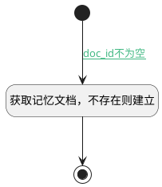

## 获取记忆文档 <!-- {docsify-ignore-all} -->

   

### 处理过程




### 处理步骤说明

#### 开始 :id=Begin<sup class="footnote-symbol"> <font color=gray size=1>[开始]</font></sup>


*- N/A*
#### 获取记忆文档，不存在则建立 :id=RAWSFCODE_01<sup class="footnote-symbol"> <font color=gray size=1>[直接后台代码]</font></sup>


<p class="panel-title"><b>执行代码[Groovy]</b></p>

```groovy
def _default = logic.param('default').getReal()
def log = org.apache.commons.logging.LogFactory.getLog("cn.ibizlab.central.core.dataentity.logic.DELogicRuntimeBase")
def kb_tag = _default.get("kb_tag")
def doc_id = _default.get("doc_id")
def doc_path = _default.get("doc_path")
def _document
if (!kb_tag || !doc_id) {
    log.debug("缺少记忆知识库或文档标识，忽略获取记忆文档")
    return 
}
def system_id = sys.getDeploySystemId()
if(sys instanceof net.ibizsys.central.cloud.core.IServiceSystemRuntime) {
    def iServiceSystemRuntime = (net.ibizsys.central.cloud.core.IServiceSystemRuntime)sys
    if(iServiceSystemRuntime.getMainSystemId()) {
        system_id = iServiceSystemRuntime.getMainSystemId();
    }
}
def kb_config = "${system_id}-kb--${kb_tag}"
try{
    _document = sys.getSysKBUtilRuntime(false).getDocument(kb_config, doc_id)
}catch(Exception e){
    log.debug("获取记忆知识库文档失败, ${doc_id}")
}
if(!_document){
   _document = new net.ibizsys.central.cloud.core.util.domain.Document()
   _document.set("id",doc_id)
   _document.set("name","Memory.md")
   _document.set("type","file")
   _document.set("kb_id",kb_tag)
   _document.set("categories",doc_path)
    sys.getSysKBUtilRuntime(false).saveDocument(kb_config, doc_id,_document)
}
```

#### 结束 :id=END_01<sup class="footnote-symbol"> <font color=gray size=1>[结束]</font></sup>


返回 `Default(传入变量)`


### 连接条件说明
#### doc_id不为空 :id=Begin-RAWSFCODE_01

`Default(传入变量).DOC_ID(记忆存储文档标识)` ISNOTNULL


### 实体逻辑参数

|    中文名   |    代码名    |  数据类型    |  实体   |备注 |
| --------| --------| -------- | -------- | --------   |
|传入变量(<i class="fa fa-check"/></i>)|Default|数据对象|[智能体记忆任务实例(AI_AGENT_MEMORY_TASK)](module/ai/ai_agent_memory_task.md)||
