## 保存记忆分块 <!-- {docsify-ignore-all} -->

   

### 处理过程

```plantuml
@startuml
hide empty description
<style>
root {
  HyperlinkColor #42b983
}
</style>

hide empty description
state "开始" as Begin <<start>> [[$./save_chunk#begin {"开始"}]]
state "保存记忆分块" as RAWSFCODE_01  [[$./save_chunk#rawsfcode_01 {"保存记忆分块"}]]
state "结束" as END_01 <<end>> [[$./save_chunk#end_01 {"结束"}]]


Begin --> RAWSFCODE_01
RAWSFCODE_01 --> END_01


@enduml
```




### 处理步骤说明

#### 开始 :id=Begin<sup class="footnote-symbol"> <font color=gray size=1>[开始]</font></sup>


*- N/A*
#### 保存记忆分块 :id=RAWSFCODE_01<sup class="footnote-symbol"> <font color=gray size=1>[直接后台代码]</font></sup>


<p class="panel-title"><b>执行代码[Groovy]</b></p>

```groovy
def _default = logic.param('default').getReal()
def _chunk= logic.param('chunk').getReal()
def log = org.apache.commons.logging.LogFactory.getLog("cn.ibizlab.central.core.dataentity.logic.DELogicRuntimeBase")
def chunk_id = _default.get("id")
def _name = _default.get("name")
def kb_tag =  _default.get("kbid")
def doc_id = _default.get("docid")
def content = _default.get("content")

println "\n--- 保存记忆分块传入数据 ---\n${_default}"
if (!kb_tag || !doc_id|| !chunk_id ) {
    log.debug("缺少记忆知识库、文档标识或分块标识，忽略保存记忆分块")
    return 
}
_chunk = new net.ibizsys.central.cloud.core.util.domain.Chunk()
_chunk.set("id",chunk_id)
_chunk.set("name",_name)
_chunk.set("type","MANUAL")
_chunk.set("kbid",kb_tag)
_chunk.set("docid",doc_id)
_chunk.set("content",content)
def system_id = sys.getDeploySystemId()
if(sys instanceof net.ibizsys.central.cloud.core.IServiceSystemRuntime) {
    def iServiceSystemRuntime = (net.ibizsys.central.cloud.core.IServiceSystemRuntime)sys
    if(iServiceSystemRuntime.getMainSystemId()) {
        system_id = iServiceSystemRuntime.getMainSystemId();
    }
}
def kb_config = "${system_id}-kb--${kb_tag}"
def kb_chunk = sys.getSysKBUtilRuntime(false).saveChunk(kb_config, doc_id,chunk_id,_chunk)
kb_chunk.copyTo(_chunk)
```

#### 结束 :id=END_01<sup class="footnote-symbol"> <font color=gray size=1>[结束]</font></sup>


返回 `chunk(记忆分块)`


### 实体逻辑参数

|    中文名   |    代码名    |  数据类型    |  实体   |备注 |
| --------| --------| -------- | -------- | --------   |
|传入变量(<i class="fa fa-check"/></i>)|Default|数据对象|[智能体记忆任务实例(AI_AGENT_MEMORY_TASK)](module/ai/ai_agent_memory_task.md)||
|记忆分块|chunk|数据对象|||
