## 更新每日记忆文档 <!-- {docsify-ignore-all} -->

   

### 处理过程

```plantuml
@startuml
hide empty description
<style>
root {
  HyperlinkColor #42b983
}
</style>

hide empty description
state "开始" as Begin <<start>> [[$./update_daily_log#begin {"开始"}]]
state "结束" as END_01 <<end>> [[$./update_daily_log#end_01 {"结束"}]]
state "更新每日记忆文档" as RAWSFCODE_01  [[$./update_daily_log#rawsfcode_01 {"更新每日记忆文档"}]]


Begin --> RAWSFCODE_01
RAWSFCODE_01 --> END_01


@enduml
```




### 处理步骤说明

#### 开始 :id=Begin<sup class="footnote-symbol"> <font color=gray size=1>[开始]</font></sup>


*- N/A*
#### 更新每日记忆文档 :id=RAWSFCODE_01<sup class="footnote-symbol"> <font color=gray size=1>[直接后台代码]</font></sup>


<p class="panel-title"><b>执行代码[Groovy]</b></p>

```groovy
def values = []
//doc_id由知识库标识||日期||业务范围标识||用户标识合成
def _default = logic.param('default').getReal()
def kb_tag = _default.get("kb_tag")
def mode = _default.get("memory_isolation_mode")
def daily_logs =  _default.get("daily_logs")
def log = org.apache.commons.logging.LogFactory.getLog("cn.ibizlab.central.core.dataentity.logic.DELogicRuntimeBase")
def doc_id
def doc_path


println"\n---过程日志---${daily_logs}"
if(kb_tag && daily_logs){
    values.add(kb_tag)
    def curdate = net.ibizsys.runtime.util.DateUtils.toDateString(new java.util.Date())
    def user_id = _default.get("user_id")?_default.get("user_id"):"undefined"
    def scope = _default.get("scope")?_default.get("scope"):"undefined"
    values.add(curdate)
    if (!mode || mode == "NONE") {
        values.add("__global__")
        values.add("__global__")
        doc_path=("/${curdate}/__global__/__global__/").toString()
    } 
    else if (mode == "BUSINESS_SCOPE") {
        values.add(scope)
        values.add("__global__")
        doc_path=("/${curdate}/${scope}/__global__/").toString()
    } 
    else if (mode == "USER_SCOPE") {
        values.add("__global__")
        values.add(user_id)
        doc_path=("/${curdate}/__global__/${user_id}/").toString()
    } 
    else if (mode == "BUSINESS_USER_SCOPE") {
        values.add(scope)
        values.add(user_id)
        doc_path= ("/${curdate}/${scope}/${user_id}/").toString()
    }  else {
        //未识别按默认处理
        values.add("__global__")
        values.add("__global__")
        doc_path=("/${curdate}/__global__/__global__/").toString()
    }

    doc_id=net.ibizsys.runtime.util.KeyValueUtils.genUniqueId(values.toArray())
    def _document
    def system_id = sys.getDeploySystemId()
    if(sys instanceof net.ibizsys.central.cloud.core.IServiceSystemRuntime) {
        def iServiceSystemRuntime = (net.ibizsys.central.cloud.core.IServiceSystemRuntime)sys
        if(iServiceSystemRuntime.getMainSystemId()) {
            system_id = iServiceSystemRuntime.getMainSystemId();
        }
    }
    def kb_config = "${system_id}-kb--${kb_tag}"
    try{
    _document = sys.getSysKBUtilRuntime(false).getDocument(kb_config, doc_id)
    }catch(Exception e){
        log.debug("获取记忆知识库文档失败, ${doc_id}")
    }
    def new_content = daily_logs.collect { it.content }.join('\n')
    if(!_document){
        _document = new net.ibizsys.central.cloud.core.util.domain.Document()
        _document.set("id",doc_id)
        _document.set("name",curdate+".md")
        _document.set("type","file")
        _document.set("kb_id",kb_tag)
        _document.set("categories",doc_path)
        _document.set("content",new_content)
    }else{
        def origin_content =_document.get("content")
        def final_content = "${origin_content}\n${new_content}"
        _document.set("content",final_content)
    }
    sys.getSysKBUtilRuntime(false).saveDocument(kb_config, doc_id,_document)
}

```

#### 结束 :id=END_01<sup class="footnote-symbol"> <font color=gray size=1>[结束]</font></sup>


*- N/A*


### 实体逻辑参数

|    中文名   |    代码名    |  数据类型    |  实体   |备注 |
| --------| --------| -------- | -------- | --------   |
|传入变量(<i class="fa fa-check"/></i>)|Default|数据对象|[智能体记忆任务实例(AI_AGENT_MEMORY_TASK)](module/ai/ai_agent_memory_task.md)||
