## exrouter <!-- {docsify-ignore-all} -->

   

### 处理过程

```plantuml
@startuml
hide empty description
<style>
root {
  HyperlinkColor #42b983
}
</style>

hide empty description
state "开始" as Begin <<start>> [[$./exrouter#begin {"开始"}]]
state "执行脚本代码" as RAWSFCODE_01  [[$./exrouter#rawsfcode_01 {"执行脚本代码"}]]
state "结束" as END_01 <<end>> [[$./exrouter#end_01 {"结束"}]]


Begin --> RAWSFCODE_01
RAWSFCODE_01 --> END_01


@enduml
```




### 处理步骤说明

#### 开始 :id=Begin<sup class="footnote-symbol"> <font color=gray size=1>[开始]</font></sup>


*- N/A*
#### 执行脚本代码 :id=RAWSFCODE_01<sup class="footnote-symbol"> <font color=gray size=1>[直接后台代码]</font></sup>


<p class="panel-title"><b>执行代码[Groovy]</b></p>

```groovy

        def _default = logic.param('Default').getReal()
        // 字符串类字段保持原有处理
        def type = _default.get("access_types")?.toString() ?: ""
        
        if(type.indexOf("CHAT")>=0){
            def sysid = sys.getDeploySystemId().toLowerCase()
            def serviceHub = net.ibizsys.central.cloud.core.spring.rt.ServiceHub.getInstance()
            org.yaml.snakeyaml.Yaml yaml = new org.yaml.snakeyaml.Yaml();

            String strConfig = serviceHub.getConfig("deployapp-${sysid}-aifactoryweb-ex".toString());
            Map config = (!strConfig) ? new HashMap() : yaml.loadAs(strConfig, Map.class)

            config.routes = config.routes ?: []

            def targetRouteId = "ibizaifactory__aifactoryweb__ai"

            if (!config.routes.any { it.id == targetRouteId }) {
                config.routes << [
                        id: targetRouteId,
                        uri: "lb://servicehub-ibizaifactory",
                        order: 60,
                        predicates: ["Path=/ibizaifactory__aifactoryweb/factories/**"],
                        filters: ["StripPrefix=1", "PrefixPath=/ibizaifactory/ai"]
                ]
                serviceHub.publishConfig("deployapp-${sysid}-aifactoryweb-ex".toString(),config)
            }
        }
```

#### 结束 :id=END_01<sup class="footnote-symbol"> <font color=gray size=1>[结束]</font></sup>


返回 `Default(传入变量)`


### 实体逻辑参数

|    中文名   |    代码名    |  数据类型    |  实体   |备注 |
| --------| --------| -------- | -------- | --------   |
|传入变量(<i class="fa fa-check"/></i>)|Default|数据对象|[AI客户端凭证(AI_CLIENT_CREDENTIAL)](module/ai/ai_client_credential.md)||
