## 获取pageIndex信息 <!-- {docsify-ignore-all} -->

   

### 处理过程

```plantuml
@startuml
hide empty description
<style>
root {
  HyperlinkColor #42b983
}
</style>

hide empty description
state "开始" as Begin <<start>> [[$./get_page_index_info#begin {"开始"}]]
state "执行脚本代码" as RAWSFCODE_01  [[$./get_page_index_info#rawsfcode_01 {"执行脚本代码"}]]
state "结束" as END_01 <<end>> [[$./get_page_index_info#end_01 {"结束"}]]


Begin --> RAWSFCODE_01 : [[$./get_page_index_info#begin-rawsfcode_01{连接名称} 连接名称]]
RAWSFCODE_01 --> END_01


@enduml
```




### 处理步骤说明

#### 开始 :id=Begin<sup class="footnote-symbol"> <font color=gray size=1>[开始]</font></sup>


*- N/A*
#### 执行脚本代码 :id=RAWSFCODE_01<sup class="footnote-symbol"> <font color=gray size=1>[直接后台代码]</font></sup>


<p class="panel-title"><b>执行代码[Groovy]</b></p>

```groovy
def chunk = logic.param("default").getReal();
try{


        def sb = new StringBuilder()

        def doc = new groovy.json.JsonSlurper().parseText(chunk.get("content"))
        def processDetails
        processDetails = { items, parentPath, docTitle, row_num ->
            def detailText = ""
            items.each { item ->
                def currentPath = parentPath ? "${parentPath} > ${item.title}" : "${docTitle} > ${item.title}"
                def level = currentPath.split(" > ").size() 
                def range = item.location ? "${item.location.start} - ${item.location.end}" : "N/A"

                detailText += "${'#' * level} ${item.id} ${item.title}\n"
                detailText += "- 【位置】: ${range}\n"
                if (item.summary) detailText += "- 【摘要】: ${item.summary}\n"


                if (item.children) detailText += processDetails(item.children, currentPath, docTitle, row_num)
            }
            return detailText
        }

        def range = doc.page_range ? "${doc.page_range.start} - ${doc.page_range.end}" : "N/A"

        sb.append("#  ${doc.document_title}\n")
        sb.append("- 【位置】: ${range}\n")

        // 插入详细层级内容
        sb.append(processDetails(doc.index, "", doc.document_title, doc.row_num))
        chunk.set("page_index_info", sb.toString())

}catch(Exception ex) {
    
}
```

#### 结束 :id=END_01<sup class="footnote-symbol"> <font color=gray size=1>[结束]</font></sup>


返回 `Default(传入变量)`


### 连接条件说明
#### 连接名称 :id=Begin-RAWSFCODE_01

`Default(传入变量).TYPE(分块类型)` EQ `index`


### 实体逻辑参数

|    中文名   |    代码名    |  数据类型    |  实体   |备注 |
| --------| --------| -------- | -------- | --------   |
|传入变量(<i class="fa fa-check"/></i>)|Default|数据对象|[知识库文档分块(AI_KB_CHUNK)](module/ai/ai_kb_chunk.md)||
