## 打开所属文档 <!-- {docsify-ignore-all} -->

   

### 处理过程

```plantuml
@startuml
hide footbox
<style>
root {
  HyperlinkColor #42b983
}
</style>

hide empty description
state "开始" as Begin <<start>> [[$./open_doc#begin {开始}]]
state "打开所属文档" as RAWJSCODE_01  [[$./open_doc#rawjscode_01 {打开所属文档}]]


Begin --> RAWJSCODE_01


@enduml
```




### 处理步骤说明

#### 打开所属文档 :id=RAWJSCODE_01<sup class="footnote-symbol"> <font color=gray size=1>[直接前台代码]</font></sup>


<p class="panel-title"><b>执行代码</b></p>

```javascript
var _default = uiLogic.default;
const ai_knowledge_base = context.ai_knowledge_base
const ai_kb_document = context.ai_kb_document? context.ai_kb_document:_default.docid;
const document_type =_default.document_type
// window.location.hash=`/-/index/ai_knowledge_base=${ai_knowledge_base}/ai_knowledge_base_index_view/srfnavctx={"srfnavctrlid":"aifactoryweb.ai_knowledge_base_grid_view@aifactoryweb.ai_knowledge_base.main"};srfnav=index_view/ai_kb_document_tree_exp_view/srfnavctx={"srfdefaulttoroutedepth":3};srfnav=root:doc_type@${document_type}:ai_kb_doc@${ai_kb_document}/ai_kb_chunk_card_view/n_document_id_eq=${ai_kb_document};doc_type=${document_type};srfnavctx={"ai_kb_document":"${ai_kb_document}","srfnavctrlid":"aifactoryweb.ai_kb_document_tree_exp_view@aifactoryweb.ai_kb_document.tree_exp_view_tree_view"}`
window.location.hash=`/-/index/ai_knowledge_base=${ai_knowledge_base}/ai_knowledge_base_index_view/srfnavctx={"srfnavctrlid":"aifactoryweb.ai_knowledge_base_grid_view@aifactoryweb.ai_knowledge_base.main"};srfnav=index_view/ai_kb_document_main_list_exp_view/srfnavctx={"srfnavctrlid":"aifactoryweb.ai_kb_document_main_grid_view@aifactoryweb.ai_kb_document.main2","ai_kb_document":"${ai_kb_document}","selected_data":"${ai_kb_document}"};srfnav=${ai_kb_document}/ai_kb_document_main_show_view/srfnavctx={"srfnavctrlid":"aifactoryweb.ai_kb_document_main_list_exp_view@aifactoryweb.ai_kb_document.main_list_exp_view_list","ai_kb_document":"${ai_kb_document}"}`

```

#### 开始 :id=Begin<sup class="footnote-symbol"> <font color=gray size=1>[开始]</font></sup>


### 实体逻辑参数

|    中文名   |    代码名    |  数据类型      |备注 |
| --------| --------| --------  | --------   |
|ctx|ctx|导航视图参数绑定参数||
|传入变量(<i class="fa fa-check"/></i>)|Default|数据对象||
