## ai_kb_document_type_counters <!-- {docsify-ignore-all} -->

   

### 处理过程

```plantuml
@startuml
hide empty description
<style>
root {
  HyperlinkColor #42b983
}
</style>

hide empty description
state "开始" as Begin <<start>> [[$./ai_kb_document_type_counters#begin {"开始"}]]
state "统计知识库分类数量" as RAWSQLCALL_01  [[$./ai_kb_document_type_counters#rawsqlcall_01 {"统计知识库分类数量"}]]
state "结束" as END_01 <<end>> [[$./ai_kb_document_type_counters#end_01 {"结束"}]]


Begin --> RAWSQLCALL_01
RAWSQLCALL_01 --> END_01


@enduml
```




### 处理步骤说明

#### 开始 :id=Begin<sup class="footnote-symbol"> <font color=gray size=1>[开始]</font></sup>


*- N/A*
#### 统计知识库分类数量 :id=RAWSQLCALL_01<sup class="footnote-symbol"> <font color=gray size=1>[直接SQL调用]</font></sup>


<p class="panel-title"><b>执行sql语句</b></p>

```sql
SELECT COUNT(*) AS total FROM ai_kb_document WHERE kb_id = ?
```

<p class="panel-title"><b>执行sql参数</b></p>

1. `Default(传入变量).kb_id(知识库标识)`

重置参数`Default(传入变量)`，并将执行sql结果赋值给参数`Default(传入变量)`

#### 结束 :id=END_01<sup class="footnote-symbol"> <font color=gray size=1>[结束]</font></sup>


返回 `Default(传入变量)`


### 实体逻辑参数

|    中文名   |    代码名    |  数据类型    |  实体   |备注 |
| --------| --------| -------- | -------- | --------   |
|传入变量(<i class="fa fa-check"/></i>)|Default|数据对象|[知识库文档(AI_KB_DOCUMENT)](module/ai/ai_kb_document.md)||
