## 文档批量解析 <!-- {docsify-ignore-all} -->

   

### 处理过程

```plantuml
@startuml
hide empty description
<style>
root {
  HyperlinkColor #42b983
}
</style>

hide empty description
state "开始" as Begin <<start>> [[$./batch_parse#begin {"开始"}]]
state "设置文档为待处理" as PREPAREPARAM_01  [[$./batch_parse#prepareparam_01 {"设置文档为待处理"}]]
state "更新文档状态" as DEACTION_01  [[$./batch_parse#deaction_01 {"更新文档状态"}]]
state "结束" as END_01 <<end>> [[$./batch_parse#end_01 {"结束"}]]


Begin --> PREPAREPARAM_01
PREPAREPARAM_01 --> DEACTION_01
DEACTION_01 --> END_01


@enduml
```

### 处理步骤说明

#### 开始 :id=Begin [开始]

*- N/A*
#### 设置文档为待处理 :id=PREPAREPARAM_01 [准备参数]

1. 将`3` 设置给  `Default(传入变量).STATUS(状态)`

#### 更新文档状态 :id=DEACTION_01 [实体行为]

调用实体 [知识库文档(AI_KB_DOCUMENT)](module/ai/ai_kb_document.md) 行为 [更新状态(UPDATE_STATUS)](module/ai/ai_kb_document#行为) ，行为参数为`Default(传入变量)`

将执行结果返回给参数`Default(传入变量)`

#### 结束 :id=END_01 [结束]

返回 `Default(传入变量)`

### 实体逻辑参数

|    中文名   |    代码名    |  数据类型    |  实体   |备注 |
| --------| --------| -------- | -------- | --------   |
|传入变量(<i class="fa fa-check"/></i>)|Default|数据对象|[知识库文档(AI_KB_DOCUMENT)](module/ai/ai_kb_document.md)||
