## 统计文档类型并更新知识库 <!-- {docsify-ignore-all} -->

   

### 处理过程

```plantuml
@startuml
hide empty description
<style>
root {
  HyperlinkColor #42b983
}
</style>

hide empty description
state "开始" as Begin <<start>> [[$./cal_source_type#begin {"开始"}]]
state "查询类型并更新知识库" as RAWSQLCALL_01  [[$./cal_source_type#rawsqlcall_01 {"查询类型并更新知识库"}]]


Begin --> RAWSQLCALL_01


@enduml
```




### 处理步骤说明

#### 开始 :id=Begin<sup class="footnote-symbol"> <font color=gray size=1>[开始]</font></sup>


*- N/A*
#### 查询类型并更新知识库 :id=RAWSQLCALL_01<sup class="footnote-symbol"> <font color=gray size=1>[直接SQL调用]</font></sup>


<p class="panel-title"><b>执行sql语句</b></p>

```sql
update ai_knowledge_base a set source_type = (
    SELECT STRING_AGG(DISTINCT TYPE, ',' ORDER BY TYPE)
    FROM public.ai_kb_document b
    WHERE b.kb_id = a.id
)
where a.id =?
```

<p class="panel-title"><b>执行sql参数</b></p>

1. `Default(传入变量).KB_ID(知识库标识)`


### 实体逻辑参数

|    中文名   |    代码名    |  数据类型    |  实体   |备注 |
| --------| --------| -------- | -------- | --------   |
|传入变量(<i class="fa fa-check"/></i>)|Default|数据对象|[知识库文档(AI_KB_DOCUMENT)](module/ai/ai_kb_document.md)||
