## 获取fullText信息 <!-- {docsify-ignore-all} -->

   

### 处理过程

```plantuml
@startuml
hide empty description
<style>
root {
  HyperlinkColor #42b983
}
</style>

hide empty description
state "开始" as Begin <<start>> [[$./get_full_text_info#begin {"开始"}]]
state "GET_FULL_TEXT" as DEACTION_01  [[$./get_full_text_info#deaction_01 {"GET_FULL_TEXT"}]]
state "执行脚本代码" as RAWSFCODE_01  [[$./get_full_text_info#rawsfcode_01 {"执行脚本代码"}]]
state "结束" as END_01 <<end>> [[$./get_full_text_info#end_01 {"结束"}]]


Begin --> DEACTION_01
DEACTION_01 --> RAWSFCODE_01
RAWSFCODE_01 --> END_01


@enduml
```




### 处理步骤说明

#### 开始 :id=Begin<sup class="footnote-symbol"> <font color=gray size=1>[开始]</font></sup>


*- N/A*
#### GET_FULL_TEXT :id=DEACTION_01<sup class="footnote-symbol"> <font color=gray size=1>[实体行为]</font></sup>


调用实体 [知识库文档(AI_KB_DOCUMENT)](module/ai/ai_kb_document.md) 行为 [获取完整文本(GET_FULL_TEXT)](module/ai/ai_kb_document#行为) ，行为参数为`Default(传入变量)`

将执行结果返回给参数`fulltext`

#### 执行脚本代码 :id=RAWSFCODE_01<sup class="footnote-symbol"> <font color=gray size=1>[直接后台代码]</font></sup>


<p class="panel-title"><b>执行代码[Groovy]</b></p>

```groovy
        def defaultEntity = logic.param("default").getReal();
        def fullText = logic.param("fulltext").getReal()?logic.param("fulltext").getReal().toString():"";
        def summary = defaultEntity.get("summary")?defaultEntity.get("summary").toString():""
        def sb = ""

        if(defaultEntity.get("name")  && fullText) {
            sb += "# ${defaultEntity.name}\n"
            if (defaultEntity.get("kb_name")) {
                sb += "<details><summary>所属: ${defaultEntity.kb_name}"
                if (defaultEntity.get("categories")) {
                    sb += "/${defaultEntity.categories}"
                }
                sb += "</summary>【文档ID】: ${defaultEntity.id}"
                sb += "</details>\n\n"
            }
            sb += "## 正文\n${fullText}\n"

            defaultEntity.set("full_text", sb)
            if(fullText.length() > 28672 ){
                if(summary && summary.length() < 28672){
                    defaultEntity.set("analysis_content", summary + "\n---\n\n## 部分正文\n" + fullText.substring(0,28672-summary.length()) + "\n\n更多内容，略……")
                }
                else {
                    defaultEntity.set("analysis_content", defaultEntity.get("full_text").substring(0,28672-10)  + "\n\n更多内容，略……")
                }

            }
            else {
                defaultEntity.set("analysis_content", defaultEntity.get("full_text"))
            }
        }
        else if(summary){
            defaultEntity.set("full_text", summary)
            defaultEntity.set("analysis_content", summary)
        }
    
        
```

#### 结束 :id=END_01<sup class="footnote-symbol"> <font color=gray size=1>[结束]</font></sup>


返回 `Default(传入变量)`


### 实体逻辑参数

|    中文名   |    代码名    |  数据类型    |  实体   |备注 |
| --------| --------| -------- | -------- | --------   |
|传入变量(<i class="fa fa-check"/></i>)|Default|数据对象|[知识库文档(AI_KB_DOCUMENT)](module/ai/ai_kb_document.md)||
|fulltext|fulltext|简单数据|||
