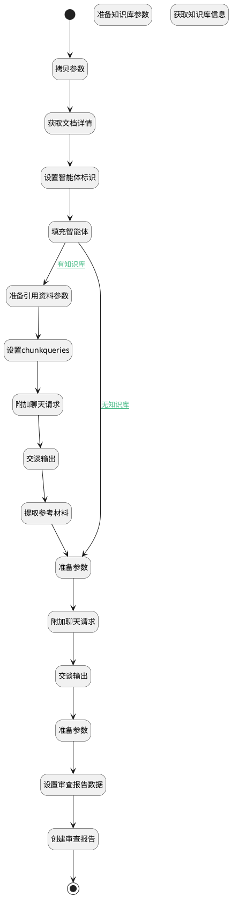

## 全文推理 <!-- {docsify-ignore-all} -->

   

### 处理过程




### 处理步骤说明

#### 拷贝参数 :id=COPYPARAM_01<sup class="footnote-symbol"> <font color=gray size=1>[拷贝参数]</font></sup>


拷贝参数`Default(传入变量)` 到 `default_temp(临时变量对象)`

#### 开始 :id=BEGIN_01<sup class="footnote-symbol"> <font color=gray size=1>[开始]</font></sup>


*- N/A*
#### 获取文档详情 :id=DEACTION_01<sup class="footnote-symbol"> <font color=gray size=1>[实体行为]</font></sup>


调用实体 [知识库文档(AI_KB_DOCUMENT)](module/ai/ai_kb_document.md) 行为 [GetFullData(get_full_data)](module/ai/ai_kb_document#行为) ，行为参数为`default_temp(临时变量对象)`

将执行结果返回给参数`default_temp(临时变量对象)`

#### 准备知识库参数 :id=PREPAREPARAM_05<sup class="footnote-symbol"> <font color=gray size=1>[准备参数]</font></sup>


1. 将`agent.SPEC_KB_ID(规格库标识)` 设置给  `kb.ID(知识库标识)`

#### 获取知识库信息 :id=DEACTION_03<sup class="footnote-symbol"> <font color=gray size=1>[实体行为]</font></sup>


调用实体 [知识库(AI_KNOWLEDGE_BASE)](module/ai/ai_knowledge_base.md) 行为 [Get](module/ai/ai_knowledge_base#行为) ，行为参数为`kb`

将执行结果返回给参数`kb`

#### 设置智能体标识 :id=PREPAREPARAM_01<sup class="footnote-symbol"> <font color=gray size=1>[准备参数]</font></sup>


1. 将`Default(传入变量).agenttag` 设置给  `chat_request.srfaiagenttag`
2. 将`Default(传入变量).agenttag` 设置给  `agent.CODE_NAME(代码标识)`
3. 将`空值（NULL）` 设置给  `chat_request.knowledgebases`

#### 填充智能体 :id=DELOGIC_01<sup class="footnote-symbol"> <font color=gray size=1>[实体逻辑]</font></sup>


调用实体 [智能体业务上下文(AI_AGENT_CONTEXT)](module/ai/ai_agent_context.md) 处理逻辑 [get_by_code]((module/ai/ai_agent_context/logic/get_by_code.md)) ，行为参数为`agent(agent)`
将执行结果返回给参数`agent(agent)`

#### 准备引用资料参数 :id=PREPAREPARAM_06<sup class="footnote-symbol"> <font color=gray size=1>[准备参数]</font></sup>


1. 将`agent.SPEC_KB_ID(规格库标识)` 设置给  `refrence_chat_request.knowledgebases`
2. 将`1` 设置给  `refrence_chat_request.chunkpageindex`

#### 设置chunkqueries :id=RAWSFCODE_01<sup class="footnote-symbol"> <font color=gray size=1>[直接后台代码]</font></sup>


<p class="panel-title"><b>执行代码[Groovy]</b></p>

```groovy
/*Groovy*/
def _refrence_chat_request = logic.param('refrence_chat_request').getReal()
def default_temp = logic.param('default_temp').getReal()
def _agententity = logic.param('agent').getReal()

String chunkqueries = "我需要执行如下任务，请帮我查询相关信息，精简输出为引用参考资料。"
if(_agententity.get('context_content')){
  chunkqueries += "\n" + _agententity.get('context_content')
}

chunkqueries += "\n任务目标数据情况如下："

if(default_temp.get('analysis_content')){
  chunkqueries += default_temp.get('analysis_content')
}
_refrence_chat_request.set('chunkqueries',chunkqueries)
```

#### 附加聊天请求 :id=SYSAICHATAGENT_APPENDCHATREQUEST_02<sup class="footnote-symbol"> <font color=gray size=1>[SYSAICHATAGENT_APPENDCHATREQUEST]</font></sup>


#### 交谈输出 :id=SYSAICHATAGENT_CHATOUTPUT_02<sup class="footnote-symbol"> <font color=gray size=1>[SYSAICHATAGENT_CHATOUTPUT]</font></sup>


#### 提取参考材料 :id=PREPAREPARAM_07<sup class="footnote-symbol"> <font color=gray size=1>[准备参数]</font></sup>


1. 将`refrence_chat_response.content` 绑定给  `refrence`

#### 准备参数 :id=PREPAREPARAM_03<sup class="footnote-symbol"> <font color=gray size=1>[准备参数]</font></sup>


1. 将`agent.context_content` 设置给  `default_temp(临时变量对象).context_content`
2. 将`agent.PAGE_INDEX(启用增强目录召回)` 设置给  `chat_request.chunkpageindex`

#### 附加聊天请求 :id=SYSAICHATAGENT_APPENDCHATREQUEST_01<sup class="footnote-symbol"> <font color=gray size=1>[SYSAICHATAGENT_APPENDCHATREQUEST]</font></sup>


#### 交谈输出 :id=SYSAICHATAGENT_CHATOUTPUT_01<sup class="footnote-symbol"> <font color=gray size=1>[SYSAICHATAGENT_CHATOUTPUT]</font></sup>


#### 准备参数 :id=PREPAREPARAM_02<sup class="footnote-symbol"> <font color=gray size=1>[准备参数]</font></sup>


1. 将`chat_response.content` 设置给  `result(结果对象).content(内容)`

#### 设置审查报告数据 :id=PREPAREPARAM_04<sup class="footnote-symbol"> <font color=gray size=1>[准备参数]</font></sup>


1. 将`default_temp(临时变量对象).ID(知识库文档标识)` 设置给  `report.DOCUMENT_ID(知识库文档标识)`
2. 将`default_temp(临时变量对象).KB_ID(知识库标识)` 设置给  `report.KB_ID(知识库标识)`
3. 将`default_temp(临时变量对象).NAME(文档名称)` 设置给  `report.NAME(审查对象)`
4. 将`Default(传入变量).agenttag` 设置给  `report.AGENT_TAG(智能体标记)`
5. 将`chat_response.content` 设置给  `report.REVIEW_REPORT(报告)`

#### 创建审查报告 :id=DEACTION_02<sup class="footnote-symbol"> <font color=gray size=1>[实体行为]</font></sup>


调用实体 [智能审查报告(AI_REVIEW_REPORT)](module/ai/ai_review_report.md) 行为 [upsert](module/ai/ai_review_report#行为) ，行为参数为`report`

将执行结果返回给参数`report`

#### 结束 :id=END_01<sup class="footnote-symbol"> <font color=gray size=1>[结束]</font></sup>


返回 `result(结果对象)`


### 连接条件说明
#### 无知识库 :id=DELOGIC_01-PREPAREPARAM_03

`agent(agent).SPEC_KB_ID(规格库标识)` ISNULL
#### 有知识库 :id=DELOGIC_01-PREPAREPARAM_06

`agent(agent).SPEC_KB_ID(规格库标识)` ISNOTNULL


### 实体逻辑参数

|    中文名   |    代码名    |  数据类型    |  实体   |备注 |
| --------| --------| -------- | -------- | --------   |
|传入变量(<i class="fa fa-check"/></i>)|Default|数据对象|[知识库文档(AI_KB_DOCUMENT)](module/ai/ai_kb_document.md)||
|agent|agent|数据对象|[智能体业务上下文(AI_AGENT_CONTEXT)](module/ai/ai_agent_context.md)||
|chat_request|chat_request||||
|chat_response|chat_response||||
|文档内容对象|content_temp|数据对象|[知识库文档(AI_KB_DOCUMENT)](module/ai/ai_kb_document.md)||
|临时变量对象|default_temp|数据对象|[知识库文档(AI_KB_DOCUMENT)](module/ai/ai_kb_document.md)||
|kb|kb|数据对象|[知识库(AI_KNOWLEDGE_BASE)](module/ai/ai_knowledge_base.md)||
|refrence|refrence|简单数据|||
|refrence_chat_request|refrence_chat_request||||
|refrence_chat_response|refrence_chat_response||||
|report|report|数据对象|[智能审查报告(AI_REVIEW_REPORT)](module/ai/ai_review_report.md)||
|结果对象|result|数据对象|[知识库文档(AI_KB_DOCUMENT)](module/ai/ai_kb_document.md)||
