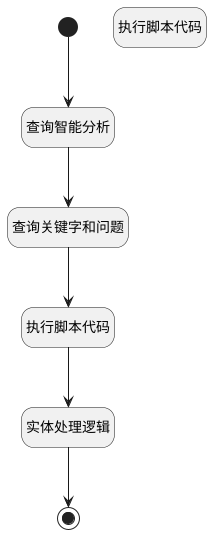

## 获取关联信息 <!-- {docsify-ignore-all} -->

   

### 处理过程




### 处理步骤说明

#### 开始 :id=Begin<sup class="footnote-symbol"> <font color=gray size=1>[开始]</font></sup>


*- N/A*
#### 查询智能分析 :id=RAWSQLCALL_01<sup class="footnote-symbol"> <font color=gray size=1>[直接SQL调用]</font></sup>


<p class="panel-title"><b>执行sql语句</b></p>

```sql
select content as intelligent_analysis from AI_KB_CHUNK where document_id = ? and pid is null and type='cluster'
```

<p class="panel-title"><b>执行sql参数</b></p>

1. `Default(传入变量).ID(知识库文档标识)`

重置参数`Default(传入变量)`，并将执行sql结果赋值给参数`Default(传入变量)`

#### 查询关键字和问题 :id=RAWSQLCALL_02<sup class="footnote-symbol"> <font color=gray size=1>[直接SQL调用]</font></sup>


<p class="panel-title"><b>执行sql语句</b></p>

```sql
SELECT keywords,key_questions FROM AI_KB_CHUNK where key_questions is NOT null and document_id = ? ORDER BY RANDOM() LIMIT 1;
```

<p class="panel-title"><b>执行sql参数</b></p>

1. `Default(传入变量).ID(知识库文档标识)`

重置参数`Default(传入变量)`，并将执行sql结果赋值给参数`Default(传入变量)`

#### 执行脚本代码 :id=RAWSFCODE2<sup class="footnote-symbol"> <font color=gray size=1>[直接后台代码]</font></sup>


<p class="panel-title"><b>执行代码[Groovy]</b></p>

```groovy
def document = logic.param("Default").getReal();
    String input = document.get("key_questions");
    if (!org.springframework.util.ObjectUtils.isEmpty(input)) {
        def lines = input.split('\n');
        List mapList = []
        if (lines.size() > 0) {
            for (String line : lines) {
                // Map<String, String> map = new HashMap<>();
                def map = sys.createEntity()
                map.set("name", line)
                mapList.add(map)
            }
            document.set("key_question_list", mapList)
        }
    }
```

#### 执行脚本代码 :id=RAWSFCODE_01<sup class="footnote-symbol"> <font color=gray size=1>[直接后台代码]</font></sup>


<p class="panel-title"><b>执行代码[Groovy]</b></p>

```groovy
def document = logic.param("Default").getReal();
String input = document.get("key_questions");
// def questions = input.split(/\n?\d+\.\s+/).findAll { it.trim() }
def lines = input.split('\n')
// def key_questions_list = questions.eachWithIndex { q, i -> println "${i + 1}: [${q}]" }

document.set("key_questions",lines);
```

#### 实体处理逻辑 :id=DELOGIC_01<sup class="footnote-symbol"> <font color=gray size=1>[实体逻辑]</font></sup>


调用实体 [知识库文档(AI_KB_DOCUMENT)](module/ai/ai_kb_document.md) 处理逻辑 [获取pageIndex信息]((module/ai/ai_kb_document/logic/get_page_index_info.md)) ，行为参数为`Default(传入变量)`
将执行结果返回给参数`Default(传入变量)`

#### 结束 :id=END_01<sup class="footnote-symbol"> <font color=gray size=1>[结束]</font></sup>


返回 `Default(传入变量)`


### 实体逻辑参数

|    中文名   |    代码名    |  数据类型    |  实体   |备注 |
| --------| --------| -------- | -------- | --------   |
|传入变量(<i class="fa fa-check"/></i>)|Default|数据对象|[知识库文档(AI_KB_DOCUMENT)](module/ai/ai_kb_document.md)||
|chunk|chunk|数据对象|[知识库文档分块(AI_KB_CHUNK)](module/ai/ai_kb_chunk.md)||
|chunk查询条件|chunkfilter|过滤器|||
|chunklist|chunklist|分页查询|||
