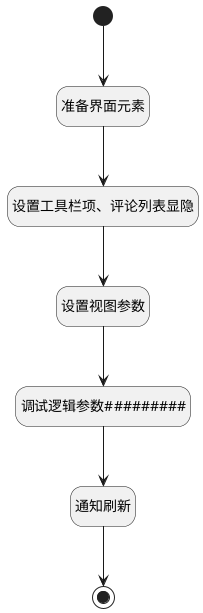

## 显示基本信息 <!-- {docsify-ignore-all} -->

   

### 处理过程




### 处理步骤说明

#### 设置工具栏项、评论列表显隐 :id=PREPAREJSPARAM2<sup class="footnote-symbol"> <font color=gray size=1>[准备参数]</font></sup>


1. 将`true` 设置给  `right_grouppanel_state(容器状态).visible`
2. 将`true` 设置给  `info_state(容器状态).visible`
3. 将`false` 设置给  `comment_state(容器状态).visible`
4. 将`true` 设置给  `button2_state_obj(评论按钮状态).visible`
5. 将`false` 设置给  `button1_state_obj(基本信息按钮状态).visible`

#### 设置视图参数 :id=PREPAREJSPARAM_01<sup class="footnote-symbol"> <font color=gray size=1>[准备参数]</font></sup>


1. 将`false` 设置给  `view.comment_list_isshow`

#### 调试逻辑参数######### :id=DEBUGPARAM_01<sup class="footnote-symbol"> <font color=gray size=1>[调试逻辑参数]</font></sup>


> [!NOTE|label:调试信息|icon:fa fa-bug]
> 调试输出参数`view`的详细信息

#### 通知刷新 :id=RAWJSCODE_01<sup class="footnote-symbol"> <font color=gray size=1>[直接前台代码]</font></sup>


<p class="panel-title"><b>执行代码</b></p>

```javascript
ibiz.mc.command.create.send({ srfdecodename: 'ai_kb_document'});
```

#### 开始 :id=Begin<sup class="footnote-symbol"> <font color=gray size=1>[开始]</font></sup>


#### 准备界面元素 :id=PREPAREJSPARAM1<sup class="footnote-symbol"> <font color=gray size=1>[准备参数]</font></sup>


1. 将`view.layoutPanel.panelItems.right_container.state` 设置给  `right_grouppanel_state(容器状态)`
2. 将`view.layoutPanel.panelItems.info.state` 设置给  `info_state(容器状态)`
3. 将`view.layoutPanel.panelItems.comment.state` 设置给  `comment_state(容器状态)`
4. 将`toolbar(工具栏).state.buttonsState.deuiaction2` 设置给  `button2_state_obj(评论按钮状态)`
5. 将`toolbar(工具栏).state.buttonsState.deuiaction1` 设置给  `button1_state_obj(基本信息按钮状态)`

#### 结束 :id=END1<sup class="footnote-symbol"> <font color=gray size=1>[结束]</font></sup>


### 实体逻辑参数

|    中文名   |    代码名    |  数据类型      |备注 |
| --------| --------| --------  | --------   |
|评论按钮状态|button2_state_obj|数据对象||
|传入变量(<i class="fa fa-check"/></i>)|Default|数据对象||
|form|form|部件对象||
|容器状态|info_state|数据对象||
|容器状态|comment_state|数据对象||
|view|view|当前视图对象||
|工具栏|toolbar|部件对象||
|关闭按钮状态|button4_state_obj|数据对象||
|容器状态|right_grouppanel_state|数据对象||
|关闭按钮状态|button3_state_obj|数据对象||
|基本信息按钮状态|button1_state_obj|数据对象||
