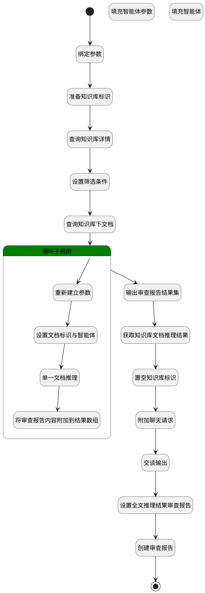

## all_doc_reason <!-- {docsify-ignore-all} -->

   通过传入知识库标识、智能体，对知识库下文档逐个进行推理

### 处理过程




### 处理步骤说明

#### 开始 :id=Begin<sup class="footnote-symbol"> <font color=gray size=1>[开始]</font></sup>


*- N/A*
#### 绑定参数 :id=BINDPARAM_01<sup class="footnote-symbol"> <font color=gray size=1>[绑定参数]</font></sup>


绑定参数`Default(传入变量)` 到 `default_temp`
#### 准备知识库标识 :id=PREPAREPARAM_06<sup class="footnote-symbol"> <font color=gray size=1>[准备参数]</font></sup>


1. 将`default_temp.ID(知识库标识)` 设置给  `kb.ID(知识库标识)`

#### 设置筛选条件 :id=PREPAREPARAM_01<sup class="footnote-symbol"> <font color=gray size=1>[准备参数]</font></sup>


1. 将`default_temp.ID(知识库标识)` 设置给  `doc_filter(文档筛选条件).n_kb_id_eq`

#### 查询知识库详情 :id=DEACTION_04<sup class="footnote-symbol"> <font color=gray size=1>[实体行为]</font></sup>


调用实体 [知识库(AI_KNOWLEDGE_BASE)](module/ai/ai_knowledge_base.md) 行为 [Get](module/ai/ai_knowledge_base#行为) ，行为参数为`kb`

将执行结果返回给参数`kb`

#### 查询知识库下文档 :id=DEDATASET_01<sup class="footnote-symbol"> <font color=gray size=1>[实体数据集]</font></sup>


调用实体 [知识库文档(AI_KB_DOCUMENT)](module/ai/ai_kb_document.md) 数据集合 [DEFAULT](module/ai/ai_kb_document#数据集合) ，查询参数为`doc_filter(文档筛选条件)`

将执行结果返回给参数`doc_list(文档查询列表)`

#### 循环子调用 :id=LOOPSUBCALL_01<sup class="footnote-symbol"> <font color=gray size=1>[循环子调用]</font></sup>


循环参数`doc_list(文档查询列表)`，子循环参数使用`doc`
#### 输出审查报告结果集 :id=DEBUGPARAM_01<sup class="footnote-symbol"> <font color=gray size=1>[调试逻辑参数]</font></sup>


> [!NOTE|label:调试信息|icon:fa fa-bug]
> 调试输出参数`doc_reason_list`的详细信息


#### 获取知识库文档推理结果 :id=RAWSFCODE_01<sup class="footnote-symbol"> <font color=gray size=1>[直接后台代码]</font></sup>


<p class="panel-title"><b>执行代码[Groovy]</b></p>

```groovy
def _all_reason_content = logic.param("all_reason_content").getReal();
def _doc_reason_list = logic.param("doc_reason_list").getReal();
      
//def dataList = new groovy.json.JsonSlurper().parseText(_doc_reason_list)
//def allContent = _doc_reason_list.collect { it.content ?: '' }.join('\n')

def allContent = _doc_reason_list.collect { item ->
    def docname = item.name ?: 'unknown'
    def content = item.content ?: ''
"""\
# 分段资料：${docname}
```
${item.content}
```
---\
"""
}.join('\n')

_all_reason_content.set('fullcontent',allContent)

println "------------------------allContent：" + allContent

```

#### 填充智能体参数 :id=PREPAREPARAM_04<sup class="footnote-symbol"> <font color=gray size=1>[准备参数]</font></sup>


1. 将`Default(传入变量).agenttag` 设置给  `agent.CODE_NAME(代码标识)`
2. 将`空值（NULL）` 设置给  `chat_request.knowledgebases`
3. 将`Default(传入变量).agenttag` 设置给  `chat_request.srfaiagenttag`

#### 重新建立参数 :id=RENEWPARAM_01<sup class="footnote-symbol"> <font color=gray size=1>[重新建立参数]</font></sup>


重建参数```doc_reason(doc_reason)```
#### 置空知识库标识 :id=PREPAREPARAM_03<sup class="footnote-symbol"> <font color=gray size=1>[准备参数]</font></sup>


1. 将`空值（NULL）` 设置给  `chat_request_reason.knowledgebases`

#### 填充智能体 :id=DELOGIC_01<sup class="footnote-symbol"> <font color=gray size=1>[实体逻辑]</font></sup>


调用实体 [智能体业务上下文(AI_AGENT_CONTEXT)](module/ai/ai_agent_context.md) 处理逻辑 [get_by_code]((module/ai/ai_agent_context/logic/get_by_code.md)) ，行为参数为`agent(agent)`
将执行结果返回给参数`agent(agent)`

#### 设置文档标识与智能体 :id=PREPAREPARAM_02<sup class="footnote-symbol"> <font color=gray size=1>[准备参数]</font></sup>


1. 将`default_temp.agenttag` 设置给  `doc_reason.agenttag`
2. 将`doc.ID(知识库文档标识)` 设置给  `doc_reason.id(知识库文档标识)`

#### 附加聊天请求 :id=SYSAICHATAGENT_APPENDCHATREQUEST_01<sup class="footnote-symbol"> <font color=gray size=1>[SYSAICHATAGENT_APPENDCHATREQUEST]</font></sup>


#### 单一文档推理 :id=DEACTION_01<sup class="footnote-symbol"> <font color=gray size=1>[实体行为]</font></sup>


调用实体 [知识库文档(AI_KB_DOCUMENT)](module/ai/ai_kb_document.md) 行为 [推理(reason)](module/ai/ai_kb_document#行为) ，行为参数为`doc_reason`

将执行结果返回给参数`doc_reason`

#### 交谈输出 :id=SYSAICHATAGENT_CHATOUTPUT_01<sup class="footnote-symbol"> <font color=gray size=1>[SYSAICHATAGENT_CHATOUTPUT]</font></sup>


#### 将审查报告内容附加到结果数组 :id=APPENDPARAM_01<sup class="footnote-symbol"> <font color=gray size=1>[附加到数组参数]</font></sup>


将参数`doc_reason` 添加到数组参数`doc_reason_list`
#### 设置全文推理结果审查报告 :id=PREPAREPARAM_05<sup class="footnote-symbol"> <font color=gray size=1>[准备参数]</font></sup>


1. 将`chat_response_reason.content` 设置给  `fullcontent_reason_report.REVIEW_REPORT(报告)`
2. 将`Default(传入变量).ID(知识库标识)` 设置给  `fullcontent_reason_report.KB_ID(知识库标识)`
3. 将`Default(传入变量).agenttag` 设置给  `fullcontent_reason_report.AGENT_TAG(智能体标记)`
4. 将`kb.NAME(知识库名称)` 设置给  `fullcontent_reason_report.NAME(审查对象)`

#### 创建审查报告 :id=DEACTION_03<sup class="footnote-symbol"> <font color=gray size=1>[实体行为]</font></sup>


调用实体 [智能审查报告(AI_REVIEW_REPORT)](module/ai/ai_review_report.md) 行为 [upsert](module/ai/ai_review_report#行为) ，行为参数为`fullcontent_reason_report`

将执行结果返回给参数`fullcontent_reason_report`

#### 结束 :id=END_01<sup class="footnote-symbol"> <font color=gray size=1>[结束]</font></sup>


返回 `fullcontent_reason_report`


### 实体逻辑参数

|    中文名   |    代码名    |  数据类型    |  实体   |备注 |
| --------| --------| -------- | -------- | --------   |
|传入变量(<i class="fa fa-check"/></i>)|Default|数据对象|[知识库(AI_KNOWLEDGE_BASE)](module/ai/ai_knowledge_base.md)||
|agent|agent|数据对象|[智能体业务上下文(AI_AGENT_CONTEXT)](module/ai/ai_agent_context.md)||
|all_reason_content|all_reason_content|数据对象|||
|chat_request|chat_request||||
|chat_request_reason|chat_request_reason||||
|chat_response|chat_response||||
|chat_response_reason|chat_response_reason||||
|default_temp|default_temp|数据对象|[知识库(AI_KNOWLEDGE_BASE)](module/ai/ai_knowledge_base.md)||
|doc|doc|数据对象|[知识库文档(AI_KB_DOCUMENT)](module/ai/ai_kb_document.md)||
|文档筛选条件|doc_filter|过滤器|||
|文档查询列表|doc_list|分页查询|||
|doc_reason|doc_reason|数据对象|[知识库文档(AI_KB_DOCUMENT)](module/ai/ai_kb_document.md)||
|doc_reason_list|doc_reason_list|数据对象列表|[智能审查报告(AI_REVIEW_REPORT)](module/ai/ai_review_report.md)||
|fullcontent_reason_report|fullcontent_reason_report|数据对象|[智能审查报告(AI_REVIEW_REPORT)](module/ai/ai_review_report.md)||
|kb|kb|数据对象|[知识库(AI_KNOWLEDGE_BASE)](module/ai/ai_knowledge_base.md)||
|report_doc|report_doc|数据对象|[智能审查报告(AI_REVIEW_REPORT)](module/ai/ai_review_report.md)||
