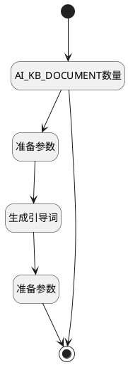

## 计算解析数完成知识库状态处理 <!-- {docsify-ignore-all} -->

   

### 处理过程




### 处理步骤说明

#### 开始 :id=Begin<sup class="footnote-symbol"> <font color=gray size=1>[开始]</font></sup>


*- N/A*
#### 准备参数 :id=PREPAREPARAM_01<sup class="footnote-symbol"> <font color=gray size=1>[准备参数]</font></sup>


1. 将`Default(传入变量).ID(知识库标识)` 设置给  `gd.ID(知识库标识)`

#### AI_KB_DOCUMENT数量 :id=RAWSQLCALL_01<sup class="footnote-symbol"> <font color=gray size=1>[直接SQL调用]</font></sup>


<p class="panel-title"><b>执行sql语句</b></p>

```sql
select count(1) as document_cnt, count(1) FILTER (WHERE status = '1') AS parsed_cnt  from AI_KB_DOCUMENT where kb_id = ?
```

<p class="panel-title"><b>执行sql参数</b></p>

1. `Default(传入变量).ID(知识库标识)`

重置参数`Default(传入变量)`，并将执行sql结果赋值给参数`Default(传入变量)`

#### 生成引导词 :id=DELOGIC_01<sup class="footnote-symbol"> <font color=gray size=1>[实体逻辑]</font></sup>


调用实体 [知识库(AI_KNOWLEDGE_BASE)](module/ai/ai_knowledge_base.md) 处理逻辑 [生成引导提示词]((module/ai/ai_knowledge_base/logic/generate_guided_prompts.md)) ，行为参数为`gd(gd)`
将执行结果返回给参数`gd(gd)`

#### 准备参数 :id=PREPAREPARAM_02<sup class="footnote-symbol"> <font color=gray size=1>[准备参数]</font></sup>


1. 将`gd.GUIDANCE_PROMPT(引导提示词)` 设置给  `Default(传入变量).GUIDANCE_PROMPT(引导提示词)`

#### 结束 :id=END_01<sup class="footnote-symbol"> <font color=gray size=1>[结束]</font></sup>


返回 `Default(传入变量)`


### 连接条件说明
#### 连接名称 


### 实体逻辑参数

|    中文名   |    代码名    |  数据类型    |  实体   |备注 |
| --------| --------| -------- | -------- | --------   |
|传入变量(<i class="fa fa-check"/></i>)|Default|数据对象|[知识库(AI_KNOWLEDGE_BASE)](module/ai/ai_knowledge_base.md)||
|gd|gd|数据对象|[知识库(AI_KNOWLEDGE_BASE)](module/ai/ai_knowledge_base.md)||
