## 创建默认成员 <!-- {docsify-ignore-all} -->

   

### 处理过程

```plantuml
@startuml
hide empty description
<style>
root {
  HyperlinkColor #42b983
}
</style>

hide empty description
state "开始" as Begin <<start>> [[$./create_member#begin {"开始"}]]
state "设置成员信息" as PREPAREPARAM_01  [[$./create_member#prepareparam_01 {"设置成员信息"}]]
state "创建默认成员" as DEACTION_01  [[$./create_member#deaction_01 {"创建默认成员"}]]
state "结束" as END_01 <<end>> [[$./create_member#end_01 {"结束"}]]


Begin --> PREPAREPARAM_01
PREPAREPARAM_01 --> DEACTION_01 : [[$./create_member#prepareparam_01-deaction_01{连接名称} 连接名称]]
DEACTION_01 --> END_01


@enduml
```

### 处理步骤说明

#### 开始 :id=Begin [开始]

*- N/A*
#### 设置成员信息 :id=PREPAREPARAM_01 [准备参数]

1. 将`Default(传入变量).ID(知识库标识)` 设置给  `ai_kb_member.KB_ID(知识库标识)`
2. 将`用户全局对象.srfuserid` 设置给  `ai_kb_member.USER_ID(标识)`
3. 将`admin` 设置给  `ai_kb_member.ROLE_ID(角色)`

#### 创建默认成员 :id=DEACTION_01 [实体行为]

调用实体 [知识库成员(AI_KB_MEMBER)](module/ai/ai_kb_member.md) 行为 [Create](module/ai/ai_kb_member#行为) ，行为参数为`ai_kb_member`

将执行结果返回给参数`ai_kb_member`

#### 结束 :id=END_01 [结束]

*- N/A*

### 连接条件说明
#### 连接名称 :id=PREPAREPARAM_01-DEACTION_01

`ai_kb_member(ai_kb_member).USER_ID(标识)` NOTEQ `aibizhi`

### 实体逻辑参数

|    中文名   |    代码名    |  数据类型    |  实体   |备注 |
| --------| --------| -------- | -------- | --------   |
|传入变量(<i class="fa fa-check"/></i>)|Default|数据对象|[知识库(AI_KNOWLEDGE_BASE)](module/ai/ai_knowledge_base.md)||
|ai_kb_member|ai_kb_member|数据对象|[知识库成员(AI_KB_MEMBER)](module/ai/ai_kb_member.md)||
