## 深度研究 <!-- {docsify-ignore-all} -->

   

### 处理过程

```plantuml
@startuml
hide empty description
<style>
root {
  HyperlinkColor #42b983
}
</style>

hide empty description
state "开始" as Begin <<start>> [[$./deep_research#begin {"开始"}]]
state "获取知识库信息" as DEACTION_01  [[$./deep_research#deaction_01 {"获取知识库信息"}]]
state "设置lead_tag" as PREPAREPARAM_015  [[$./deep_research#prepareparam_015 {"设置lead_tag"}]]
state "设置synthesizer_tag" as PREPAREPARAM_011  [[$./deep_research#prepareparam_011 {"设置synthesizer_tag"}]]
state "交谈输出" as SYSAICHATAGENT_CHATOUTPUT_01  [[$./deep_research#sysaichatagent_chatoutput_01 {"交谈输出"}]]
state "异常信息" as COPYPARAM_02  [[$./deep_research#copyparam_02 {"异常信息"}]]
state "附加聊天请求" as RAWSFCODE_02  [[$./deep_research#rawsfcode_02 {"附加聊天请求"}]]
state "拷贝default" as COPYPARAM_01  [[$./deep_research#copyparam_01 {"拷贝default"}]]
state "查询智能体" as DELOGIC_01  [[$./deep_research#delogic_01 {"查询智能体"}]]
state "设置默认synthesizer_tag" as PREPAREPARAM_012  [[$./deep_research#prepareparam_012 {"设置默认synthesizer_tag"}]]
state "切换lead智能体" as PREPAREPARAM_02  [[$./deep_research#prepareparam_02 {"切换lead智能体"}]]
state "准备查询参数" as PREPAREPARAM_014  [[$./deep_research#prepareparam_014 {"准备查询参数"}]]
state "查询report" as DEDATAQUERY_01  [[$./deep_research#dedataquery_01 {"查询report"}]]
state "附加聊天请求" as SYSAICHATAGENT_APPENDCHATREQUEST_01  [[$./deep_research#sysaichatagent_appendchatrequest_01 {"附加聊天请求"}]]
state "准备参数" as PREPAREPARAM_016  [[$./deep_research#prepareparam_016 {"准备参数"}]]
state "设置默认lead" as PREPAREPARAM_08  [[$./deep_research#prepareparam_08 {"设置默认lead"}]]
state "结束" as END_05 <<end>> [[$./deep_research#end_05 {"结束"}]]
state "设置report" as PREPAREPARAM_013  [[$./deep_research#prepareparam_013 {"设置report"}]]
state "创建report" as DEACTION_04  [[$./deep_research#deaction_04 {"创建report"}]]
state "提取深度研究son对象" as PREPAREPARAM_03  [[$./deep_research#prepareparam_03 {"提取深度研究son对象"}]]
state "设置search_plans，verification_checklist" as PREPAREPARAM_04  [[$./deep_research#prepareparam_04 {"设置search_plans，verification_checklist"}]]
state "切换通用事实核验员智能体、请求清除知识库标识" as PREPAREPARAM_05  [[$./deep_research#prepareparam_05 {"切换通用事实核验员智能体、请求清除知识库标识"}]]
state "通用事实核验交谈输出" as SYSAICHATAGENT_CHATOUTPUT_02  [[$./deep_research#sysaichatagent_chatoutput_02 {"通用事实核验交谈输出"}]]
state "提取通用事实核验员内容" as PREPAREPARAM_06  [[$./deep_research#prepareparam_06 {"提取通用事实核验员内容"}]]
state "判定交谈输出" as SYSAICHATAGENT_CHATOUTPUT_03  [[$./deep_research#sysaichatagent_chatoutput_03 {"判定交谈输出"}]]
state "判定请求" as SYSAICHATAGENT_APPENDCHATREQUEST_03  [[$./deep_research#sysaichatagent_appendchatrequest_03 {"判定请求"}]]
state "切换判定专家智能体" as PREPAREPARAM_09  [[$./deep_research#prepareparam_09 {"切换判定专家智能体"}]]
state "提取判定形成报告" as PREPAREPARAM_010  [[$./deep_research#prepareparam_010 {"提取判定形成报告"}]]
state "执行脚本代码" as RAWSFCODE_03  [[$./deep_research#rawsfcode_03 {"执行脚本代码"}]]
state "保存报告" as DEACTION_02  [[$./deep_research#deaction_02 {"保存报告"}]]
state "结束" as END_01 <<end>> [[$./deep_research#end_01 {"结束"}]]
state "循环子调用" as LOOPSUBCALL_01  [[$./deep_research#loopsubcall_01 {"循环子调用"}]] #green {
state "准备知识检索参数" as PREPAREPARAM_07  [[$./deep_research#prepareparam_07 {"准备知识检索参数"}]]
state "知识检索" as SYSAICHATAGENT_FETCHCHUNKS_01  [[$./deep_research#sysaichatagent_fetchchunks_01 {"知识检索"}]]
state "添加到retrieved_chunks" as RAWSFCODE_01  [[$./deep_research#rawsfcode_01 {"添加到retrieved_chunks"}]]
}
state "循环子调用" as LOOPSUBCALL_02  [[$./deep_research#loopsubcall_02 {"循环子调用"}]] #green {
state "设置report" as PREPAREPARAM_01  [[$./deep_research#prepareparam_01 {"设置report"}]]
state "更新report" as DEACTION_03  [[$./deep_research#deaction_03 {"更新report"}]]
}


Begin --> PREPAREPARAM_016
PREPAREPARAM_016 --> COPYPARAM_01
COPYPARAM_01 --> DEACTION_01
DEACTION_01 --> DELOGIC_01 : [[$./deep_research#deaction_01-delogic_01{无lead_tag} 无lead_tag]]
DELOGIC_01 --> PREPAREPARAM_08
PREPAREPARAM_08 --> PREPAREPARAM_015
PREPAREPARAM_015 --> PREPAREPARAM_012 : [[$./deep_research#prepareparam_015-prepareparam_012{无synthesizer_tag} 无synthesizer_tag]]
PREPAREPARAM_012 --> PREPAREPARAM_011
PREPAREPARAM_011 --> PREPAREPARAM_02
PREPAREPARAM_02 --> SYSAICHATAGENT_APPENDCHATREQUEST_01
SYSAICHATAGENT_APPENDCHATREQUEST_01 --> SYSAICHATAGENT_CHATOUTPUT_01
SYSAICHATAGENT_CHATOUTPUT_01 --> PREPAREPARAM_03
PREPAREPARAM_03 --> PREPAREPARAM_04
PREPAREPARAM_04 --> LOOPSUBCALL_01
LOOPSUBCALL_01 --> PREPAREPARAM_07
PREPAREPARAM_07 --> SYSAICHATAGENT_FETCHCHUNKS_01 : [[$./deep_research#prepareparam_07-sysaichatagent_fetchchunks_01{queries > 0} queries > 0]]
SYSAICHATAGENT_FETCHCHUNKS_01 --> RAWSFCODE_01
LOOPSUBCALL_01 --> PREPAREPARAM_05
PREPAREPARAM_05 --> RAWSFCODE_02
RAWSFCODE_02 --> SYSAICHATAGENT_CHATOUTPUT_02
SYSAICHATAGENT_CHATOUTPUT_02 --> PREPAREPARAM_06
PREPAREPARAM_06 --> PREPAREPARAM_09
PREPAREPARAM_09 --> SYSAICHATAGENT_APPENDCHATREQUEST_03
SYSAICHATAGENT_APPENDCHATREQUEST_03 --> SYSAICHATAGENT_CHATOUTPUT_03
SYSAICHATAGENT_CHATOUTPUT_03 --> PREPAREPARAM_010
PREPAREPARAM_010 --> RAWSFCODE_03
RAWSFCODE_03 --> DEACTION_02
DEACTION_02 --> END_01
SYSAICHATAGENT_CHATOUTPUT_03 -[#red]-> COPYPARAM_02
COPYPARAM_02 --> PREPAREPARAM_014
PREPAREPARAM_014 --> DEDATAQUERY_01
DEDATAQUERY_01 --> LOOPSUBCALL_02 : [[$./deep_research#dedataquery_01-loopsubcall_02{存在} 存在]]
LOOPSUBCALL_02 --> PREPAREPARAM_01
PREPAREPARAM_01 --> DEACTION_03
LOOPSUBCALL_02 --> END_05
DEDATAQUERY_01 --> PREPAREPARAM_013 : [[$./deep_research#dedataquery_01-prepareparam_013{连接不存在} 连接不存在]]
PREPAREPARAM_013 --> DEACTION_04
DEACTION_04 --> END_05
SYSAICHATAGENT_CHATOUTPUT_02 -[#red]-> COPYPARAM_02
LOOPSUBCALL_01 -[#red]-> COPYPARAM_02
SYSAICHATAGENT_CHATOUTPUT_01 -[#red]-> COPYPARAM_02
PREPAREPARAM_015 --> PREPAREPARAM_011 : [[$./deep_research#prepareparam_015-prepareparam_011{有synthesizer_tag} 有synthesizer_tag]]
DEACTION_01 --> PREPAREPARAM_015 : [[$./deep_research#deaction_01-prepareparam_015{有lead_tag} 有lead_tag]]


@enduml
```




### 处理步骤说明

#### 拷贝default :id=COPYPARAM_01<sup class="footnote-symbol"> <font color=gray size=1>[拷贝参数]</font></sup>


拷贝参数`Default` 到 `default_temp`

#### 准备参数 :id=PREPAREPARAM_016<sup class="footnote-symbol"> <font color=gray size=1>[准备参数]</font></sup>


1. 将`Default.agenttag` 绑定给  `agenttag`
2. 将`Default.agenttag` 设置给  `agententity.CODE_NAME(代码标识)`

#### 开始 :id=Begin<sup class="footnote-symbol"> <font color=gray size=1>[开始]</font></sup>


*- N/A*
#### 获取知识库信息 :id=DEACTION_01<sup class="footnote-symbol"> <font color=gray size=1>[实体行为]</font></sup>


调用实体 [知识库(AI_KNOWLEDGE_BASE)](module/ai/ai_knowledge_base.md) 行为 [Get](module/ai/ai_knowledge_base#行为) ，行为参数为`Default`

将执行结果返回给参数`Default`

#### 查询智能体 :id=DELOGIC_01<sup class="footnote-symbol"> <font color=gray size=1>[实体逻辑]</font></sup>


调用实体 [智能体业务上下文(AI_AGENT_CONTEXT)](module/ai/ai_agent_context.md) 处理逻辑 [get_by_code]((module/ai/ai_agent_context/logic/get_by_code.md)) ，行为参数为`agententity(agententity)`
将执行结果返回给参数`agententity(agententity)`

#### 设置默认lead :id=PREPAREPARAM_08<sup class="footnote-symbol"> <font color=gray size=1>[准备参数]</font></sup>


1. 将`agenttag` 设置给  `default_temp.lead_tag`

#### 设置lead_tag :id=PREPAREPARAM_015<sup class="footnote-symbol"> <font color=gray size=1>[准备参数]</font></sup>


1. 将`default_temp.lead_tag` 设置给  `Default.lead_tag`

#### 设置默认synthesizer_tag :id=PREPAREPARAM_012<sup class="footnote-symbol"> <font color=gray size=1>[准备参数]</font></sup>


1. 将`agententity.SYNTHESIZER(总结智能体)` 设置给  `default_temp.synthesizer_tag`

#### 设置synthesizer_tag :id=PREPAREPARAM_011<sup class="footnote-symbol"> <font color=gray size=1>[准备参数]</font></sup>


1. 将`default_temp.synthesizer_tag` 设置给  `Default.synthesizer_tag`

#### 切换lead智能体 :id=PREPAREPARAM_02<sup class="footnote-symbol"> <font color=gray size=1>[准备参数]</font></sup>


1. 将`Default.lead_tag` 设置给  `chat_request.srfaiagenttag`
2. 将`Default.ID(知识库标识)` 设置给  `chat_request.knowledgebases`

#### 准备查询参数 :id=PREPAREPARAM_014<sup class="footnote-symbol"> <font color=gray size=1>[准备参数]</font></sup>


1. 将`Default.ID(知识库标识)` 设置给  `query_report.kb_id(知识库标识)`
2. 将`Default.synthesizer_tag` 设置给  `query_report.agent_tag(智能体标记)`

#### 查询report :id=DEDATAQUERY_01<sup class="footnote-symbol"> <font color=gray size=1>[实体数据查询]</font></sup>


调用实体 [智能审查报告(AI_REVIEW_REPORT)](module/ai/ai_review_report.md) 数据查询 [Bykb_id_agent](module/ai/ai_review_report#数据查询) ，查询参数为`query_report`

将执行结果返回给参数`exists_report`

#### 循环子调用 :id=LOOPSUBCALL_02<sup class="footnote-symbol"> <font color=gray size=1>[循环子调用]</font></sup>


循环参数`exists_report`，子循环参数使用`report`
#### 设置report :id=PREPAREPARAM_01<sup class="footnote-symbol"> <font color=gray size=1>[准备参数]</font></sup>


1. 将`空值（NULL）` 设置给  `report.REVIEW_REPORT(报告)`
2. 将`空值（NULL）` 设置给  `report.CHECK_INFO(校验信息)`
3. 将`error` 设置给  `report.REVIEW_RESULT(审查结果)`
4. 将`exception_entity.info` 设置给  `report.REVIEW_REPORT(报告)`

#### 更新report :id=DEACTION_03<sup class="footnote-symbol"> <font color=gray size=1>[实体行为]</font></sup>


调用实体 [智能审查报告(AI_REVIEW_REPORT)](module/ai/ai_review_report.md) 行为 [Update](module/ai/ai_review_report#行为) ，行为参数为`report`

将执行结果返回给参数`report`

#### 附加聊天请求 :id=SYSAICHATAGENT_APPENDCHATREQUEST_01<sup class="footnote-symbol"> <font color=gray size=1>[SYSAICHATAGENT_APPENDCHATREQUEST]</font></sup>


#### 结束 :id=END_05<sup class="footnote-symbol"> <font color=gray size=1>[结束]</font></sup>


返回 `Default`

#### 交谈输出 :id=SYSAICHATAGENT_CHATOUTPUT_01<sup class="footnote-symbol"> <font color=gray size=1>[SYSAICHATAGENT_CHATOUTPUT]</font></sup>


#### 异常信息 :id=COPYPARAM_02<sup class="footnote-symbol"> <font color=gray size=1>[拷贝参数]</font></sup>


拷贝参数`last` 到 `exception_entity`

#### 设置report :id=PREPAREPARAM_013<sup class="footnote-symbol"> <font color=gray size=1>[准备参数]</font></sup>


1. 将`Default.ID(知识库标识)` 设置给  `report.KB_ID(知识库标识)`
2. 将`Default.synthesizer_tag` 设置给  `report.AGENT_TAG(智能体标记)`
3. 将`error` 设置给  `report.REVIEW_RESULT(审查结果)`
4. 将`exception_entity.info` 设置给  `report.REVIEW_REPORT(报告)`
5. 将`Default.NAME(知识库名称)` 设置给  `report.NAME(审查对象)`

#### 创建report :id=DEACTION_04<sup class="footnote-symbol"> <font color=gray size=1>[实体行为]</font></sup>


调用实体 [智能审查报告(AI_REVIEW_REPORT)](module/ai/ai_review_report.md) 行为 [upsert](module/ai/ai_review_report#行为) ，行为参数为`report`

#### 提取深度研究son对象 :id=PREPAREPARAM_03<sup class="footnote-symbol"> <font color=gray size=1>[准备参数]</font></sup>


1. 将`chat_response.json` 绑定给  `chat_response_entity`

#### 设置search_plans，verification_checklist :id=PREPAREPARAM_04<sup class="footnote-symbol"> <font color=gray size=1>[准备参数]</font></sup>


1. 将`chat_response_entity.search_plans` 绑定给  `search_plans`
2. 将`chat_response_entity.verification_checklist` 绑定给  `verification_checklist`

#### 循环子调用 :id=LOOPSUBCALL_01<sup class="footnote-symbol"> <font color=gray size=1>[循环子调用]</font></sup>


循环参数`search_plans`，子循环参数使用`search_plan`
#### 切换通用事实核验员智能体、请求清除知识库标识 :id=PREPAREPARAM_05<sup class="footnote-symbol"> <font color=gray size=1>[准备参数]</font></sup>


1. 将`FactVerifier` 设置给  `chat_request.srfaiagenttag`
2. 将`无值（NONE）` 设置给  `chat_request.knowledgebases`

#### 附加聊天请求 :id=RAWSFCODE_02<sup class="footnote-symbol"> <font color=gray size=1>[直接后台代码]</font></sup>


<p class="panel-title"><b>执行代码[Groovy]</b></p>

```groovy
def chat_request = logic.param("chat_request").getReal();
def retrieved_chunks = logic.param("retrieved_chunks").getReal();
def verification_checklist = logic.param("verification_checklist").getReal();

def retrieved_chunk_contents = retrieved_chunks
    .collect { it.getContent() } 
    .findAll { it && it.trim() }


String strMessage = ""

// strMessage += "下面将输出根据会话从资料库中检索的内容，供你在后续的交谈中使用。如你的回答涉及引用资料，则必须精准、客观 。杜绝信息幻觉：严禁编造、夸大或组合片段信息来生成片段中不存在的答案。对于片段信息不足的问题，必须如实告知。\n"
// strMessage += "**注意**：输出内容如引用资料片段，需要显式声明及提供资料片段的访问链接`url`，如::[资料片段01](chunkview://chunkid)"
// strMessage += "\r\n\r\n"

strMessage += "retrieved_chunks : \n"

int nIndex = 1;
for (int i = 0; i < retrieved_chunks.size(); i++) {
    def chunk = retrieved_chunks.get(i);
    if (!chunk.getContent()) {
        continue;
    }
    if (chunk.getDocName()) {
        strMessage += String.format("# 资料片段`%1\$s`，url`chunkview://%2\$s`，来自文档`%3\$s`\r\n", nIndex, chunk.getId(), chunk.getDocName());
    } else {
        strMessage += String.format("# 资料片段`%1\$s`，url`chunkview://%2\$s`\r\n", nIndex, chunk.getId());
    }

    strMessage += "---\r\n";
    strMessage += chunk.getContent();
    strMessage += "\r\n";
    nIndex++;
}

strMessage += "\nverification_checklist :" + sys.serialize(verification_checklist)


chat_request.getMessagesIf().addAll(net.ibizsys.central.cloud.core.util.ChatMessagesBuilder.create().user(strMessage).build());


def _content = logic.param("content")
_content.bind(strMessage)
```

#### 通用事实核验交谈输出 :id=SYSAICHATAGENT_CHATOUTPUT_02<sup class="footnote-symbol"> <font color=gray size=1>[SYSAICHATAGENT_CHATOUTPUT]</font></sup>


#### 提取通用事实核验员内容 :id=PREPAREPARAM_06<sup class="footnote-symbol"> <font color=gray size=1>[准备参数]</font></sup>


1. 将`chat_response.content` 绑定给  `sshy_content`

#### 准备知识检索参数 :id=PREPAREPARAM_07<sup class="footnote-symbol"> <font color=gray size=1>[准备参数]</font></sup>


1. 将`Default.id(知识库标识)` 设置给  `query_chunk.n_kbid_eq`
2. 将`search_plan.queries` 设置给  `query_chunk.queries`
3. 将`0.7` 设置给  `query_chunk.n_vector_similarity_gtandeq`
4. 将`1` 设置给  `query_chunk.n_rerank_eq`
5. 将`10` 设置给  `query_chunk.size`
6. 将`0.2` 设置给  `query_chunk.n_similarity_gtandeq`
7. 将`search_plan.expected_data` 设置给  `query_chunk.instruct`
8. 将`search_plan.queries` 绑定给  `queries`

#### 判定交谈输出 :id=SYSAICHATAGENT_CHATOUTPUT_03<sup class="footnote-symbol"> <font color=gray size=1>[SYSAICHATAGENT_CHATOUTPUT]</font></sup>


#### 判定请求 :id=SYSAICHATAGENT_APPENDCHATREQUEST_03<sup class="footnote-symbol"> <font color=gray size=1>[SYSAICHATAGENT_APPENDCHATREQUEST]</font></sup>


#### 切换判定专家智能体 :id=PREPAREPARAM_09<sup class="footnote-symbol"> <font color=gray size=1>[准备参数]</font></sup>


1. 将`Default.synthesizer_tag` 设置给  `chat_request.srfaiagenttag`

#### 知识检索 :id=SYSAICHATAGENT_FETCHCHUNKS_01<sup class="footnote-symbol"> <font color=gray size=1>[SYSAICHATAGENT_FETCHCHUNKS]</font></sup>


#### 提取判定形成报告 :id=PREPAREPARAM_010<sup class="footnote-symbol"> <font color=gray size=1>[准备参数]</font></sup>


1. 将`chat_response.content` 设置给  `report.REVIEW_REPORT(报告)`
2. 将`Default.synthesizer_tag` 设置给  `report.AGENT_TAG(智能体标记)`
3. 将`Default.ID(知识库标识)` 设置给  `report.KB_ID(知识库标识)`
4. 将`sshy_content` 设置给  `report.CHECK_INFO(校验信息)`
5. 将`Default.NAME(知识库名称)` 设置给  `report.NAME(审查对象)`

#### 添加到retrieved_chunks :id=RAWSFCODE_01<sup class="footnote-symbol"> <font color=gray size=1>[直接后台代码]</font></sup>


<p class="panel-title"><b>执行代码[Groovy]</b></p>

```groovy
def query_chunk_result = logic.param("query_chunk_result").getReal();
def retrieved_chunks = logic.param("retrieved_chunks").getReal();

if (!query_chunk_result || !query_chunk_result.getContent()) {
    return
}

//只取前五条
def query_chunks = query_chunk_result.getContent().take(5)

// 计算当前 retrieved_chunks 中所有 content 的总长度
def currentTotalLength = 0
if(retrieved_chunks){
    currentTotalLength = retrieved_chunks.sum { it.getContent() ? it.getContent().length() : 0 }
}

if(currentTotalLength > 30000) {
    return
}


// 构建已存在 ID 的集合（用于快速去重）
Set existingIds = retrieved_chunks.collect { it.getId() } as Set

for (def chunk in query_chunks) {
    if(currentTotalLength > 30000) {
        break
    }
    if (existingIds.contains(chunk.getId())) {
        continue
    }

    retrieved_chunks.add(chunk)
    existingIds.add(chunk.getId())
    currentTotalLength += chunk.getContent() ? chunk.getContent().length() : 0

    println "------------------------retrieved_chunks lenght：" + currentTotalLength
}


```

#### 执行脚本代码 :id=RAWSFCODE_03<sup class="footnote-symbol"> <font color=gray size=1>[直接后台代码]</font></sup>


<p class="panel-title"><b>执行代码[Groovy]</b></p>

```groovy
def report = logic.param('report').getReal()
def review = report.get("review_report")
if (review) {
    try {
        def jsonContent = net.ibizsys.central.cloud.core.ai.util.AIChatUtils.getJsonContent(review)
        def json = new groovy.json.JsonSlurper().parseText(jsonContent)
        
        // 只处理Map类型
        if (json && json instanceof Map) {
            def result = json.get("result")
            def check = json.get("check_info")
            
            if (result != null) {
                report.set("review_result", result)
            }
            if (check != null) {
                report.set("check_info", check)
            }
        } 
    } catch (Exception e) {
        println("处理报告时发生错误: " + e.message)
    }
}
```

#### 保存报告 :id=DEACTION_02<sup class="footnote-symbol"> <font color=gray size=1>[实体行为]</font></sup>


调用实体 [智能审查报告(AI_REVIEW_REPORT)](module/ai/ai_review_report.md) 行为 [upsert](module/ai/ai_review_report#行为) ，行为参数为`report`

将执行结果返回给参数`report`

#### 结束 :id=END_01<sup class="footnote-symbol"> <font color=gray size=1>[结束]</font></sup>


返回 `Default`


### 连接条件说明
#### 无lead_tag :id=DEACTION_01-DELOGIC_01

`default_temp(default_temp).lead_tag` ISNULL AND `agententity(agententity).CODE_NAME(代码标识)` ISNOTNULL
#### 无synthesizer_tag :id=PREPAREPARAM_015-PREPAREPARAM_012

`default_temp(default_temp).synthesizer_tag` ISNULL AND `agententity(agententity).SYNTHESIZER(总结智能体)` ISNOTNULL
#### queries > 0 :id=PREPAREPARAM_07-SYSAICHATAGENT_FETCHCHUNKS_01

`queries(queries)` ISNOTNULL AND `queries(queries).size` GT `0`
#### 存在 :id=DEDATAQUERY_01-LOOPSUBCALL_02

`exists_report(exists_report).size` GT `0`
#### 连接不存在 :id=DEDATAQUERY_01-PREPAREPARAM_013

`exists_report(exists_report).size` EQ `0`
#### 有synthesizer_tag :id=PREPAREPARAM_015-PREPAREPARAM_011

`default_temp(default_temp).synthesizer_tag` ISNOTNULL
#### 有lead_tag :id=DEACTION_01-PREPAREPARAM_015

`default_temp(default_temp).lead_tag` ISNOTNULL


### 实体逻辑参数

|    中文名   |    代码名    |  数据类型    |  实体   |备注 |
| --------| --------| -------- | -------- | --------   |
|Default(<i class="fa fa-check"/></i>)|Default|数据对象|[知识库(AI_KNOWLEDGE_BASE)](module/ai/ai_knowledge_base.md)||
|agententity|agententity|数据对象|[智能体业务上下文(AI_AGENT_CONTEXT)](module/ai/ai_agent_context.md)||
|agenttag|agenttag|简单数据|||
|chat_request|chat_request||||
|chat_response|chat_response||||
|chat_response_entity|chat_response_entity|数据对象|||
|content|content|简单数据|||
|default_temp|default_temp|数据对象|[知识库(AI_KNOWLEDGE_BASE)](module/ai/ai_knowledge_base.md)||
|exception_entity|exception_entity|数据对象|||
|exists_report|exists_report|数据对象列表|[智能审查报告(AI_REVIEW_REPORT)](module/ai/ai_review_report.md)||
|last|last|上一次调用返回|||
|queries|queries|简单数据列表|||
|query_chunk|query_chunk|过滤器|||
|query_chunk_result|query_chunk_result|分页查询|||
|query_report|query_report|过滤器|||
|report|report|数据对象|[智能审查报告(AI_REVIEW_REPORT)](module/ai/ai_review_report.md)||
|返回信息|ret|数据对象|[知识库(AI_KNOWLEDGE_BASE)](module/ai/ai_knowledge_base.md)||
|retrieved_chunks|retrieved_chunks|数据对象列表|||
|search_plan|search_plan|数据对象|||
|search_plans|search_plans|数据对象列表|||
|sshy_content|sshy_content|简单数据|||
|verification_checklist|verification_checklist|简单数据列表|||
