## 填充分类配置 <!-- {docsify-ignore-all} -->

   

### 处理过程

```plantuml
@startuml
hide empty description
<style>
root {
  HyperlinkColor #42b983
}
</style>

hide empty description
state "开始" as Begin <<start>> [[$./fill_category_config#begin {"开始"}]]
state "获取选择的分类ID" as PREPAREPARAM_01  [[$./fill_category_config#prepareparam_01 {"获取选择的分类ID"}]]
state "查询分类配置" as DEACTION_01  [[$./fill_category_config#deaction_01 {"查询分类配置"}]]
state "结束" as END_01 <<end>> [[$./fill_category_config#end_01 {"结束"}]]
state "填充分类配置" as PREPAREPARAM_03  [[$./fill_category_config#prepareparam_03 {"填充分类配置"}]]
state "拷贝参数" as COPYPARAM_01  [[$./fill_category_config#copyparam_01 {"拷贝参数"}]]


Begin --> PREPAREPARAM_01
PREPAREPARAM_01 --> DEACTION_01 : [[$./fill_category_config#prepareparam_01-deaction_01{有ID} 有ID]]
DEACTION_01 --> PREPAREPARAM_03 : [[$./fill_category_config#deaction_01-prepareparam_03{连接名称} 连接名称]]
PREPAREPARAM_03 --> COPYPARAM_01
COPYPARAM_01 --> END_01


@enduml
```

### 处理步骤说明

#### 开始 :id=Begin [开始]

*- N/A*
#### 获取选择的分类ID :id=PREPAREPARAM_01 [准备参数]

1. 将`Default(传入变量).CATEGORY_ID(目录标识)` 设置给  `category.ID(标识)`

#### 查询分类配置 :id=DEACTION_01 [实体行为]

调用实体 [类别(CATEGORY)](module/Base/category.md) 行为 [Get](module/Base/category#行为) ，行为参数为`category`

将执行结果返回给参数`category`

#### 结束 :id=END_01 [结束]

返回 `Default(传入变量)`

#### 填充分类配置 :id=PREPAREPARAM_03 [准备参数]

1. 将`category.SETTING(设置)` 绑定给  `setting`
2. 将`无值（NONE）` 设置给  `setting.ID(标识)`
3. 将`无值（NONE）` 设置给  `setting.NAME(名称)`
4. 将`计算式 null` 设置给  `setting.CHUNK_METHOD(切片方法)`

#### 拷贝参数 :id=COPYPARAM_01 [拷贝参数]

拷贝参数`setting` 到 `Default(传入变量)`

且仅拷贝不存在属性

### 连接条件说明
#### 有ID :id=PREPAREPARAM_01-DEACTION_01

`category(category).ID(标识)` ISNOTNULL
#### 连接名称 :id=DEACTION_01-PREPAREPARAM_03

`category(category).SETTING(设置)` ISNOTNULL

### 实体逻辑参数

|    中文名   |    代码名    |  数据类型    |  实体   |备注 |
| --------| --------| -------- | -------- | --------   |
|传入变量(<i class="fa fa-check"/></i>)|Default|数据对象|[知识库(AI_KNOWLEDGE_BASE)](module/ai/ai_knowledge_base.md)||
|category|category|数据对象|[类别(CATEGORY)](module/Base/category.md)||
|setting|setting|数据对象|[类别设置(CATEGORY_SETTINGS)](module/Base/category_settings.md)||
