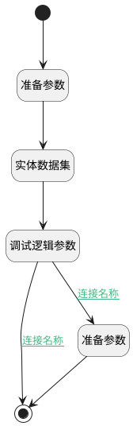

## 查找知识库首页模版 <!-- {docsify-ignore-all} -->

   

### 处理过程

### 处理步骤说明

#### 开始 :id=Begin [开始]

*- N/A*
#### 结束 :id=END1 [结束]

返回 `result_board`

#### 准备参数 :id=PREPAREPARAM1 [准备参数]

1. 将`知识库首页` 设置给  `filter.N_DYNADASHBOARDNAME_EQ`
2. 将`1` 设置给  `filter.N_IS_SYSTEM_EQ`

#### 实体数据集 :id=DEDATASET1 [实体数据集]

调用实体 [动态数据看板(DYNADASHBOARD)](module/Base/dyna_dashboard.md) 数据集合 [正常数据(normal)](module/Base/dyna_dashboard#数据集合) ，查询参数为`filter`

将执行结果返回给参数`page_board`

#### 调试逻辑参数 :id=DEBUGPARAM1 [调试逻辑参数]

> [!NOTE|label:调试信息|icon:fa fa-bug]
> 调试输出参数`page_board`的详细信息

#### 准备参数 :id=PREPAREPARAM2 [准备参数]

1. 将`page_board.0` 绑定给  `result_board`

### 连接条件说明
#### 连接名称 :id=DEBUGPARAM1-END1

`page_board(page_board).size` EQ `0`
#### 连接名称 :id=DEBUGPARAM1-PREPAREPARAM2

`page_board(page_board).size` GT `0`

### 实体逻辑参数

|    中文名   |    代码名    |  数据类型    |  实体   |备注 |
| --------| --------| -------- | -------- | --------   |
|传入变量(<i class="fa fa-check"/></i>)|Default|数据对象|[知识库(AI_KNOWLEDGE_BASE)](module/ai/ai_knowledge_base.md)||
|filter|filter|过滤器|||
|page_board|page_board|分页查询|||
|result_board|result_board|数据对象|[动态数据看板(DYNADASHBOARD)](module/Base/dyna_dashboard.md)||
