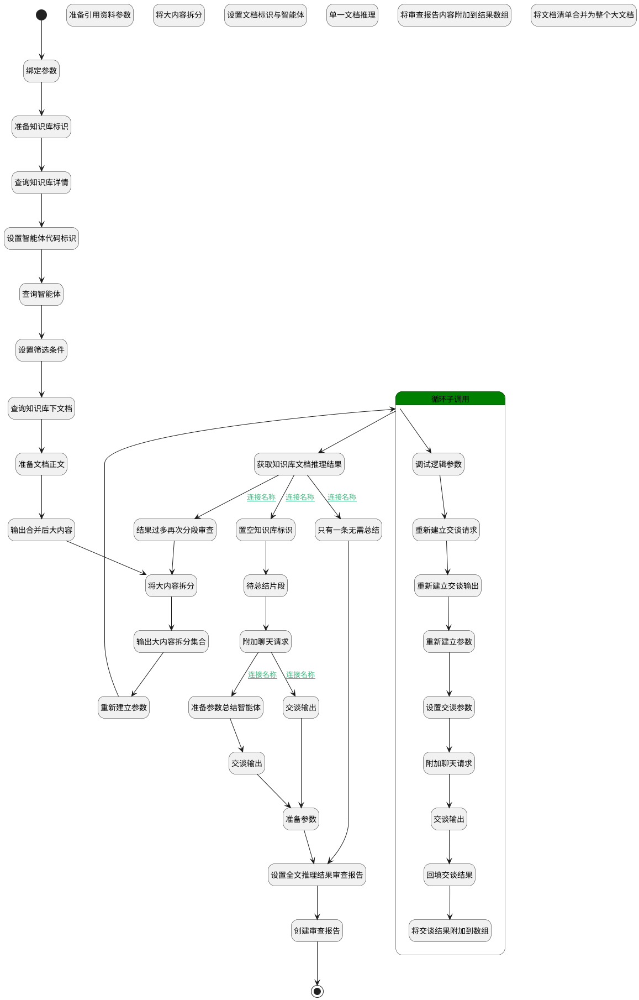

## 全文内容推理 <!-- {docsify-ignore-all} -->

   

### 处理过程




### 处理步骤说明

#### 开始 :id=Begin<sup class="footnote-symbol"> <font color=gray size=1>[开始]</font></sup>


*- N/A*
#### 绑定参数 :id=BINDPARAM_01<sup class="footnote-symbol"> <font color=gray size=1>[绑定参数]</font></sup>


绑定参数`Default(传入变量)` 到 `default_temp`
#### 准备知识库标识 :id=PREPAREPARAM_06<sup class="footnote-symbol"> <font color=gray size=1>[准备参数]</font></sup>


1. 将`default_temp.ID(知识库标识)` 设置给  `kb.ID(知识库标识)`

#### 查询知识库详情 :id=DEACTION_04<sup class="footnote-symbol"> <font color=gray size=1>[实体行为]</font></sup>


调用实体 [知识库(AI_KNOWLEDGE_BASE)](module/ai/ai_knowledge_base.md) 行为 [Get](module/ai/ai_knowledge_base#行为) ，行为参数为`kb`

将执行结果返回给参数`kb`

#### 设置筛选条件 :id=PREPAREPARAM_01<sup class="footnote-symbol"> <font color=gray size=1>[准备参数]</font></sup>


1. 将`default_temp.ID(知识库标识)` 设置给  `doc_filter(文档筛选条件).n_kb_id_eq`
2. 将`1000` 设置给  `doc_filter(文档筛选条件).size(内容大小)`

#### 查询智能体 :id=DELOGIC_02<sup class="footnote-symbol"> <font color=gray size=1>[实体逻辑]</font></sup>


调用实体 [智能体业务上下文(AI_AGENT_CONTEXT)](module/ai/ai_agent_context.md) 处理逻辑 [get_by_code]((module/ai/ai_agent_context/logic/get_by_code.md)) ，行为参数为`agent(agent)`
将执行结果返回给参数`agent(agent)`

#### 设置智能体代码标识 :id=PREPAREPARAM_07<sup class="footnote-symbol"> <font color=gray size=1>[准备参数]</font></sup>


1. 将`default_temp.agenttag` 设置给  `agent.CODE_NAME(代码标识)`

#### 查询知识库下文档 :id=DEDATASET_01<sup class="footnote-symbol"> <font color=gray size=1>[实体数据集]</font></sup>


调用实体 [知识库文档(AI_KB_DOCUMENT)](module/ai/ai_kb_document.md) 数据集合 [DEFAULT](module/ai/ai_kb_document#数据集合) ，查询参数为`doc_filter(文档筛选条件)`

将执行结果返回给参数`doc_list(文档查询列表)`

#### 准备文档正文 :id=RAWSFCODE_03<sup class="footnote-symbol"> <font color=gray size=1>[直接后台代码]</font></sup>


<p class="panel-title"><b>执行代码[Groovy]</b></p>

```groovy
        def _doc_list = logic.param("doc_list").getReal();
        def kb_doc_runtime = sys.dataentity('ai_kb_document')
        def _doc_fulltext = logic.param("doc_fulltext").getReal();

        _doc_fulltext.clear()
        
        _doc_list.each { doc ->
            def text = kb_doc_runtime.executeAction("get_full_text", null, doc)
            _doc_fulltext.add( [
                    name: (doc.get("categories") ? (doc.get("categories") + "/") : "") + doc.get("name"),
                    content: text ?: ""
            ]
            )
        }

        
```

#### 输出合并后大内容 :id=DEBUGPARAM_03<sup class="footnote-symbol"> <font color=gray size=1>[调试逻辑参数]</font></sup>


> [!NOTE|label:调试信息|icon:fa fa-bug]
> 调试输出参数`doc_fulltext`的详细信息


#### 重新建立参数 :id=RENEWPARAM_04<sup class="footnote-symbol"> <font color=gray size=1>[重新建立参数]</font></sup>


重建参数```chunk_reason_list(chunk_reason_list)```
#### 输出大内容拆分集合 :id=DEBUGPARAM_04<sup class="footnote-symbol"> <font color=gray size=1>[调试逻辑参数]</font></sup>


> [!NOTE|label:调试信息|icon:fa fa-bug]
> 调试输出参数`fulltext_chunk_list`的详细信息


#### 将大内容拆分 :id=RAWSFCODE_05<sup class="footnote-symbol"> <font color=gray size=1>[直接后台代码]</font></sup>


<p class="panel-title"><b>执行代码[Groovy]</b></p>

```groovy
        def processedDocs = logic.param("doc_fulltext").getReal();
        
        def splitContent
        splitContent = { String text, int limit ->
            def res = []
            def start = 0
            while (start < text.length()) {
                int end = Math.min(start + limit, text.length())
                // 尽量找换行符切分，避免切断句子
                if (end < text.length()) {
                    int lastNewline = text.lastIndexOf("\n", end)
                    if (lastNewline > start) end = lastNewline
                }
                res << text.substring(start, end).trim()
                start = end
            }
            return res
        }


        def MAX_CHARS = 25600
        def allGroups = []
        def currentGroup = []
        def currentGroupSize = 0

        def flatFragments = []

        processedDocs.each { doc ->

            def content = doc.content
            def docName = doc.name

            if (content.length() > MAX_CHARS) {
                // 超大文档：切分成多个虚拟片段对象
                def parts = splitContent(content, MAX_CHARS)
                parts.eachWithIndex { text, index ->
                    flatFragments << [name: docName, content: text, part: index + 1]
                }
            } else {
                // 普通文档
                flatFragments << [name: docName, content: content, part: null]
            }
        }

        flatFragments.each { frag ->
            if (currentGroupSize + frag.content.length() > MAX_CHARS) {
                if (currentGroup) {
                    allGroups << currentGroup
                }
                currentGroup = [frag]
                currentGroupSize = frag.content.length()
            } else {
                currentGroup << frag
                currentGroupSize += frag.content.length()
            }
        }
        if (currentGroup) allGroups << currentGroup

        def chunks = logic.param("fulltext_chunk_list").getReal();

        chunks.clear()

        int sn = 1
        allGroups.each { group ->
            chunks << [sn: sn++, content:
                group.collect { item ->
                    def partAttr = item.part ? " part=\"${item.part}\"" : ""
                    "<doc name=\"${item.name}\"${partAttr}>\n${item.content}\n</doc>"
                }.join("\n\n")
            ]
        }

        processedDocs.clear()
```

#### 结果过多再次分段审查 :id=DEBUGPARAM_05<sup class="footnote-symbol"> <font color=gray size=1>[调试逻辑参数]</font></sup>


> [!NOTE|label:调试信息|icon:fa fa-bug]
> 调试输出参数`doc_fulltext`的详细信息


#### 重新建立交谈请求 :id=RENEWPARAM_01<sup class="footnote-symbol"> <font color=gray size=1>[重新建立参数]</font></sup>


重建参数```chat_request(chat_request)```
#### 调试逻辑参数 :id=DEBUGPARAM_01<sup class="footnote-symbol"> <font color=gray size=1>[调试逻辑参数]</font></sup>


> [!NOTE|label:调试信息|icon:fa fa-bug]
> 调试输出参数`text_chunk`的详细信息


#### 准备引用资料参数 :id=PREPAREPARAM_04<sup class="footnote-symbol"> <font color=gray size=1>[准备参数]</font></sup>


1. 将`agent.SPEC_KB_ID(规格库标识)` 设置给  `refrence_chat_request.knowledgebases`
2. 将`1` 设置给  `refrence_chat_request.chunkpageindex`

#### 循环子调用 :id=LOOPSUBCALL_02<sup class="footnote-symbol"> <font color=gray size=1>[循环子调用]</font></sup>


循环参数`fulltext_chunk_list`，子循环参数使用`text_chunk`
#### 重新建立交谈输出 :id=RENEWPARAM_02<sup class="footnote-symbol"> <font color=gray size=1>[重新建立参数]</font></sup>


重建参数```chat_response(chat_response)```
#### 置空知识库标识 :id=PREPAREPARAM_03<sup class="footnote-symbol"> <font color=gray size=1>[准备参数]</font></sup>


1. 将`空值（NULL）` 设置给  `textreason_chat_request.knowledgebases`
2. 将`null` 重新建立为  `textreason_chat_request`
3. 将`null` 重新建立为  `textreason_chat_response`

#### 获取知识库文档推理结果 :id=RAWSFCODE_01<sup class="footnote-symbol"> <font color=gray size=1>[直接后台代码]</font></sup>


<p class="panel-title"><b>执行代码[Groovy]</b></p>

```groovy
def _all_reason_content = logic.param("all_reason_content").getReal();
def _doc_reason_list = logic.param("chunk_reason_list").getReal();

def _fullcontent_reason_report = logic.param("fullcontent_reason_report").getReal();
_all_reason_content.set('fullcontent',null)


if(_doc_reason_list.size()==1) {
    _fullcontent_reason_report.set("review_report", _doc_reason_list.get(0).content)
}
      
def allContent = _doc_reason_list.collect { item ->
    def content = item.content ?: ''
"""\
# 分段结果：
```
${item.content}
```
---\
"""
}.join('\n\n')

int retry = 0
if(_all_reason_content.get("retry"))
    retry = _all_reason_content.get("retry")

if(allContent.length()<25600)  {
    _all_reason_content.set('fullcontent',allContent)
    println "------------------------allContent：" + allContent
}
else if(retry<3){
        def _doc_fulltext = logic.param("doc_fulltext").getReal();
        retry = retry +1
        _all_reason_content.set("retry", retry)
        println "------------------------allContent 过大再次分段审查：" + allContent

        _doc_fulltext.clear()
        
        _doc_reason_list.each { item ->
            
            _doc_fulltext.add( [
                    name: "分段结果",
                    content: item.content ?: ''
            ]
            )
        }
    
}
else {
        _fullcontent_reason_report.set("review_report", allContent)
        println "------------------------重试分段审查3次 allContent 仍过大，直接保存报告：" + allContent
}


```

#### 附加聊天请求 :id=SYSAICHATAGENT_APPENDCHATREQUEST_02<sup class="footnote-symbol"> <font color=gray size=1>[SYSAICHATAGENT_APPENDCHATREQUEST]</font></sup>


#### 只有一条无需总结 :id=DEBUGPARAM_06<sup class="footnote-symbol"> <font color=gray size=1>[调试逻辑参数]</font></sup>


> [!NOTE|label:调试信息|icon:fa fa-bug]
> 调试输出参数`fullcontent_reason_report`的详细信息


#### 重新建立参数 :id=RENEWPARAM_03<sup class="footnote-symbol"> <font color=gray size=1>[重新建立参数]</font></sup>


重建参数```chunk_reason(chunk_reason)```
#### 待总结片段 :id=DEBUGPARAM_07<sup class="footnote-symbol"> <font color=gray size=1>[调试逻辑参数]</font></sup>


> [!NOTE|label:调试信息|icon:fa fa-bug]
> 调试输出参数`chunk_reason_list`的详细信息


#### 交谈输出 :id=SYSAICHATAGENT_CHATOUTPUT_02<sup class="footnote-symbol"> <font color=gray size=1>[SYSAICHATAGENT_CHATOUTPUT]</font></sup>


#### 设置交谈参数 :id=PREPAREPARAM_09<sup class="footnote-symbol"> <font color=gray size=1>[准备参数]</font></sup>


1. 将`空值（NULL）` 设置给  `chat_request.knowledgebases`
2. 将`default_temp.agenttag` 设置给  `chat_request.srfaiagenttag`

#### 设置全文推理结果审查报告 :id=PREPAREPARAM_05<sup class="footnote-symbol"> <font color=gray size=1>[准备参数]</font></sup>


1. 将`Default(传入变量).ID(知识库标识)` 设置给  `fullcontent_reason_report.KB_ID(知识库标识)`
2. 将`Default(传入变量).agenttag` 设置给  `fullcontent_reason_report.AGENT_TAG(智能体标记)`
3. 将`kb.NAME(知识库名称)` 设置给  `fullcontent_reason_report.NAME(审查对象)`
4. 将`all_reason_content.fullcontent` 设置给  `fullcontent_reason_report.CHECK_INFO(校验信息)`
5. 将`all_reason_content.retry` 设置给  `fullcontent_reason_report.REVIEW_RESULT(审查结果)`

#### 将大内容拆分 :id=RAWSFCODE_04<sup class="footnote-symbol"> <font color=gray size=1>[直接后台代码]</font></sup>


<p class="panel-title"><b>执行代码[Groovy]</b></p>

```groovy
def _fulltext_chunk_list = logic.param("fulltext_chunk_list").getReal();
def _doc_fulltext = logic.param("doc_fulltext").getReal();

def  fulltext = _doc_fulltext.get("content")
// 按行分割，保留换行结构（便于段落感知）
    def lines = fulltext.readLines()
    def chunks = []
    def currentChunk = []
    def currentWordCount = 0

    for (line in lines) {
        // 计算当前行的字数（中文/英文通用：按字符数或按空格+中文字符？这里按字符数更稳妥）
        def lineWordCount = line.length()

        // 如果当前行本身超过 maxWordsPerChunk，强制分割（极端情况）
        if (lineWordCount > 20000) {
            // 先 flush 当前 chunk
            if (currentChunk) {
                chunks << currentChunk.join('\n')
                currentChunk = []
                currentWordCount = 0
            }

            // 对超长行进行句子级分割
            def sentences = line.split(/(?<=[。！？.!?])\s*/)
            def tempSentences = []
            def tempCount = 0

            for (sent in sentences) {
                def sentLen = sent.length()
                if (tempCount + sentLen > 20000 && tempSentences) {
                    chunks << tempSentences.join('')
                    tempSentences = [sent]
                    tempCount = sentLen
                } else {
                    tempSentences << sent
                    tempCount += sentLen
                }
            }
            if (tempSentences) {
                chunks << tempSentences.join('')
            }
            continue
        }

        // 正常行：判断加入后是否超限
        if (currentWordCount + lineWordCount > 20000) {
            // 超了，先保存当前 chunk
            if (currentChunk) {
                chunks << currentChunk.join('\n')
            }
            // 开启新 chunk
            currentChunk = [line]
            currentWordCount = lineWordCount
        } else {
            // 未超限，加入当前 chunk
            currentChunk << line
            currentWordCount += lineWordCount
        }
    }

    // 处理最后一块
    if (currentChunk) {
        chunks << currentChunk.join('\n')
    }

_fulltext_chunk_list = chunks

println "------------------------拆分后的文档块：" + _fulltext_chunk_list

```

#### 回填交谈结果 :id=PREPAREPARAM_08<sup class="footnote-symbol"> <font color=gray size=1>[准备参数]</font></sup>


1. 将`chat_response.content` 设置给  `chunk_reason.content`

#### 附加聊天请求 :id=SYSAICHATAGENT_APPENDCHATREQUEST_01<sup class="footnote-symbol"> <font color=gray size=1>[SYSAICHATAGENT_APPENDCHATREQUEST]</font></sup>


#### 交谈输出 :id=SYSAICHATAGENT_CHATOUTPUT_01<sup class="footnote-symbol"> <font color=gray size=1>[SYSAICHATAGENT_CHATOUTPUT]</font></sup>


#### 设置文档标识与智能体 :id=PREPAREPARAM_02<sup class="footnote-symbol"> <font color=gray size=1>[准备参数]</font></sup>


1. 将`default_temp.agenttag` 设置给  `text_reason.agenttag`
2. 将`doc.ID(知识库文档标识)` 设置给  `text_reason.id(知识库文档标识)`

#### 将交谈结果附加到数组 :id=APPENDPARAM_03<sup class="footnote-symbol"> <font color=gray size=1>[附加到数组参数]</font></sup>


将参数`chunk_reason` 添加到数组参数`chunk_reason_list`
#### 创建审查报告 :id=DEACTION_03<sup class="footnote-symbol"> <font color=gray size=1>[实体行为]</font></sup>


调用实体 [智能审查报告(AI_REVIEW_REPORT)](module/ai/ai_review_report.md) 行为 [upsert](module/ai/ai_review_report#行为) ，行为参数为`fullcontent_reason_report`

将执行结果返回给参数`fullcontent_reason_report`

#### 单一文档推理 :id=DEACTION_01<sup class="footnote-symbol"> <font color=gray size=1>[实体行为]</font></sup>


调用实体 [知识库文档(AI_KB_DOCUMENT)](module/ai/ai_kb_document.md) 行为 [推理(reason)](module/ai/ai_kb_document#行为) ，行为参数为`text_reason`

将执行结果返回给参数`text_reason`

#### 准备参数总结智能体 :id=PREPAREPARAM_010<sup class="footnote-symbol"> <font color=gray size=1>[准备参数]</font></sup>


1. 将`agent.SYNTHESIZER(总结智能体)` 设置给  `textreason_chat_request.srfaiagenttag`

#### 将审查报告内容附加到结果数组 :id=APPENDPARAM_01<sup class="footnote-symbol"> <font color=gray size=1>[附加到数组参数]</font></sup>


将参数`text_reason` 添加到数组参数`doc_reason_list`
#### 将文档清单合并为整个大文档 :id=RAWSFCODE_02<sup class="footnote-symbol"> <font color=gray size=1>[直接后台代码]</font></sup>


<p class="panel-title"><b>执行代码[Groovy]</b></p>

```groovy
def _full_doc_list = logic.param("full_doc_list").getReal();
def _doc_fulltext = logic.param("doc_fulltext").getReal();

def mergedDocument  = _full_doc_list.collect { doc ->
    def header = "---${doc.name}---"
    "$header\n${doc.analysis_content}"
}.join('\n\n')  // 用两个换行分隔不同文档

_doc_fulltext = mergedDocument

println "------------------------doc_fulltext：" + _doc_fulltext
```

#### 结束 :id=END_01<sup class="footnote-symbol"> <font color=gray size=1>[结束]</font></sup>


返回 `fullcontent_reason_report`

#### 交谈输出 :id=SYSAICHATAGENT_CHATOUTPUT_03<sup class="footnote-symbol"> <font color=gray size=1>[SYSAICHATAGENT_CHATOUTPUT]</font></sup>


#### 准备参数 :id=PREPAREPARAM_011<sup class="footnote-symbol"> <font color=gray size=1>[准备参数]</font></sup>


1. 将`textreason_chat_response.content` 设置给  `fullcontent_reason_report.REVIEW_REPORT(报告)`


### 连接条件说明
#### 连接名称 :id=RAWSFCODE_01-PREPAREPARAM_03

`fullcontent_reason_report(fullcontent_reason_report).REVIEW_REPORT(报告)` ISNULL AND `all_reason_content(all_reason_content).fullcontent` ISNOTNULL
#### 连接名称 :id=SYSAICHATAGENT_APPENDCHATREQUEST_01-SYSAICHATAGENT_CHATOUTPUT_01

`agent(agent).SYNTHESIZER(总结智能体)` ISNULL
#### 连接名称 :id=SYSAICHATAGENT_APPENDCHATREQUEST_01-PREPAREPARAM_010

`agent(agent).SYNTHESIZER(总结智能体)` ISNOTNULL
#### 连接名称 :id=RAWSFCODE_01-DEBUGPARAM_06

`fullcontent_reason_report(fullcontent_reason_report).REVIEW_REPORT(报告)` ISNOTNULL
#### 连接名称 :id=RAWSFCODE_01-DEBUGPARAM_05

`doc_fulltext(doc_fulltext).size` GT `0` AND `all_reason_content(all_reason_content).fullcontent` ISNULL


### 实体逻辑参数

|    中文名   |    代码名    |  数据类型    |  实体   |备注 |
| --------| --------| -------- | -------- | --------   |
|传入变量(<i class="fa fa-check"/></i>)|Default|数据对象|[知识库(AI_KNOWLEDGE_BASE)](module/ai/ai_knowledge_base.md)||
|agent|agent|数据对象|[智能体业务上下文(AI_AGENT_CONTEXT)](module/ai/ai_agent_context.md)||
|all_reason_content|all_reason_content|数据对象|||
|chat_request|chat_request||||
|chat_response|chat_response||||
|chunk_reason|chunk_reason|数据对象|||
|chunk_reason_list|chunk_reason_list|数据对象列表|||
|default_temp|default_temp|数据对象|[知识库(AI_KNOWLEDGE_BASE)](module/ai/ai_knowledge_base.md)||
|doc|doc|数据对象|[知识库文档(AI_KB_DOCUMENT)](module/ai/ai_kb_document.md)||
|文档筛选条件|doc_filter|过滤器|||
|doc_fulltext|doc_fulltext|数据对象列表|||
|文档查询列表|doc_list|分页查询|||
|doc_reason_list|doc_reason_list|数据对象列表|[智能审查报告(AI_REVIEW_REPORT)](module/ai/ai_review_report.md)||
|full_doc_list|full_doc_list|数据对象列表|[知识库文档(AI_KB_DOCUMENT)](module/ai/ai_kb_document.md)||
|fullcontent_reason_report|fullcontent_reason_report|数据对象|[智能审查报告(AI_REVIEW_REPORT)](module/ai/ai_review_report.md)||
|fulltext_chunk_list|fulltext_chunk_list|数据对象列表|||
|kb|kb|数据对象|[知识库(AI_KNOWLEDGE_BASE)](module/ai/ai_knowledge_base.md)||
|obj|obj|数据对象|||
|refrence_chat_request|refrence_chat_request||||
|refrence_chat_response|refrence_chat_response||||
|report_doc|report_doc|数据对象|[智能审查报告(AI_REVIEW_REPORT)](module/ai/ai_review_report.md)||
|text_chunk|text_chunk|数据对象|||
|text_reason|text_reason|数据对象|[知识库文档(AI_KB_DOCUMENT)](module/ai/ai_kb_document.md)||
|textreason_chat_request|textreason_chat_request||||
|textreason_chat_response|textreason_chat_response||||
