## 生成引导提示词 <!-- {docsify-ignore-all} -->

   

### 处理过程

```plantuml
@startuml
hide empty description
<style>
root {
  HyperlinkColor #42b983
}
</style>

hide empty description
state "开始" as Begin <<start>> [[$./generate_guided_prompts#begin {"开始"}]]
state "获取知识库信息" as DEACTION_01  [[$./generate_guided_prompts#deaction_01 {"获取知识库信息"}]]
state "附加聊天请求" as SYSAICHATAGENT_APPENDCHATREQUEST_02  [[$./generate_guided_prompts#sysaichatagent_appendchatrequest_02 {"附加聊天请求"}]]
state "查询类别" as DEACTION_02  [[$./generate_guided_prompts#deaction_02 {"查询类别"}]]
state "调试逻辑参数" as DEBUGPARAM_01  [[$./generate_guided_prompts#debugparam_01 {"调试逻辑参数"}]]
state "获取类别标识" as PREPAREPARAM_03  [[$./generate_guided_prompts#prepareparam_03 {"获取类别标识"}]]
state "绑定参数" as BINDPARAM_01  [[$./generate_guided_prompts#bindparam_01 {"绑定参数"}]]
state "准备参数" as PREPAREPARAM_01  [[$./generate_guided_prompts#prepareparam_01 {"准备参数"}]]
state "查找agent_context" as DEACTION_04  [[$./generate_guided_prompts#deaction_04 {"查找agent_context"}]]
state "交谈输出（默认引导词）" as SYSAICHATAGENT_CHATOUTPUT_02  [[$./generate_guided_prompts#sysaichatagent_chatoutput_02 {"交谈输出（默认引导词）"}]]
state "交谈输出（动态引导词）" as SYSAICHATAGENT_CHATOUTPUT_01  [[$./generate_guided_prompts#sysaichatagent_chatoutput_01 {"交谈输出（动态引导词）"}]]
state "设置智能体" as PREPAREPARAM_05  [[$./generate_guided_prompts#prepareparam_05 {"设置智能体"}]]
state "输出交谈反馈内容" as DEBUGPARAM_02  [[$./generate_guided_prompts#debugparam_02 {"输出交谈反馈内容"}]]
state "填充AI反馈内容" as PREPAREPARAM_06  [[$./generate_guided_prompts#prepareparam_06 {"填充AI反馈内容"}]]
state "超过2000时截取" as RAWSFCODE_03  [[$./generate_guided_prompts#rawsfcode_03 {"超过2000时截取"}]]
state "更新引导提示词" as RAWSQLCALL_01  [[$./generate_guided_prompts#rawsqlcall_01 {"更新引导提示词"}]]
state "结束" as END_01 <<end>> [[$./generate_guided_prompts#end_01 {"结束"}]]


Begin --> DEACTION_01
DEACTION_01 --> SYSAICHATAGENT_APPENDCHATREQUEST_02
SYSAICHATAGENT_APPENDCHATREQUEST_02 --> DEBUGPARAM_01
DEBUGPARAM_01 --> PREPAREPARAM_03 : [[$./generate_guided_prompts#debugparam_01-prepareparam_03{有类别} 有类别]]
PREPAREPARAM_03 --> DEACTION_02
DEACTION_02 --> BINDPARAM_01
BINDPARAM_01 --> PREPAREPARAM_01 : [[$./generate_guided_prompts#bindparam_01-prepareparam_01{有智能体} 有智能体]]
PREPAREPARAM_01 --> DEACTION_04
DEACTION_04 --> PREPAREPARAM_05
PREPAREPARAM_05 --> SYSAICHATAGENT_CHATOUTPUT_01
SYSAICHATAGENT_CHATOUTPUT_01 --> DEBUGPARAM_02
DEBUGPARAM_02 --> PREPAREPARAM_06
PREPAREPARAM_06 --> RAWSFCODE_03
RAWSFCODE_03 --> RAWSQLCALL_01
RAWSQLCALL_01 --> END_01
BINDPARAM_01 --> SYSAICHATAGENT_CHATOUTPUT_02 : [[$./generate_guided_prompts#bindparam_01-sysaichatagent_chatoutput_02{没有智能体} 没有智能体]]
SYSAICHATAGENT_CHATOUTPUT_02 --> DEBUGPARAM_02
DEBUGPARAM_01 --> SYSAICHATAGENT_CHATOUTPUT_02 : [[$./generate_guided_prompts#debugparam_01-sysaichatagent_chatoutput_02{无类别} 无类别]]


@enduml
```




### 处理步骤说明

#### 开始 :id=Begin<sup class="footnote-symbol"> <font color=gray size=1>[开始]</font></sup>


*- N/A*
#### 获取知识库信息 :id=DEACTION_01<sup class="footnote-symbol"> <font color=gray size=1>[实体行为]</font></sup>


调用实体 [知识库(AI_KNOWLEDGE_BASE)](module/ai/ai_knowledge_base.md) 行为 [GetFullData(get_full_data)](module/ai/ai_knowledge_base#行为) ，行为参数为`Default(传入变量)`

将执行结果返回给参数`Default(传入变量)`

#### 附加聊天请求 :id=SYSAICHATAGENT_APPENDCHATREQUEST_02<sup class="footnote-symbol"> <font color=gray size=1>[SYSAICHATAGENT_APPENDCHATREQUEST]</font></sup>


#### 查询类别 :id=DEACTION_02<sup class="footnote-symbol"> <font color=gray size=1>[实体行为]</font></sup>


调用实体 [类别(CATEGORY)](module/Base/category.md) 行为 [Get](module/Base/category#行为) ，行为参数为`category`

将执行结果返回给参数`category`

#### 调试逻辑参数 :id=DEBUGPARAM_01<sup class="footnote-symbol"> <font color=gray size=1>[调试逻辑参数]</font></sup>


> [!NOTE|label:调试信息|icon:fa fa-bug]
> 调试输出参数`kb_info(知识库信息)`的详细信息


#### 获取类别标识 :id=PREPAREPARAM_03<sup class="footnote-symbol"> <font color=gray size=1>[准备参数]</font></sup>


1. 将`Default(传入变量).CATEGORY_ID(目录标识)` 设置给  `category.ID(标识)`

#### 绑定参数 :id=BINDPARAM_01<sup class="footnote-symbol"> <font color=gray size=1>[绑定参数]</font></sup>


绑定参数`category` 到 `category_settings`
#### 准备参数 :id=PREPAREPARAM_01<sup class="footnote-symbol"> <font color=gray size=1>[准备参数]</font></sup>


1. 将`category_settings.GUIDED_PROMPT_AGENT_ID(引导提示词智能体标识)` 设置给  `agent.ID(智能体业务上下文标识)`

#### 查找agent_context :id=DEACTION_04<sup class="footnote-symbol"> <font color=gray size=1>[实体行为]</font></sup>


调用实体 [智能体业务上下文(AI_AGENT_CONTEXT)](module/ai/ai_agent_context.md) 行为 [Get](module/ai/ai_agent_context#行为) ，行为参数为`agent`

将执行结果返回给参数`agent`

#### 交谈输出（默认引导词） :id=SYSAICHATAGENT_CHATOUTPUT_02<sup class="footnote-symbol"> <font color=gray size=1>[SYSAICHATAGENT_CHATOUTPUT]</font></sup>


#### 交谈输出（动态引导词） :id=SYSAICHATAGENT_CHATOUTPUT_01<sup class="footnote-symbol"> <font color=gray size=1>[SYSAICHATAGENT_CHATOUTPUT]</font></sup>


#### 设置智能体 :id=PREPAREPARAM_05<sup class="footnote-symbol"> <font color=gray size=1>[准备参数]</font></sup>


1. 将`agent.code_name(代码标识)` 设置给  `chat_request.srfaiagenttag`

#### 输出交谈反馈内容 :id=DEBUGPARAM_02<sup class="footnote-symbol"> <font color=gray size=1>[调试逻辑参数]</font></sup>


> [!NOTE|label:调试信息|icon:fa fa-bug]
> 调试输出参数`chat_response`的详细信息


#### 填充AI反馈内容 :id=PREPAREPARAM_06<sup class="footnote-symbol"> <font color=gray size=1>[准备参数]</font></sup>


1. 将`chat_response.content` 设置给  `Default(传入变量).GUIDANCE_PROMPT(引导提示词)`

#### 超过2000时截取 :id=RAWSFCODE_03<sup class="footnote-symbol"> <font color=gray size=1>[直接后台代码]</font></sup>


<p class="panel-title"><b>执行代码[Groovy]</b></p>

```groovy
def kb = logic.param("Default").getReal();
def prompt_before = kb.get("GUIDANCE_PROMPT")
def prompt_after = prompt_before?.take(2000) ?: kb.get("description")

kb.set("GUIDANCE_PROMPT",prompt_after)
```

#### 更新引导提示词 :id=RAWSQLCALL_01<sup class="footnote-symbol"> <font color=gray size=1>[直接SQL调用]</font></sup>


<p class="panel-title"><b>执行sql语句</b></p>

```sql
UPDATE AI_KNOWLEDGE_BASE set GUIDANCE_PROMPT=? where ID = ?
```

<p class="panel-title"><b>执行sql参数</b></p>

1. `Default(传入变量).GUIDANCE_PROMPT(引导提示词)`
2. `Default(传入变量).ID(知识库标识)`


#### 结束 :id=END_01<sup class="footnote-symbol"> <font color=gray size=1>[结束]</font></sup>


返回 `Default(传入变量)`


### 连接条件说明
#### 有类别 :id=DEBUGPARAM_01-PREPAREPARAM_03

`Default(传入变量).CATEGORY_ID(目录标识)` ISNOTNULL
#### 有智能体 :id=BINDPARAM_01-PREPAREPARAM_01

`category_settings(category_settings).GUIDED_PROMPT_AGENT_ID(引导提示词智能体标识)` ISNOTNULL
#### 没有智能体 :id=BINDPARAM_01-SYSAICHATAGENT_CHATOUTPUT_02

`category_settings(category_settings).GUIDED_PROMPT_AGENT_ID(引导提示词智能体标识)` ISNULL
#### 无类别 :id=DEBUGPARAM_01-SYSAICHATAGENT_CHATOUTPUT_02

`Default(传入变量).CATEGORY_ID(目录标识)` ISNULL


### 实体逻辑参数

|    中文名   |    代码名    |  数据类型    |  实体   |备注 |
| --------| --------| -------- | -------- | --------   |
|传入变量(<i class="fa fa-check"/></i>)|Default|数据对象|[知识库(AI_KNOWLEDGE_BASE)](module/ai/ai_knowledge_base.md)||
|agent|agent|数据对象|[智能体业务上下文(AI_AGENT_CONTEXT)](module/ai/ai_agent_context.md)||
|category|category|数据对象|[类别(CATEGORY)](module/Base/category.md)||
|category_settings|category_settings|数据对象|[类别设置(CATEGORY_SETTINGS)](module/Base/category_settings.md)||
|chat_request|chat_request||||
|chat_response|chat_response||||
|切片过滤器|chunk_filter|过滤器|||
|chunk_list|chunk_list|数据对象列表|[知识库文档分块(AI_KB_CHUNK)](module/ai/ai_kb_chunk.md)||
|文档过滤器|doc_filter|过滤器|||
|doc_list|doc_list|数据对象列表|[知识库文档(AI_KB_DOCUMENT)](module/ai/ai_kb_document.md)||
|知识库信息|kb_info|数据对象|||
|result|result|简单数据|||
