## get_by_code <!-- {docsify-ignore-all} -->

   

### 处理过程

```plantuml
@startuml
hide empty description
<style>
root {
  HyperlinkColor #42b983
}
</style>

hide empty description
state "开始" as Begin <<start>> [[$./get_by_code#begin {"开始"}]]
state "执行脚本代码" as RAWSFCODE_01  [[$./get_by_code#rawsfcode_01 {"执行脚本代码"}]]
state "实体行为" as DEACTION_01  [[$./get_by_code#deaction_01 {"实体行为"}]]
state "结束" as END_01 <<end>> [[$./get_by_code#end_01 {"结束"}]]


Begin --> RAWSFCODE_01
RAWSFCODE_01 --> END_01
RAWSFCODE_01 --> DEACTION_01 : [[$./get_by_code#rawsfcode_01-deaction_01{连接名称} 连接名称]]
DEACTION_01 --> END_01


@enduml
```




### 处理步骤说明

#### 开始 :id=Begin<sup class="footnote-symbol"> <font color=gray size=1>[开始]</font></sup>


*- N/A*
#### 执行脚本代码 :id=RAWSFCODE_01<sup class="footnote-symbol"> <font color=gray size=1>[直接后台代码]</font></sup>


<p class="panel-title"><b>执行代码[Groovy]</b></p>

```groovy
def defaultEntity = logic.param("default").getReal();
def filter = logic.param("filter").getReal();

def kbtags=defaultEntity.get("kb_tag")
if(!kbtags)
    kbtags=defaultEntity.get("id")

def ids =[kbtags].flatten().findAll().collectMany { it.toString().replaceAll(/[\[\]\"]/, "").split(',')*.trim() }.findAll { it }.collect { it.split("-kb--")[-1] }


//def knowledge_base_runtime = sys.dataentity('ai_knowledge_base')
//knowledge_base = knowledge_base_runtime.get(kbids[0])
if(ids) {
    defaultEntity.set("id",ids[0])
    if(ids.size()>1)  {
        filter.set("n_id_in",ids)
    }
}

```

#### 实体行为 :id=DEACTION_01<sup class="footnote-symbol"> <font color=gray size=1>[实体行为]</font></sup>


调用实体 [知识库(AI_KNOWLEDGE_BASE)](module/ai/ai_knowledge_base.md) 行为 [Get](module/ai/ai_knowledge_base#行为) ，行为参数为`Default(传入变量)`

将执行结果返回给参数`Default(传入变量)`

#### 结束 :id=END_01<sup class="footnote-symbol"> <font color=gray size=1>[结束]</font></sup>


返回 `Default(传入变量)`


### 连接条件说明
#### 连接名称 :id=RAWSFCODE_01-DEACTION_01

`Default(传入变量).ID(知识库标识)` ISNOTNULL


### 实体逻辑参数

|    中文名   |    代码名    |  数据类型    |  实体   |备注 |
| --------| --------| -------- | -------- | --------   |
|传入变量(<i class="fa fa-check"/></i>)|Default|数据对象|[知识库(AI_KNOWLEDGE_BASE)](module/ai/ai_knowledge_base.md)||
|filter|filter|过滤器|||
|kbids|kbids|简单数据列表|||
