## 获取summary信息 <!-- {docsify-ignore-all} -->

   

### 处理过程

```plantuml
@startuml
hide empty description
<style>
root {
  HyperlinkColor #42b983
}
</style>

hide empty description
state "开始" as Begin <<start>> [[$./get_summary#begin {"开始"}]]
state "准备参数" as PREPAREPARAM_01  [[$./get_summary#prepareparam_01 {"准备参数"}]]
state "pageidx" as DEDATAQUERY_01  [[$./get_summary#dedataquery_01 {"pageidx"}]]
state "准备参数" as PREPAREPARAM_02  [[$./get_summary#prepareparam_02 {"准备参数"}]]
state "summary" as DEDATAQUERY_02  [[$./get_summary#dedataquery_02 {"summary"}]]
state "执行脚本代码" as RAWSFCODE_01  [[$./get_summary#rawsfcode_01 {"执行脚本代码"}]]
state "结束" as END_01 <<end>> [[$./get_summary#end_01 {"结束"}]]


Begin --> PREPAREPARAM_01
PREPAREPARAM_01 --> DEDATAQUERY_01
DEDATAQUERY_01 --> PREPAREPARAM_02
PREPAREPARAM_02 --> DEDATAQUERY_02
DEDATAQUERY_02 --> RAWSFCODE_01
RAWSFCODE_01 --> END_01


@enduml
```




### 处理步骤说明

#### 开始 :id=Begin<sup class="footnote-symbol"> <font color=gray size=1>[开始]</font></sup>


*- N/A*
#### 准备参数 :id=PREPAREPARAM_01<sup class="footnote-symbol"> <font color=gray size=1>[准备参数]</font></sup>


1. 将`Default(传入变量).ID(知识库标识)` 设置给  `filter.n_kb_id_eq`
2. 将`1000` 设置给  `filter.size`
3. 将`document_sequence,asc;document_id,asc;sequence,asc` 设置给  `filter.sort`
4. 将`index` 设置给  `filter.n_type_eq`

#### pageidx :id=DEDATAQUERY_01<sup class="footnote-symbol"> <font color=gray size=1>[实体数据查询]</font></sup>


调用实体 [知识库文档分块(AI_KB_CHUNK)](module/ai/ai_kb_chunk.md) 数据查询 [DEFAULT](module/ai/ai_kb_chunk#数据查询) ，查询参数为`filter`

将执行结果返回给参数`chunks`

#### 准备参数 :id=PREPAREPARAM_02<sup class="footnote-symbol"> <font color=gray size=1>[准备参数]</font></sup>


1. 将`cluster` 设置给  `filter.n_type_eq`
2. 将`1` 设置给  `filter.N_PID_ISNULL`

#### summary :id=DEDATAQUERY_02<sup class="footnote-symbol"> <font color=gray size=1>[实体数据查询]</font></sup>


调用实体 [知识库文档分块(AI_KB_CHUNK)](module/ai/ai_kb_chunk.md) 数据查询 [DEFAULT](module/ai/ai_kb_chunk#数据查询) ，查询参数为`filter`

将执行结果返回给参数`cluster`

#### 执行脚本代码 :id=RAWSFCODE_01<sup class="footnote-symbol"> <font color=gray size=1>[直接后台代码]</font></sup>


<p class="panel-title"><b>执行代码[Groovy]</b></p>

```groovy
    def defaultEntity = logic.param("default").getReal();
        def chunks = logic.param("chunks").getReal();
        def clusters = logic.param("cluster").getReal();
        List docs = new ArrayList()
        def sb = new StringBuilder()
        def header = new StringBuilder()
        def paragraph = new StringBuilder()
        def sbTOC = new StringBuilder()
        def summary = new StringBuilder()
        def cluster = new StringBuilder()
        def footer = new StringBuilder()
        boolean summarized = false

        if(defaultEntity.get("name")) {
            sb.append("# ${defaultEntity.name}\n")
            if (defaultEntity.get("description")) {
                sb.append("## 摘要\n${defaultEntity.description}\n")
                sb.append("\n---\n\n")
            }
            header.append(sb.toString())
        }
        if(clusters) {
            clusters.forEach { item ->
                if (item.get("document_name")) {
                    sb.append("## ${item.document_name}\n")
                    if (item.get("categories"))
                        sb.append("* **目录**: ${item.categories}\n")
                    sb.append("* **文档ID**: ${item.document_id}\n")

                    if (item.get("content")) {
                        sb.append("### 摘要\n${item.content}\n")
                    }
                    sb.append("\n---\n\n")
                }

            }
            if(sb.length()<12288) {
                header = new StringBuilder()
                header.append(sb.toString())
            }
        }
        if(chunks) {
            chunks.forEach { chunk ->
                if(chunk.get("content")) {
                    try{
                        def doc = new groovy.json.JsonSlurper().parseText(chunk.get("content"))
                        doc["document_id"] = chunk.get("document_id")
                        doc['document_name'] = chunk.get("document_name")
                        doc['categories'] = chunk.get("categories")
                        docs.add(doc)

                    }catch (Exception ex) {}
                }
            }

            def lastDocId = ""

            docs.eachWithIndex { doc, index ->
                if(!lastDocId.equalsIgnoreCase(doc.document_id)) {
                    paragraph.append("\n---\n\n")
                    paragraph.append("## ${doc.document_name}\n")
                    paragraph.append("\n* **文档ID**: ${doc.document_id}\n\n")
                    if (doc.get("categories"))
                        paragraph.append("* **目录**: ${doc.categories}\n\n")

                    paragraph.append("| 章节名称 | 页码范围 |\n")
                    paragraph.append("| :--- | :--- |\n")
                    lastDocId = doc.document_id

                }

                def range = doc.page_range ? "${doc.page_range.start} - ${doc.page_range.end}" : "N/A"
                doc.row_num = index + 1
                doc.range = range
                paragraph.append("| ${doc.document_title} | ${doc.range} |\n")
            }


            if(!summarized && paragraph.length()>16384) {
                summarized = true
                summary.append(header.toString())
                summary.append(paragraph.toString())
            }


            // --- 2. 内部递归辅助闭包 ---
            // 闭包 A: 生成树状小目录
            def generateTOC
            generateTOC = { items, depth, row_num, maxDepth ->
                def tocText = ""
                items.each { item ->
                    def range = item.location ? "${item.location.start} - ${item.location.end}" : "N/A"
                    item.range = range
                    tocText += "  " * depth + "- ${row_num}.${item.id} ${item.title} (${item.range})\n"
                    if (item.children && depth<maxDepth) tocText += generateTOC(item.children, depth + 1, row_num, maxDepth)
                }
                return tocText
            }

            // 闭包 B: 生成详细内容块
            def processDetails
            processDetails = { items, parentPath, docTitle, row_num ->
                def detailText = ""
                items.each { item ->
                    def currentPath = parentPath ? "${parentPath} > ${item.title}" : "${docTitle} > ${item.title}"
                    def level = currentPath.split(" > ").size() + 1

                    detailText += "#${'#' * level} ${row_num}.${item.id} ${item.title}\n"
                    detailText += "- **位置**: ${item.range}\n"
                    if (item.summary) detailText += "- **摘要**: ${item.summary}\n"


                    if (item.children) detailText += processDetails(item.children, currentPath, docTitle, row_num)
                }
                return detailText
            }


            lastDocId = ""
            // --- 3. 遍历文档构建全文 ---
            docs.each { doc ->
                if(!lastDocId.equalsIgnoreCase(doc.document_id)) {
                    sbTOC.append("\n---\n\n")
                    sbTOC.append("## ${doc.document_name} 目录清单\n")
                    sbTOC.append("\n* **文档ID**: ${doc.document_id}\n\n")
                    if (doc.get("categories"))
                        sbTOC.append("* **目录**: ${doc.categories}\n\n")
                    lastDocId = doc.document_id
                }
                // 插入局部小目录
                sbTOC.append("- ${doc.row_num} ${doc.document_title} (${doc.range})\n")
                sbTOC.append(generateTOC(doc.index, 1, doc.row_num, 4))

            }


            lastDocId = ""
            // --- 3. 遍历文档构建全文 ---
            docs.each { doc ->

                if(!lastDocId.equalsIgnoreCase(doc.document_id)) {
                    footer.append("\n---\n\n")
                    footer.append("## ${doc.document_name} 章节简介\n")
                    footer.append("\n* **文档ID**: ${doc.document_id}\n\n")
                    if (doc.get("categories"))
                        footer.append("* **目录**: ${doc.categories}\n\n")
                    lastDocId = doc.document_id
                }

                footer.append("### ${doc.row_num} ${doc.document_title}\n")

                footer.append("- **位置**: ${doc.range}\n")

                // 插入详细层级内容
                footer.append(processDetails(doc.index, "", doc.document_title, doc.row_num))


                footer.append("\n---\n\n")

            }

            if(!summarized && footer.length()<16384) {
                summarized = true
                summary.append(header.toString())
                summary.append(footer.toString())
            }

            sb.append(footer.toString())


            if(!summarized) {
                summarized = true
                if(sbTOC.length()>16384) {
                    sbTOC = new StringBuilder()
                    lastDocId = ""
                    docs.each { doc ->
                        if(!lastDocId.equalsIgnoreCase(doc.document_id)) {
                            sbTOC.append("\n---\n\n")
                            sbTOC.append("## ${doc.document_name} 目录清单\n")
                            sbTOC.append("\n* **文档ID**: ${doc.document_id}\n\n")
                            if (doc.get("categories"))
                                sbTOC.append("* **目录**: ${doc.categories}\n\n")
                            lastDocId = doc.document_id
                        }
                        // 插入局部小目录
                        sbTOC.append("- ${doc.row_num} ${doc.document_title} (${doc.range})\n")
                        sbTOC.append(generateTOC(doc.index, 1, doc.row_num, 2))
                    }
                }
                if(sbTOC.length()>16384) {
                    sbTOC = new StringBuilder()
                    lastDocId = ""
                    docs.each { doc ->
                        if(!lastDocId.equalsIgnoreCase(doc.document_id)) {
                            sbTOC.append("\n---\n\n")
                            sbTOC.append("## ${doc.document_name} 目录清单\n")
                            sbTOC.append("\n* **文档ID**: ${doc.document_id}\n\n")
                            if (doc.get("categories"))
                                sbTOC.append("* **目录**: ${doc.categories}\n\n")
                            lastDocId = doc.document_id
                        }
                        // 插入局部小目录
                        sbTOC.append("- ${doc.row_num} ${doc.document_title} (${doc.range})\n")
                        sbTOC.append(generateTOC(doc.index, 1, doc.row_num, 1))
                    }
                }
                if(sbTOC.length()>16384) {
                    sbTOC = new StringBuilder()
                    sbTOC.append(paragraph.toString())
                }
                summary.append(header.toString())
                summary.append(sbTOC.toString())
            }


            defaultEntity.set("page_index_info", sb.toString())
        }
        if(!summarized) {
            summary.append(sb.toString())
        }
        defaultEntity.set("summary", summary.toString())
```

#### 结束 :id=END_01<sup class="footnote-symbol"> <font color=gray size=1>[结束]</font></sup>


返回 `Default(传入变量)`


### 实体逻辑参数

|    中文名   |    代码名    |  数据类型    |  实体   |备注 |
| --------| --------| -------- | -------- | --------   |
|传入变量(<i class="fa fa-check"/></i>)|Default|数据对象|[知识库(AI_KNOWLEDGE_BASE)](module/ai/ai_knowledge_base.md)||
|chunks|chunks|数据对象列表|[知识库文档分块(AI_KB_CHUNK)](module/ai/ai_kb_chunk.md)||
|cluster|cluster|数据对象列表|||
|filter|filter|过滤器|||
