## keywords计算 <!-- {docsify-ignore-all} -->

   

### 处理过程

```plantuml
@startuml
hide empty description
<style>
root {
  HyperlinkColor #42b983
}
</style>

hide empty description
state "开始" as Begin <<start>> [[$./keywords#begin {"开始"}]]
state "结束" as END_01 <<end>> [[$./keywords#end_01 {"结束"}]]
state "解析keywords" as RAWSFCODE_01  [[$./keywords#rawsfcode_01 {"解析keywords"}]]


Begin --> RAWSFCODE_01
RAWSFCODE_01 --> END_01


@enduml
```




### 处理步骤说明

#### 开始 :id=Begin<sup class="footnote-symbol"> <font color=gray size=1>[开始]</font></sup>


*- N/A*
#### 解析keywords :id=RAWSFCODE_01<sup class="footnote-symbol"> <font color=gray size=1>[直接后台代码]</font></sup>


<p class="panel-title"><b>执行代码[Groovy]</b></p>

```groovy
def filter = logic.param("Default").getReal();

// 1. 获取三个来源，不做任何假设
def kw1 = filter.get("keyword")  // 可能为 String 或 null
def kw2 = filter.get("keywords") // 可能为 String[] 或 List 或 null
def kw3 = filter.get("queries")    // 可能为 String 或 null

def allTokens = []

// 2. 逐个手动处理，确保不触发非法转换
[kw1, kw2, kw3].each { item ->
    if (item == null) return
    
    if (item instanceof Object[]) { 
        // 专门处理 String[] 数组，这是你报错的根源
        item.each { if (it) allTokens.add(it.toString()) }
    } else if (item instanceof Collection) {
        // 专门处理 List
        item.each { if (it) allTokens.add(it.toString()) }
    } else if (item instanceof String) {
        // 专门处理字符串，按空格切分
        item.split('[,\\s]+').each { if (it) allTokens.add(it) }
    }
}

// 3. 统一清洗：去掉首尾空格，去掉空字符串
allTokens = allTokens.collect { it.trim() }.findAll { it != "" }.unique()

// 4. 校验与合并
if (allTokens.isEmpty()) {
    throw new IllegalArgumentException("搜索关键词不能为空")
}

def finalKeyword = allTokens.join(" ")

filter.set("keyword",finalKeyword)
```

#### 结束 :id=END_01<sup class="footnote-symbol"> <font color=gray size=1>[结束]</font></sup>


返回 `Default(传入变量)`


### 实体逻辑参数

|    中文名   |    代码名    |  数据类型    |  实体   |备注 |
| --------| --------| -------- | -------- | --------   |
|传入变量(<i class="fa fa-check"/></i>)|Default|过滤器|||
